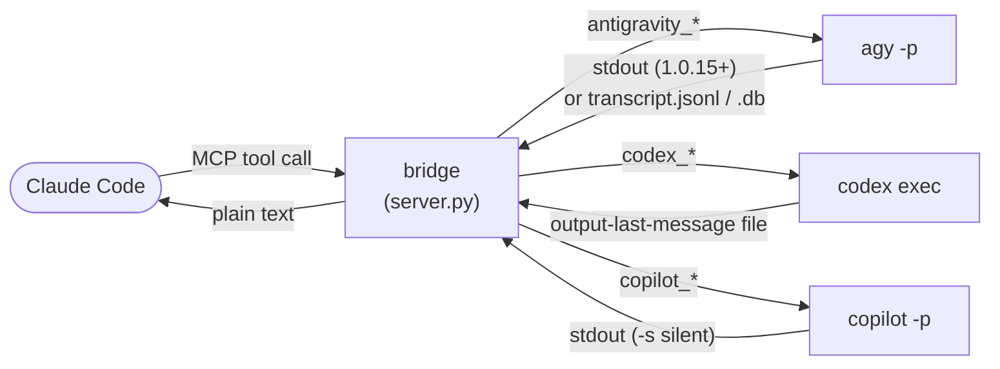
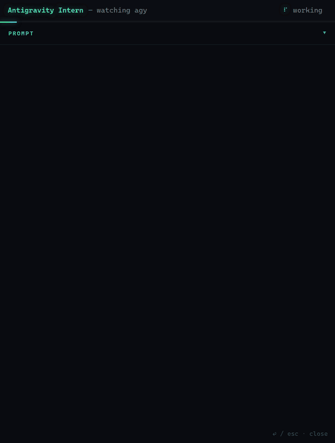
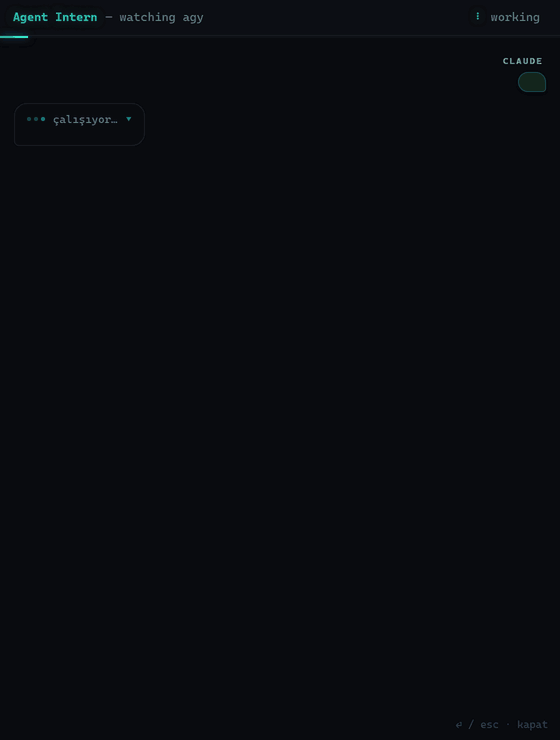
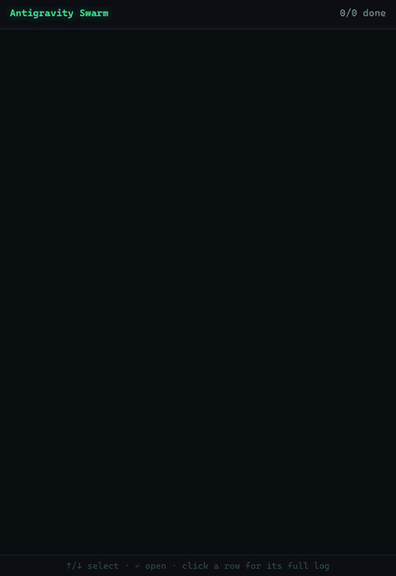

<div align="center">

# Claude Code × Antigravity + Codex + Copilot — MCP Bridge



**Drive three external coding CLIs — Google's [Antigravity](https://antigravity.google/) (Gemini 3.5 Flash), [OpenAI Codex](https://developers.openai.com/codex/), and the [GitHub Copilot CLI](https://docs.github.com/en/copilot/how-tos/copilot-cli) — as sub-agents inside [Claude Code](https://claude.com/claude-code). Text answers, image generation, real repo work, and parallel swarms, on quota you already pay for.**

[](https://github.com/SinanTufekci/agent-intern/actions/workflows/ci.yml)
[](https://pypi.org/project/agent-intern/)
[](https://pepy.tech/projects/agent-intern)
[](LICENSE)
[](https://www.python.org/)
[](https://modelcontextprotocol.io/)
[](https://glama.ai/mcp/servers/SinanTufekci/agent-intern)
[](https://antigravity.google/)
[](https://developers.openai.com/codex/)
[](https://docs.github.com/en/copilot/how-tos/copilot-cli)
[](#requirements)
[](https://github.com/sponsors/SinanTufekci)

</div>

---

One MCP server, **three backends**. It exposes Google Antigravity, OpenAI Codex, and the GitHub
Copilot CLI to Claude Code as clean MCP tools so you can delegate work to a different model family
mid-task — without leaving your terminal, and on the subscriptions you already have. Each backend is
independent: install one, two, or all three.

- **🛰️ Antigravity (`agy`, Gemini 3.5 Flash High).** Fast, cheap tool-calling — and the **only**
  backend with an image model. Its headless print mode (`agy -p`) historically had a **stdout bug**:
  it wrote the answer to the *controlling terminal* instead of its stdout, so anything capturing
  stdout got nothing (and, under a TUI, agy's text leaked into the host's prompt). **agy 1.0.15 fixed
  this on Windows** — `-p` now writes the clean answer to stdout — so the bridge **prefers stdout** and
  falls back to reading agy's *own* transcript files only when stdout is empty (older agy, non-Windows,
  or `--sandbox` runs). It still **detaches agy from the terminal** so older versions can't leak.
- **🤖 Codex (`codex exec`, OpenAI).** A strong reasoner for real code/repo work. It writes its final
  message straight to a file the bridge asks for (no scraping), supports **model selection**, and has
  a **real, enforced sandbox**.
- **🐙 Copilot (`copilot -p`, GitHub).** GitHub's agentic coder. Stdout-native like Codex (`-s`
  prints just the answer), with **model selection** (`--model`), a **best-effort** tool/path
  permission knob, and a deterministic resume mechanism (the bridge sets each session's UUID itself).

All three share the same niceties: a `*_continue` to resume a thread, a [live "watch" window](#watch-mode)
to see the agent work, a unified [`agent_swarm`](#swarm) that runs many tasks in parallel **across
all backends at once**, and `*_status` diagnostics that spend no quota.

> [!WARNING]
> **This runs unsandboxed code with your privileges.** `agy -p` auto-executes its tools
> (read/write files, run shell commands, reach the network) with **no usable approval gate** — its
> `--sandbox` blocks only *shell commands*, leaving file writes and network egress wide open.
> `codex exec` also runs autonomously, but its `sandbox` flag (default `read-only`) **is** a real,
> enforced boundary. `copilot -p` runs headless with `--allow-all-tools`; its `sandbox` maps to
> **best-effort** tool/path permissions (read-only denies the local write/shell tools) — safer than
> agy, but **not** an OS sandbox like Codex's. In all three cases the `workspace` argument is a
> *starting context*, **not** a security boundary. Only use these with **trusted prompts on trusted
> content**; for real isolation, run the bridge inside a container or VM. **[Full details →](#security)**

## Why you'd want this

| | |
|---|---|
| 🧠 **Second opinion** | Ask a different model family — Gemini *or* GPT — mid-task without switching tools. |
| 🎨 **Image generation** | Have Gemini draw an image and get the saved file back — no extra API key or image tool. |
| 🛠️ **Real coding sub-agent** | Hand a focused repo task to Codex with a real `workspace-write` sandbox. |
| 💸 **Cheap delegation** | Burn Antigravity / Codex quota on grunt work instead of Claude tokens. |
| 🐝 **Parallel fan-out** | Run N tasks at once, mixing Gemini and Codex workers in a single swarm. |
| 📁 **Cross-repo reads** | Point a worker at another project directory and let it read/answer there. |
| 🔌 **Zero new auth** | Piggybacks the logins you already did — no keys for the bridge to manage. |

## The three backends at a glance

The bridge normalizes all three CLIs into the same shape, but they differ where it matters. Pick per task:

| | 🛰️ **Antigravity** (`agy`) | 🤖 **Codex** (`codex exec`) | 🐙 **Copilot** (`copilot -p`) |
|---|---|---|---|
| **Model** | Selectable via `model` (agy's `--model`); Gemini 3.5 Flash (High) default (see [Model & auth](#model--auth)) | Selectable via `model` (codex's `-m`) | Selectable via `model` (`--model`) |
| **Best at** | Fast, cheap tool-calling; quick answers | Heavier reasoning; real code/repo work | Agentic coding; real code/repo work |
| **Image generation** | ✅ `antigravity_image` (+ `antigravity_image_swarm`) | ❌ no image model | ❌ no image model |
| **Sandbox** | ❌ no real boundary (`--sandbox` blocks only shell) | ✅ real, enforced: `read-only` / `workspace-write` / `danger-full-access` | ⚠️ best-effort: tool/path permissions (`read-only` denies write/shell) — **not** an OS sandbox |
| **How the answer is read** | stdout on agy 1.0.15+ (Windows); else scraped from `transcript.jsonl` | Written to a file via `-o/--output-last-message` | stdout (`-s` silent mode) |
| **Continue mechanism** | Pins the workspace's conversation id (`--conversation`) | Resumes the session id (`codex exec resume <id>`) | Resumes a self-set session UUID (`--session-id`) |
| **Auth** | OS credential store (AI Pro session) | `codex login` (ChatGPT account or API key) | OS credential store (`copilot login`) or a GitHub token env |
| **In a swarm** | Runs with an isolated `HOME` to avoid state races | Fresh one-shot — needs no isolation | Fresh one-shot — needs no isolation |

## How it works

All three backends run **headless** and one-shot per call; the bridge's job is to get a clean answer
out of each and hand it to Claude Code as a plain string.



**Antigravity.** On agy **1.0.15+** (Windows), `agy -p` writes its clean final answer straight to
stdout, and the bridge returns that directly. On older agy — or non-Windows, or a `--sandbox` run —
stdout stays empty and the bridge falls back to agy's own transcript at:

```
~/.gemini/antigravity-cli/brain/<conv-id>/.system_generated/logs/transcript.jsonl
```

For the fallback it locates the conversation via `cache/last_conversations.json` (falling back to the
newest `brain/` directory touched since launch), streams the transcript, and returns the final
`source=MODEL, status=DONE, type=PLANNER_RESPONSE` entry — the answer, minus the intermediate
tool-calling steps (or the SQLite `.db` agy dual-writes, when no JSONL exists). Either way,
`antigravity_continue` pins the workspace's **exact** conversation id via `--conversation`, so it
never resumes the wrong thread.

**Codex.** `codex exec` is well-behaved: the bridge passes `-o/--output-last-message <file>` and
codex writes its final message straight there — no scraping. Continue works by capturing the session
id from codex's own rollout files (`~/.codex/sessions/.../rollout-*.jsonl`) and resuming with
`codex exec resume <id>`, falling back to the newest on-disk session for that cwd after a server
restart.

**Copilot.** `copilot -p "<prompt>" -s` runs a prompt non-interactively and prints the clean final
answer to stdout — the bridge reads it there, no scraping. It runs headless with `--allow-all-tools
--no-ask-user --no-auto-update` (so it never blocks on a prompt), and disables copilot's flaky
builtin GitHub-API MCP by default for predictable latency (`COPILOT_GITHUB_MCP=1` re-enables it).
Continue is **deterministic**: copilot's `--session-id <uuid>` both *sets* a new session's id and
*resumes* an existing one, so the bridge generates the UUID itself, pins it to the workspace, and
resumes that exact session — falling back after a restart to the newest on-disk session
(`~/.copilot/session-state/<id>/workspace.yaml`) whose recorded `cwd` matches.

## Set up in 60 seconds

**Prerequisites — install whichever backend(s) you want, and sign in once each:**

- **Antigravity:** install `agy` and sign in to Antigravity once (via the IDE or `agy -i`).
- **Codex:** install `codex` and run `codex login` once (ChatGPT account or API key).
- **Copilot:** install `copilot` (`npm i -g @github/copilot`, or `winget install GitHub.Copilot`)
  and run `copilot` then `/login` once (or set a `COPILOT_GITHUB_TOKEN`/`GH_TOKEN` env var).

You don't need all three — the tools for a missing CLI simply report "not found" via their `*_status`
tool.

### Recommended — no clone, you control updates

With [`uv`](https://docs.astral.sh/uv/) installed, register the bridge straight from
[PyPI](https://pypi.org/project/agent-intern/) under `mcpServers` in `~/.claude.json` — no
path to hardcode, no `git pull` to remember:

```json
"agent-intern": {
  "command": "uvx",
  "args": ["agent-intern"]
}
```

uvx pins to the version it first caches and does **not** auto-upgrade, so you never run an update you
didn't choose — important, since the bridge runs [unsandboxed code](#security): a surprise (or
compromised) release can't execute until you opt in. When the startup check warns that a newer
release is out, upgrade deliberately and restart Claude Code:

```bash
uvx agent-intern@latest      # fetch + run the newest release (refreshes uv's cache)
```

> [!TIP]
> Prefer hands-off auto-updates? Put `"args": ["agent-intern@latest"]` in the config instead —
> every launch runs the newest release. Convenient, but it pulls new code without asking each time.

### From source

Clone it instead if you want to hack on the bridge or pin a local copy:

```bash
git clone https://github.com/SinanTufekci/agent-intern.git
cd agent-intern
pip install fastmcp
python test_smoke.py        # 4 real round-trips (ask, continue, image, swarm) — prints four PASS lines
```

> [!NOTE]
> The smoke test costs a tiny bit of quota and takes ~30–60 s. It exercises the Antigravity path.

Then point Claude Code at the absolute path to `server.py` under `mcpServers` in `~/.claude.json`:

<table>
<tr><th>Windows</th><th>macOS / Linux</th></tr>
<tr><td>

```json
"agent-intern": {
  "command": "python",
  "args": ["C:\\path\\to\\server.py"]
}
```

</td><td>

```json
"agent-intern": {
  "command": "python3",
  "args": ["/path/to/server.py"]
}
```

</td></tr>
</table>

Restart Claude Code. **Twelve tools** appear, each prefixed `mcp__agent-intern__`:

- **Antigravity (5):** `antigravity_ask`, `antigravity_continue`, `antigravity_image`,
  `antigravity_image_swarm`, `antigravity_status`
- **Codex (3):** `codex_ask`, `codex_continue`, `codex_status`
- **Copilot (3):** `copilot_ask`, `copilot_continue`, `copilot_status`
- **Shared (1):** `agent_swarm` — fans a list of tasks out across **all three** backends in one run

The single-prompt tools — Antigravity, Codex, **and** Copilot — take a **`watch=true`** flag for the
live browser view ([Watch mode](#watch-mode)).

> *"Use antigravity_ask to summarize the README of this repo in three bullets."* → Claude routes the
> prompt through the bridge, agy reads the file under the workspace root, and the answer comes back
> as a plain string. Swap in `codex_ask` or `copilot_ask` to have GPT or Copilot do the same.

## Tools

### 🛰️ Antigravity

| Tool | Purpose |
|---|---|
| `antigravity_ask(prompt, workspace?, model?, timeout_s?=180, watch?=false)` | Start a **new** Antigravity conversation. `model` selects the model (agy's `--model`, e.g. `"Claude Sonnet 4.6 (Thinking)"`); validated against `agy models`, defaults to your `settings.json` model. `watch=true` opens the live browser view ([Watch mode](#watch-mode)). |
| `antigravity_continue(prompt, workspace?, model?, timeout_s?=180, watch?=false)` | Continue the conversation **rooted at `workspace`** (pinned by id). agy's model is per-invocation, so `model` can differ from the original ask. `watch=true` opens the live view. |
| `antigravity_image(prompt, output_path?, workspace?, timeout_s?=240, watch?=false)` | Generate an image; saves the file (extension corrected to the real bytes) and returns its path + format/size. `watch=true` streams progress and **shows the image** inline. |
| `antigravity_image_swarm(prompts, output_paths?, workspaces?, max_concurrency?=4, timeout_s?=240, watch?=false)` | Generate **several images in parallel** (one worker per prompt). |
| `antigravity_status()` | Setup diagnostics: **the bridge's own version + whether a newer release is available**, plus agy version/compat, state dirs, and newest-transcript readability. Spends no quota. |

### 🤖 Codex

| Tool | Purpose |
|---|---|
| `codex_ask(prompt, workspace?, sandbox?="read-only", model?, timeout_s?=180, watch?=false)` | Start a **new** Codex session. `sandbox` is a **real** boundary (see [Codex bridge](#codex-bridge)); `model` selects the model (`-m`). `watch=true` opens the live view, streaming codex's steps from its `--json` event stream. |
| `codex_continue(prompt, workspace?, timeout_s?=180, watch?=false)` | Continue the Codex session **rooted at `workspace`** — resumes the exact session id, falling back to the newest on-disk session for that cwd after a server restart. The resumed session keeps its original sandbox and model. `watch=true` opens the live view. |
| `codex_status()` | Setup diagnostics: codex version, login status (`codex login status`), sessions dir. Spends no quota. |

### 🐙 Copilot

| Tool | Purpose |
|---|---|
| `copilot_ask(prompt, workspace?, sandbox?="read-only", model?, timeout_s?=180, watch?=false)` | Start a **new** Copilot session. `sandbox` maps to copilot's tool/path permissions (**best-effort**, not an OS sandbox — see [Copilot bridge](#copilot-bridge)); `model` selects the model (`--model`). `watch=true` opens the live view, streaming copilot's steps from its `--output-format json` event stream. |
| `copilot_continue(prompt, workspace?, sandbox?="read-only", timeout_s?=180, watch?=false)` | Continue the Copilot session **rooted at `workspace`** — resumes the exact self-set session id, falling back to the newest on-disk session for that cwd after a restart. Unlike Codex, `sandbox` applies here too (copilot re-applies permissions each turn). `watch=true` opens the live view. |
| `copilot_status()` | Setup diagnostics: copilot version, an auth hint (no `login status` command exists, so best-effort), session-state dir. Spends no quota. |

### 🐝 Shared

| Tool | Purpose |
|---|---|
| `agent_swarm(tasks, max_concurrency?=4, timeout_s?=180, watch?=false)` | Run **several tasks in parallel across all three backends** — each task names its `backend` (`antigravity`, `codex`, or `copilot`) plus a `prompt` (an optional `model` for any backend, and `sandbox` for Codex/Copilot). Every answer comes back in one block; `watch=true` opens the live dashboard ([Swarm](#swarm)). |

`workspace` defaults to the MCP server's current working directory. Point it at a real project dir
for context-aware answers — every backend gives the model access to files under that root (Codex and
Copilot honoring their `sandbox`).

`antigravity_image` forces agy to save to an explicit absolute path — without one, agy
falls back to its own scratch dir (`~/.gemini/antigravity-cli/scratch/`). It then
corrects the file extension to match the real bytes: agy's image model picks the
format itself (JPEG for photo-like images, PNG for flat graphics), so a requested
`out.png` may come back as `out.jpg`. The returned path always reflects the true
format.

<a id="codex-bridge"></a>

## 🤖 Codex bridge — the well-behaved sibling

`codex exec` writes its final message to a file the bridge asks for via `-o/--output-last-message`,
so the answer comes back without any scraping (where agy needed a transcript workaround before 1.0.15
fixed its stdout). Three things make Codex worth reaching for over Antigravity:

- **Real sandbox.** `sandbox` accepts `read-only` (default — reads and answers, writes nothing),
  `workspace-write` (may edit files under the workspace), or `danger-full-access` (no sandbox —
  avoid). Unlike agy's no-op `--sandbox`, codex's `-s` actually enforces this. `codex exec` has no
  interactive approval gate, so this flag **is** your safety boundary — opt into write access
  deliberately.
- **Model selection works.** `model` maps to codex's `-m`. (agy's `--model` works in print mode too
  as of 1.0.16; all three backends now expose the same `model` knob.)
- **Stronger reasoning.** Codex is a coding agent, not an image model — there's no `codex_image`. Its
  strength is reasoning and real code/repo work; hand it the jobs that need a heavier model.

**Auth.** Uses your existing Codex login (ChatGPT account or API key). Run `codex login` once; check
with `codex_status`. No new keys for the bridge to manage.

> [!WARNING]
> `codex exec` runs the model as an **autonomous agent with no interactive approval gate**. The
> `sandbox` flag (default `read-only`) is the real boundary, but `workspace-write` /
> `danger-full-access` let it modify files — and a swarm runs N agents at once. Only use it with
> **trusted prompts on trusted content**.

<a id="copilot-bridge"></a>

## 🐙 Copilot bridge — GitHub's agentic coder

The GitHub Copilot CLI (`copilot`, from `@github/copilot`) is stdout-native like Codex:
`copilot -p "<prompt>" -s` runs a prompt non-interactively and prints just the final answer to
stdout, so the bridge reads it there — no scraping. What makes it worth reaching for:

- **Model selection.** `model` maps to copilot's `--model` (e.g. `gpt-5.3-codex`, `claude-sonnet-4.6`,
  or `auto`). An unavailable model errors immediately with a clear message.
- **Deterministic, race-free continue.** copilot's `--session-id <uuid>` both **sets** a new session's
  id and **resumes** an existing one, so the bridge generates the UUID itself and pins it to the
  workspace — no rollout-scraping. After a restart it falls back to the newest on-disk session
  (`~/.copilot/session-state/<id>/workspace.yaml`) whose recorded `cwd` matches.
- **Fast by default.** Runs with `--allow-all-tools --no-ask-user --no-auto-update`, and disables
  copilot's builtin GitHub-API MCP (`--disable-builtin-mcps`) because its flaky HTTP connect can stall
  a call up to ~60 s. Set **`COPILOT_GITHUB_MCP=1`** to keep it (for Copilot's issue/PR/repo tools).

**Sandbox is best-effort, not enforced.** Unlike Codex's OS sandbox, copilot's boundary is
tool/path permissions. The `sandbox` knob maps to copilot flags for a uniform cross-backend field:

- **`read-only`** (default) — auto-approves tools so it runs headless, then **denies** the local
  `write` and `shell` tools (`--deny-tool`). Best-effort: it is **not** an OS sandbox, and network/MCP
  tools can still act. For a **hard** read-only boundary, use `codex_ask` instead.
- **`workspace-write`** — writes allowed, but file access stays confined to the workspace (no
  `--allow-all-paths`).
- **`danger-full-access`** — `--allow-all` (tools + all paths + all URLs). Avoid.

**Auth.** Uses your existing Copilot login — run `copilot` then `/login` once (stored in the OS
credential store), or set `COPILOT_GITHUB_TOKEN`/`GH_TOKEN`/`GITHUB_TOKEN` for headless use. Check
with `copilot_status`. If `copilot` isn't on `PATH` (the winget install can land off a stale `PATH`),
set **`COPILOT_BIN`** to its full path — e.g.
`%LOCALAPPDATA%\Microsoft\WinGet\Packages\GitHub.Copilot_*\copilot.exe`.

> [!WARNING]
> `copilot -p` runs the model as an **autonomous agent** with `--allow-all-tools` (required to run
> headless). Its `sandbox` is **best-effort tool/path permissions**, not an OS sandbox — safer than
> agy, weaker than Codex's `read-only`. Only use it with **trusted prompts on trusted content**.

<a id="watch-mode"></a>

## 👁️ Watch mode — Agent Intern (experimental)

Pass **`watch=true`** to **any single-prompt tool** — `antigravity_ask`, `antigravity_continue`,
`antigravity_image`, `codex_ask`, `codex_continue`, `copilot_ask`, or `copilot_continue` — to **watch
the agent work live in a little terminal-style browser window** called **Agent Intern**. The agent
still runs headless; alongside it
the bridge serves a tiny page on `127.0.0.1` and opens it in a small, chromeless app window that
streams the agent's steps — its planner narration (▸), the **real commands** it runs (`$`), and
completions (✓) — read live (from agy's transcript, or codex's / copilot's JSON event stream), with
the final answer rendered as Markdown (and, for `antigravity_image` with `watch=true`, the generated
image shown inline).

<div align="center">
<table>
<tr>
<td width="50%" align="center"><b>text ask / continue (agy <i>or</i> codex)</b></td>
<td width="50%" align="center"><b><code>antigravity_image</code> — image inline</b></td>
</tr>
<tr>
<td></td>
<td></td>
</tr>
</table>
<sub>Real captures — the agent runs headless while the <b>Agent Intern</b> window live-streams its steps (▸ narration · <code>$</code> commands · ✓ completions), then shows the final answer or image.</sub>
</div>

- **Cross-platform & best-effort.** Prefers a Chromium browser (`--app` mode) for the
  windowed look; falls back to a normal browser window. If nothing can open, the run
  still completes and returns normally.
- **Window size.** Set **`AGY_WATCH_WINDOW_SIZE`** (e.g. `AGY_WATCH_WINDOW_SIZE=480,700`)
  to resize the window; default is `560,760`. Press **Enter / Esc** in the window to
  close it.
- **One window, reused.** Repeated watch calls **reuse the already-open window**
  instead of stacking a new one each time — the open page resets itself for the new
  run (the swarm dashboard rebuilds for the new fan-out). If you closed the window, the
  next run opens a fresh one. Set **`AGY_WATCH_ALWAYS_NEW=1`** to force a new window
  every time.
- **Progress, keyboard & copy.** Each panel shows a time progress bar (elapsed /
  timeout). The swarm dashboard adds an overall done/total bar and per-row time bars;
  use **↑/↓** to select a worker and **↵** to open its detail window. Answers render
  as Markdown with a **copy** button, and a "jump to latest" badge appears if you
  scroll up.
- **Coarse, not token-level.** Both backends flush their step stream in chunks, so you
  get a handful of live steps, not character streaming. The returned value is identical
  to the non-watch call. Nothing is sent anywhere but your own machine.

<a id="swarm"></a>

## 🐝 Swarm — run agents in parallel

`agent_swarm` fans a list of **tasks** out to workers that run **truly
concurrently** (capped at `max_concurrency`, default 4), then returns every
worker's result in one block. Each task names its own `backend`, so a **single
swarm can mix Antigravity (Gemini), Codex, and Copilot** workers — hand the
reasoning-heavy jobs to Codex or Copilot and the quick ones to Gemini, all at
once. Good for independent sub-tasks: summarise N files, ask the same question
about N repos, fix N bugs. (`antigravity_image_swarm` stays separate — it
generates N images, and only agy has an image model.)

```
agent_swarm(tasks=[
  {"backend": "antigravity", "prompt": "Summarise src/auth.py in 2 bullets."},
  {"backend": "codex", "prompt": "Find and fix the failing test in tests/",
   "sandbox": "workspace-write", "workspace": "./repo"},
  {"backend": "copilot", "prompt": "Explain what src/api.py exposes.",
   "sandbox": "read-only", "workspace": "./repo"},
])
```

<div align="center">

<br>
<sub><code>agent_swarm(..., watch=true)</code> — one row per worker (with a backend badge); the done/total bar climbs as workers finish. Click a row (or <b>↑/↓</b> then <b>↵</b>) to pop that agent into its own window.</sub>
</div>

**How it stays correct under concurrency.** The single-agent agy tools serialize
through a lock because agy rewrites `last_conversations.json` on every call, so
concurrent runs sharing one state dir would race. The swarm sidesteps this: each
**agy** worker runs with its **own isolated `HOME`/`USERPROFILE`**, so agy's
`brain/`, `cache/`, and `last_conversations.json` never collide — no lock needed.
Auth still works because agy reads it from the **OS credential store**, not from
`~/.gemini` (verified on agy 1.0.9). **Codex** and **Copilot** workers need no such
isolation — each is a fresh one-shot (`codex exec` with its own `-o` file; `copilot
-p` with its own self-set session id). Each worker's `cwd` is its real `workspace`,
so file access is unchanged. Measured ~**2.8× speedup at 3 agy workers** (the AI Pro
backend does not serialize per-account); higher `max_concurrency` trades
quota/rate-limit pressure for wall-clock.

- **Per-task fields** — `backend` (`antigravity`/`codex`/`copilot`) and `prompt`
  are required; `workspace` defaults to the server cwd; `sandbox` and `model` apply
  to **Codex and Copilot** (ignored for Antigravity). Swarm workers are
  **one-shot** — there is no `*_continue` for a swarm worker's session.
- **Error isolation** — a worker that fails is reported in place; the others still
  return.
- **`watch=true`** — opens a thin live **Agent Swarm** dashboard (one row per
  worker, with a **backend badge**, repo, prompt, and latest step). **Click a row**
  to pop that agent into its own window streaming its full step log.

> [!WARNING]
> A swarm launches **N unsandboxed agents at once** — N× the prompt-injection
> "lethal trifecta" surface of a single call (see [Security](#security)). Only use
> it with **trusted prompts on trusted content**. Codex workers honor their
> enforced `sandbox`; Copilot workers honor their best-effort `sandbox`;
> Antigravity workers have no real boundary.

## Model & auth

| | 🛰️ **Antigravity** | 🤖 **Codex** | 🐙 **Copilot** |
|---|---|---|---|
| **Model** | **Selectable** via the `model` argument (agy's `--model`, e.g. `"Gemini 3.1 Pro (High)"`, `"Claude Sonnet 4.6 (Thinking)"`); omit to use the `"model"` field in agy's `settings.json` (**Gemini 3.5 Flash (High)** by default). Switching model in `-p` used to hang (through ~1.0.14) but is **fixed as of 1.0.16**. agy silently ignores an unknown label, so the bridge validates it against `agy models` and rejects a typo. Flash High is speed-optimized for cheap tool-calling; pick a bigger label for heavier work. | **Selectable** via the `model` argument (codex's `-m`). codex does not hang on a switch, so model choice is a first-class knob. | **Selectable** via the `model` argument (`--model`, e.g. `gpt-5.3-codex`, `claude-sonnet-4.6`, `auto`); omit for your account default. An unavailable model errors immediately. |
| **Auth** | Piggybacks whatever credential store `agy` uses on your OS (Windows Credential Manager, macOS Keychain, libsecret on Linux — the bridge never touches it directly). Log in once; every call silent-auths on the **same AI Pro quota** you already pay for. | Uses your existing **Codex login** — ChatGPT account or API key. Run `codex login` once; verify with `codex_status`. | Uses your existing **Copilot login** — run `copilot` then `/login` once (OS credential store), or set `COPILOT_GITHUB_TOKEN`/`GH_TOKEN`/`GITHUB_TOKEN`. Verify with `copilot_status`. |

<a id="security"></a>

## ⚠️ Security

All three backends run the model as an **autonomous agent**. The difference is whether you get a real
boundary: Codex enforces one, Copilot offers a best-effort one, Antigravity offers none.

### Antigravity — no usable boundary

`agy -p` auto-executes its own tools — reading and writing files, running shell commands, reaching
the network — with **no approval gate and no opt-out**. This isn't a choice the bridge makes; it's
how agy's print mode works. Re-verified empirically on **agy 1.0.9 / Windows** (all three checks
below still hold):

- Print mode runs out-of-workspace file writes and live network fetches **even without**
  `--dangerously-skip-permissions` — that flag is a **no-op** for `-p`. There is **no** agy flag
  that disables tool execution in print mode.
- agy 1.0.5 integrated a permission system (its logs show `toolPermission=request-review`), but it
  **still does not gate print-mode execution** — a fresh `-p` run created a file outside the
  workspace with no prompt. agy 1.0.12 reshuffled how that permission config *merges* (per-project
  files under `~/.gemini/config/projects/` now take precedence over
  `~/.gemini/antigravity-cli/settings.json`), and 1.0.13 made "Always Approve" rule matching
  strict (non-regex) by default with a `regex:` opt-in and relaxed its redirection checks — but
  those are config/interactive-approval changes, they add no print-mode approval gate, and the
  bridge reads none of it.
- `--sandbox` is **not** a usable boundary. agy 1.0.6 fixed its propagation into `-p` (the 1.0.6/1.0.7
  changelog calls this "sandbox isolation correctly enforced") and it now **does** block terminal/
  shell command execution — but re-verified on 1.0.9 that it leaves the `write_to_file` tool and
  network **wide open**: under `--sandbox` the model still wrote a file *outside* its workspace. agy
  1.0.9 hardened the sandbox's *command* path (stricter exact-match command checks; `.git` added to
  its dangerous-paths list), but none of that closes the out-of-workspace `write_to_file` hole. On
  top of that, a `--sandbox` run whose blocked terminal command halts it writes **no JSONL
  transcript** (only the SQLite `.db`, re-confirmed on 1.0.9). The bridge can now read that `.db`,
  but still never passes `--sandbox` — it's no boundary, with file writes and network left open.

### Codex — a real sandbox you should use

`codex exec` also has **no interactive approval gate**, but its `sandbox` flag is a genuine boundary
that codex enforces:

- **`read-only`** (default) — reads and answers; writes nothing. Safe for untrusted *questions* on
  trusted content.
- **`workspace-write`** — may edit files under the workspace. Opt in deliberately, per task.
- **`danger-full-access`** — no sandbox at all. Avoid.

Because there's no approval prompt, the flag you pass **is** the safety decision — choose it per
call.

### Copilot — best-effort, not an OS sandbox

`copilot -p` runs headless with `--allow-all-tools` (required — otherwise it blocks on per-tool
permission prompts). Its `sandbox` maps to copilot's tool/path permission flags, which are a
**real-ish but not enforced** boundary:

- **`read-only`** (default) — auto-approves tools to run headless, then **denies** the local `write`
  and `shell` tools (`--deny-tool`). Blocks local file edits and command execution, but it is **not**
  an OS sandbox: other tools (including network/MCP) can still act. Weaker than Codex's `read-only`.
- **`workspace-write`** — writes allowed, but file access stays confined to the workspace (no
  `--allow-all-paths`).
- **`danger-full-access`** — `--allow-all` (tools + all paths + all URLs). Avoid.

For a **hard** read-only boundary, prefer `codex_ask`.

### What that means for you

- The `workspace` argument is only a *starting context*, **not a security boundary** — Antigravity
  can and does act outside it; Codex is bounded by its enforced `sandbox`; Copilot by its best-effort
  tool/path permissions.
- An Antigravity call effectively runs **arbitrary code with your user privileges**. A Copilot call
  does too outside its best-effort denials; a Codex call does unless you keep it at `read-only`.
- Only invoke these with **trusted prompts on trusted content**. Untrusted input here is the classic
  prompt-injection *lethal trifecta*: private-data access + code execution + network egress.
- For real isolation, run the **whole bridge inside a container or VM**.

The bridge itself does only cross-platform filesystem reads under `~/.gemini/antigravity-cli/`,
`~/.codex/`, and `~/.copilot/` — no private APIs, no token theft. The risk above is entirely in what
the sub-agents are allowed to do.

## FAQ

<details>
<summary><b>Is this against Google's / OpenAI's / GitHub's Terms of Service?</b></summary>

It runs the **official `agy`, `codex`, and `copilot` CLIs under your own logins** — no private APIs,
no token theft, no quota abuse. It just bridges what the CLIs already do. That said, your AI Pro /
Antigravity, OpenAI / Codex, and GitHub Copilot ToS apply, and you're responsible for staying within
them.
</details>

<details>
<summary><b>Do I need all three CLIs?</b></summary>

No. Each backend is independent — install only the CLI(s) you want. The tools for a missing backend
report "not found" via their `*_status` tool (`antigravity_status` / `codex_status` /
`copilot_status`) and never crash the server.
</details>

<details>
<summary><b>When should I use Antigravity vs Codex vs Copilot?</b></summary>

Use **Antigravity** for fast, cheap tool-calling, quick answers, and **image generation** (it's the
only backend with an image model) — and it now lets you **pick the model** too (agy's `--model`). Use
**Codex** for heavier reasoning, real code/repo work, or when you want a **real, enforced
`workspace-write` sandbox**. Use **Copilot** for agentic coding on your GitHub Copilot plan, or as a
second coding opinion alongside Codex — noting its sandbox is **best-effort**, not enforced. All three
let you choose a `model`; in a swarm you can mix all three. See
[The three backends at a glance](#the-three-backends-at-a-glance).
</details>

<details>
<summary><b>Will it break when agy updates?</b></summary>

Less likely now. As of **agy 1.0.15** the bridge prefers agy's **stdout** on the happy path (1.0.15
fixed the print-mode stdout bug on Windows — `-p` now writes the clean answer there), which removes
its dependence on agy's **undocumented transcript schema** for normal runs. It still falls back to
reading the JSONL transcript, or the SQLite `.db` agy dual-writes, when stdout is empty (older agy,
non-Windows, or `--sandbox` runs) — so a schema change would only bite that fallback path. Re-verified
working on **1.0.15** (stdout answer clean under tool use; transcript/`.db` fallback intact; live ask
round-trip + `antigravity_status` diagnostics pass). Still, if you rely on the fallback, pin a
known-good `agy` version.
</details>

<details>
<summary><b>Which model does Antigravity use — can I pick it?</b></summary>

Yes. Pass `model` to `antigravity_ask`/`antigravity_continue` (or per task in `agent_swarm`) — it maps
to agy's `--model`, taking any label from `agy models` (e.g. `"Gemini 3.1 Pro (High)"`,
`"Claude Sonnet 4.6 (Thinking)"`). Omit it to use the `"model"` field in agy's `settings.json`, which
defaults to **Gemini 3.5 Flash (High)** — speed-optimized for cheap tool-calling.

agy 1.0.5 added `--model`, but through ~1.0.14 switching to a different model in `-p` **hung** the
call, so earlier bridge versions stayed single-model. **Re-verified on agy 1.0.16 that the hang is
fixed** — a Claude label answers as Anthropic Claude, a Gemini label as Gemini, each in seconds. One
caveat the bridge handles for you: agy **silently ignores an unknown label** (it falls back to the
default with no error), so the bridge validates your label against `agy models` and rejects a typo up
front.
</details>

<details>
<summary><b>Can it generate images?</b></summary>

**Yes — that's the `antigravity_image` tool**, on the Antigravity backend. agy's print mode generates
real images on your AI Pro quota; `antigravity_image` drives it, saves the file to a path you choose
(or a timestamped default in your workspace), fixes the extension to match the real bytes (agy picks
JPEG or PNG itself), and returns the path. Verified on **agy 1.0.9 / Windows**. Codex has no image
model — it's a coding agent.
</details>

<details>
<summary><b>Does it cost extra money?</b></summary>

No. It uses the **same quota you already pay for** — AI Pro for Antigravity, your Codex plan for
Codex, your GitHub Copilot plan for Copilot. The smoke test spends a negligible amount.
</details>

<details>
<summary><b>Does it stream responses?</b></summary>

The final answer is request/response — the CLIs return it all at once, so the tools return when the
agent finishes (each call typically takes 10–30 s; Copilot's reasoning models can run longer). If you
want to *watch* the agent work as it goes,
pass **`watch=true`** to any single-prompt tool: it opens the **Agent Intern** browser window and
live-streams the agent's steps — see [Watch mode](#watch-mode). It's coarse (a handful of steps, not
token-by-token), and the returned value is identical to the non-watch call.
</details>

<details>
<summary><b>Can I run several calls at once?</b></summary>

The **single-agent** tools are **serialized** inside the server: agy rewrites `last_conversations.json`
on every call, so concurrent runs sharing one state dir would race and could return the wrong
conversation. A `threading.Lock` makes extra requests queue rather than race.

For real parallelism use **[`agent_swarm`](#swarm)** — each agy worker runs in its own isolated state
dir (and Codex/Copilot workers need none), so they don't race and the lock isn't needed (~2.8× at 3
workers). That's the supported way to run many calls at once, across any backend.
</details>

## Status & caveats

- ✅ **Verified on agy 1.1.0** — base dir, `last_conversations.json` (still keyed by workspace path),
  the `brain/.../transcript.jsonl` path, the transcript schema, and the `-p`/`-c`/`--print-timeout`
  flags are all unchanged; a live `antigravity_ask` + conversation-pinned `antigravity_continue`
  round-trip returns clean over stdout and `antigravity_status` diagnostics pass. **1.1.0 added an
  agent execution-mode system** — a `--mode` flag (`accept-edits` | `plan`) and a new interactive
  **request-review** default that pauses before file writes — but it does **not** touch the bridge:
  `-p` is spawned with DEVNULL stdin, so the approval gate never engages and print mode still
  auto-executes (a file-writing task completed in ~36 s, exit 0, with and without `--mode
  accept-edits`). `--sandbox` behavior is likewise unchanged (blocks the terminal, not file writes).
  The print-mode stdout path (fixed on **1.0.15**, Windows) still applies; the transcript stays the
  fallback.
- ✅ **Verified on codex-cli 0.141.0** — `codex exec`, `-o/--output-last-message`,
  `codex exec resume`, the `--json` event stream, and the `~/.codex/sessions/.../rollout-*.jsonl`
  layout the continue path reads are all in place; a live `codex_ask` round-trip + `codex_status`
  pass.
- ✅ **Verified on copilot 1.0.68** — `copilot -p -s` (clean stdout answer), `--session-id`
  set-then-resume, `--model`, `--output-format json` (watch stream), and the
  `~/.copilot/session-state/<id>/workspace.yaml` layout the continue fallback reads are all in place;
  live `copilot_ask` / `copilot_continue` round-trips + a mixed `agent_swarm` pass.
- 🖥️ **Console-detach** — before 1.0.15 agy `-p` wrote its answer to the *controlling terminal*,
  not stdout; under a TUI that text leaked into the host's prompt (seen on 1.0.9). 1.0.15 fixed this
  on Windows (stdout now carries the answer), but the bridge still spawns agy detached
  (`CREATE_NO_WINDOW` / a new POSIX session), which prevents the leak on older/other platforms and is
  harmless on 1.0.15+.
- 💾 **SQLite migration — handled** — agy still dual-writes a `.db` per conversation; on the fallback
  path, when the JSONL transcript is absent (already true for `--sandbox` runs, and the announced
  future default) `_read_response` falls back to reading the `.db`, verified to match across 100+
  conversations. See the [FAQ](#faq).
- 🐛 **agy stdout bug — fixed on 1.0.15** — `-p` now prints the clean answer to stdout in a non-TTY
  subprocess (Windows), so the bridge prefers stdout and only scrapes the transcript when stdout is
  empty (older agy, non-Windows, or `--sandbox`). (Codex and Copilot never had this problem — both
  are stdout-native.)
- 👁️ **Watch mode is experimental** — pass `watch=true` to any single-prompt tool to open the
  **Agent Intern** window and watch the agent work live (coarse steps; image shown inline).
  Best-effort and cross-platform; see [Watch mode](#watch-mode).
- 🔒 **Sandbox** — agy's `--sandbox` blocks only shell commands, so it's no boundary and the bridge
  never passes it. **Codex's `sandbox` is real and enforced** — use it; default `read-only`.
  **Copilot's `sandbox` is best-effort** (tool/path denials, not an OS sandbox); default `read-only`.
  See [Security](#security).

## Requirements

- Python 3.10+
- **For the Antigravity tools:** [`agy`](https://antigravity.google/) 1.0.0+ on `PATH` (state-file layout re-verified on **1.0.15**) and an active Antigravity / AI Pro session
- **For the Codex tools:** [`codex`](https://developers.openai.com/codex/) on `PATH` and logged in (`codex login`) — verified on **codex-cli 0.141.0**
- **For the Copilot tools:** [`copilot`](https://docs.github.com/en/copilot/how-tos/copilot-cli) on `PATH` and logged in (`copilot` → `/login`, or a `COPILOT_GITHUB_TOKEN`/`GH_TOKEN` env) — verified on **copilot 1.0.68**

Each backend is independent — install only the CLI(s) you plan to use; the other tools simply report "not found" via their `*_status` tool.

> [!TIP]
> If `agy` isn't reliably on `PATH` (e.g. a new terminal or reboot drops it on Windows), set the
> **`AGY_BIN`** env var to its full path and the bridge will use that instead of `"agy"` — e.g.
> `AGY_BIN=%LOCALAPPDATA%\agy\bin\agy.exe`. Likewise, set **`CODEX_BIN`** if `codex` isn't reliably on
> `PATH` (the native Windows installer puts it under `%LOCALAPPDATA%\Programs\OpenAI\Codex\bin\`), and
> **`COPILOT_BIN`** if `copilot` isn't (the winget install lands under
> `%LOCALAPPDATA%\Microsoft\WinGet\Packages\GitHub.Copilot_*\copilot.exe`).

The bridge uses only cross-platform Python (`Path.home()`, `subprocess`) and reads paths under
`~/.gemini/antigravity-cli/`, `~/.codex/`, and `~/.copilot/`, which the CLIs write the same way on
every OS. **Developed and verified on Windows; macOS and Linux should work unmodified provided the
CLIs run there.** If you test it on those platforms, please open an issue / PR to confirm.

## 🌐 Community & Acknowledgments

- **Qiita (Japan):** A huge thanks to `@fallout` and the Japanese developer community for featuring this project and providing invaluable feedback!
  - [Detailed Hybrid Setup Guide (Claude Code × Antigravity CLI)](https://qiita.com/fallout/items/5097f0575b58f4c69b81)
  - [Quick Installation Guide](https://qiita.com/fallout/items/d699df3d6931c07eb38d)

> 💡 **Path Resolution Fix:** Thanks to their community's real-world testing, we identified and resolved a Windows PATH edge case where the MCP server inherits a *stale* `PATH` at startup and can't find `agy`. The `AGY_BIN` environment-variable fallback was implemented directly inspired by their report!

## License

[MIT](LICENSE). Do whatever you want with it.
