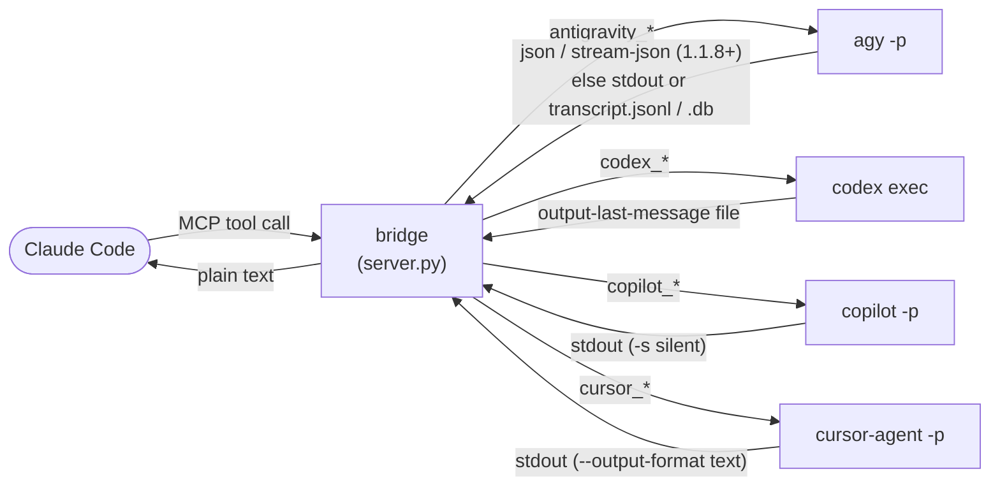
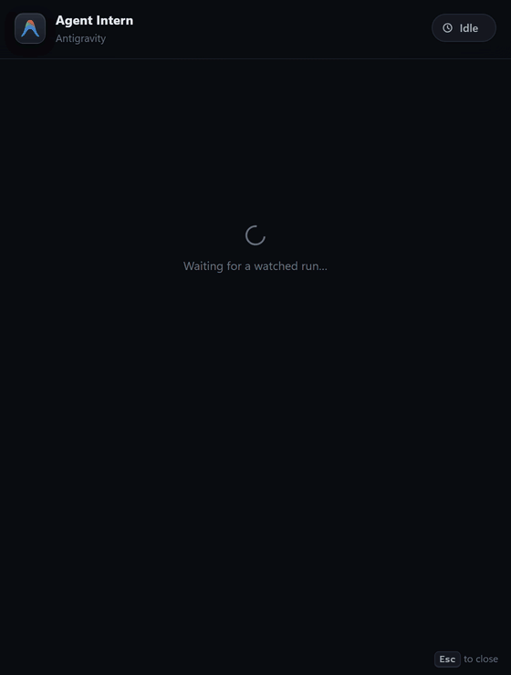
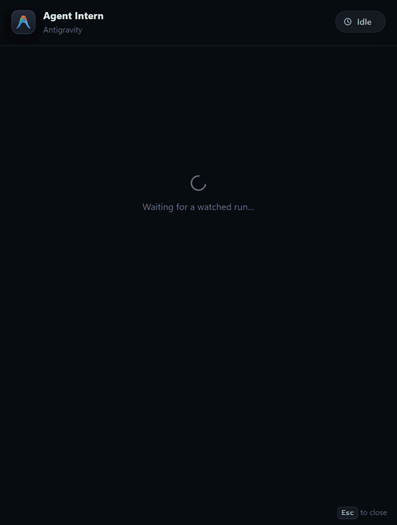
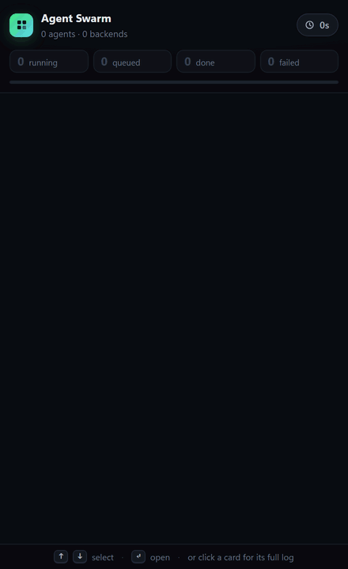

<div align="center">

# Claude Code × Antigravity + Codex + Copilot + Cursor + opencode + Grok + Kimi — MCP Bridge



**Drive seven external coding CLIs — Google's [Antigravity](https://antigravity.google/) (Gemini 3.8 Flash), [OpenAI Codex](https://developers.openai.com/codex/), the [GitHub Copilot CLI](https://docs.github.com/en/copilot/how-tos/copilot-cli), [Cursor](https://cursor.com/cli), [opencode](https://opencode.ai/), and the two experimental newcomers [Grok Build](https://docs.x.ai/build/overview) and [Kimi Code](https://github.com/MoonshotAI/kimi-code) — as sub-agents inside [Claude Code](https://claude.com/claude-code). Text answers, image generation, real repo work, and parallel swarms, on quota you already pay for — or, with opencode's free models, on no quota at all.**

[](https://github.com/SinanTufekci/agent-intern/actions/workflows/ci.yml)
[](https://pypi.org/project/agent-intern/)
[](https://pepy.tech/projects/agent-intern)
[](LICENSE)
[](https://www.python.org/)
[](https://modelcontextprotocol.io/)
[](https://glama.ai/mcp/servers/SinanTufekci/agent-intern)
[](https://antigravity.google/)
[](https://developers.openai.com/codex/)
[](https://docs.github.com/en/copilot/how-tos/copilot-cli)
[](https://cursor.com/cli)
[](https://opencode.ai/)
[](#experimental-backends)
[](#experimental-backends)
[](#requirements)
[](https://github.com/sponsors/SinanTufekci)

</div>

---

One MCP server, **seven backends** — five verified, two experimental. It exposes Google Antigravity,
OpenAI Codex, the GitHub Copilot CLI, Cursor, opencode, and xAI's Grok Build and Moonshot's Kimi Code
to Claude Code as clean MCP tools so you can delegate work to a different model family mid-task —
without leaving your terminal, and on the subscriptions you already have. Each backend is
independent: install one, or all seven. **opencode needs no subscription at all** — its free hosted
models answer with zero credentials, so it is the one backend you can try on a machine that has never
logged in to anything.

- **🛰️ Antigravity (`agy`, Gemini 3.8 Flash High).** Fast, cheap tool-calling — and the **only**
  backend with an image model. Its headless print mode (`agy -p`) historically had a **stdout bug**:
  it wrote the answer to the *controlling terminal* instead of its stdout, so anything capturing
  stdout got nothing (and, under a TUI, agy's text leaked into the host's prompt). **agy 1.0.15 fixed
  this on Windows** — `-p` now writes the clean answer to stdout — so the bridge **prefers stdout** and
  falls back to reading agy's *own* transcript files only when stdout is empty (older agy, non-Windows,
  or `--sandbox` runs). It still **detaches agy from the terminal** so older versions can't leak.
- **🤖 Codex (`codex exec`, OpenAI).** A strong reasoner for real code/repo work. It writes its final
  message straight to a file the bridge asks for (no scraping), supports **model selection**, and has
  a **real, enforced sandbox**.
- **🐙 Copilot (`copilot -p`, GitHub).** GitHub's agentic coder. Stdout-native like Codex (`-s`
  prints just the answer), with **model selection** (`--model`), a **best-effort** tool/path
  permission knob, and a deterministic resume mechanism (the bridge sets each session's UUID itself).
- **✳️ Cursor (`cursor-agent -p`, Cursor).** Cursor's agentic coder, with the **widest model menu** —
  GPT, Claude, Grok, and Composer via `--model` (validated against `cursor-agent models`). Stdout-native
  like Codex/Copilot (`--output-format text` prints just the answer), an **agent-enforced** sandbox
  (read-only via `--mode ask`), and a deterministic resume mechanism (the bridge mints each chat's id
  itself via `create-chat`). No image model.
- **🧩 opencode (`opencode run`, SST).** The one backend with **no subscription requirement**: its
  own `opencode/*-free` models answer with **zero credentials configured** (add a key for
  Claude/GPT-class models). Stdout-native (`--format json` NDJSON events, which double as the watch
  stream), with `-s` resume off the session id every event carries. Its `sandbox` is an
  **`OPENCODE_PERMISSION` policy** that opencode merges *last*, so it overrides even the agent's own
  rules — agent-enforced rather than an OS jail, but it behaves identically on Windows, macOS and
  Linux. In headless mode a permission that would prompt is **auto-rejected**, never hung. No image
  model. ⚠️ The free models are slow — a one-word answer took **152–260 s** in testing.
- **🧪 Grok Build (`grok -p`, xAI) — EXPERIMENTAL.** xAI's terminal coding agent, and the only backend
  besides Codex with a **real OS sandbox** — though only on Linux/macOS. Stdout-native
  (`--output-format json` returns the answer *and* the session id), with `-r` resume, `streaming-json`
  for watch mode, and full swarm support. **Never verified end-to-end** — see below.
- **🌙 Kimi Code (`kimi -p`, Moonshot) — EXPERIMENTAL.** Moonshot's terminal coding agent (Kimi K2
  family). Stdout-native (`--output-format text`), resumes per working directory (`-c`). **No sandbox** —
  print mode auto-executes every tool, like Antigravity. **Never verified end-to-end** — see below.

They share the same niceties: a `*_continue` to resume a thread, a [live "watch" window](#watch-mode)
to see the agent work, a unified [`agent_swarm`](#swarm) that runs many tasks in parallel **across
all backends at once**, and `*_status` diagnostics that spend no quota. (Kimi is the one exception:
no watch or swarm support yet — see [Experimental backends](#experimental-backends).)

> [!IMPORTANT]
> **Grok Build and Kimi Code ship unverified, and I need your help.** I don't have a Grok or Kimi
> subscription, so no authenticated round-trip has ever run against either backend. Everything up to
> each CLI's auth wall *is* verified live — flag surface, error shapes, model list, on-disk layout —
> but everything behind it comes from vendor docs and could be wrong. If you have either
> subscription, **[one issue from the verification template](https://github.com/SinanTufekci/agent-intern/issues/new?template=backend_verification.yml)
> is the single most useful contribution you can make.** Even confirming one checkbox helps.
> [Full detail →](#experimental-backends)

> [!WARNING]
> **This runs unsandboxed code with your privileges.** `agy -p` auto-executes its tools
> (read/write files, run shell commands, reach the network) with **no usable approval gate** — its
> `--sandbox` blocks only *shell commands*, leaving file writes and network egress wide open.
> `codex exec` also runs autonomously, but its `sandbox` flag (default `read-only`) **is** a real,
> enforced boundary. `copilot -p` runs headless with `--allow-all-tools`; its `sandbox` maps to
> **best-effort** tool/path permissions (read-only denies the local write/shell tools) — safer than
> agy, but **not** an OS sandbox like Codex's. `cursor-agent -p` runs headless with `--trust` (and
> `--force` for writes); its `sandbox` is **agent-enforced** (read-only = `--mode ask`, which makes the
> write/shell tools unavailable) — best-effort like Copilot, **not** an OS sandbox. `grok -p` runs
> headless with `--always-approve`; its `sandbox` maps to a **real OS profile (Landlock/Seatbelt)** —
> but **only on Linux and macOS**, and on Windows grok silently continues *without enforcement*, so
> read-only there rests on an agent-enforced tool allowlist. `opencode run` maps its `sandbox` to an
> **`OPENCODE_PERMISSION` policy** — agent-enforced like Copilot's and Cursor's, but the *same on
> every platform*, and a rule that would prompt is auto-rejected rather than left hanging. `kimi -p`
> has **no sandbox at all** and auto-executes every tool, like agy. In all seven cases
> the `workspace` argument is a *starting context*, **not** a security boundary. Only use these with **trusted prompts on trusted
> content**; for real isolation, run the bridge inside a container or VM. **[Full details →](#security)**

## Why you'd want this

| | |
|---|---|
| 🧠 **Second opinion** | Ask a different model family — Gemini *or* GPT — mid-task without switching tools. |
| 🎨 **Image generation** | Have Gemini draw an image and get the saved file back — no extra API key or image tool. |
| 🛠️ **Real coding sub-agent** | Hand a focused repo task to Codex with a real `workspace-write` sandbox. |
| 💸 **Cheap delegation** | Burn Antigravity / Codex quota on grunt work instead of Claude tokens. |
| 🐝 **Parallel fan-out** | Run N tasks at once, mixing Gemini and Codex workers in a single swarm. |
| 📁 **Cross-repo reads** | Point a worker at another project directory and let it read/answer there. |
| 🔌 **Zero new auth** | Piggybacks the logins you already did — no keys for the bridge to manage. |
| 🆓 **No subscription needed** | opencode's free `opencode/*` models answer with **zero credentials** — a backend that works before you pay for anything. |

## The backends at a glance

The bridge normalizes every CLI into the same shape, but they differ where it matters. Pick per task.
The five verified backends first; the [two experimental ones](#experimental-backends) follow.

| | 🛰️ **Antigravity** (`agy`) | 🤖 **Codex** (`codex exec`) | 🐙 **Copilot** (`copilot -p`) | ✳️ **Cursor** (`cursor-agent -p`) | 🧩 **opencode** (`opencode run`) |
|---|---|---|---|---|---|
| **Model** | Selectable via `model` (agy's `--model`); Gemini 3.8 Flash (High) default (see [Model & auth](#model--auth)) | Selectable via `model` (codex's `-m`) | Selectable via `model` (`--model`) | Selectable via `model` (`--model`), validated against `cursor-agent models` | Selectable via `model` (`-m`, `"provider/model"`), validated against `opencode models`; **free `opencode/*` ids need no account** |
| **Best at** | Fast, cheap tool-calling; quick answers | Heavier reasoning; real code/repo work | Agentic coding; real code/repo work | Agentic coding; wide model menu (GPT/Claude/Grok/Composer) | Working with **no subscription**; any provider you do have. Free models are slow (**152–260 s** measured) |
| **Image generation** | ✅ `antigravity_image` (+ `antigravity_image_swarm`) | ❌ no image model | ❌ no image model | ❌ no image model | ❌ no image model |
| **Sandbox** | ❌ no real boundary (`--sandbox` blocks only shell); ⚠️ opt-in `plan=True` blocks writes/shell, agent-enforced | ✅ real, enforced: `read-only` / `workspace-write` / `danger-full-access` | ⚠️ best-effort: tool/path permissions (`read-only` denies write/shell) — **not** an OS sandbox | ⚠️ agent-enforced: mode/force (`read-only` = `--mode ask`, write/shell tools unavailable) — **not** an OS sandbox | ⚠️ agent-enforced: an `OPENCODE_PERMISSION` policy that wins over the agent's own rules; **identical on every OS**; a would-be prompt is auto-rejected — **not** an OS sandbox |
| **How the answer is read** | `--output-format json` on agy 1.1.8+ (`stream-json` when watching); else stdout, else scraped from `transcript.jsonl` | Written to a file via `-o/--output-last-message` | stdout (`-s` silent mode) | stdout (`--output-format text`) | `--format json` NDJSON events (the same stream watch mode renders) |
| **Continue mechanism** | Pins the workspace's conversation id (`--conversation`) | Resumes the session id (`codex exec resume <id>`) | Resumes a self-set session UUID (`--session-id`) | Mints a chat id (`create-chat`) and resumes it (`--resume <id>`) | Pins the session id every event carries and resumes it (`-s <id>`); falls back to opencode's per-directory `-c` |
| **Auth** | OS credential store (AI Pro session) | `codex login` (ChatGPT account or API key) | OS credential store (`copilot login`) or a GitHub token env | `cursor-agent login` (OS credential store) or `CURSOR_API_KEY` | **None required** — free `opencode/*` models answer with 0 credentials; `opencode auth login` (or a provider env var) unlocks the rest |
| **In a swarm** | Runs with an isolated `HOME` to avoid state races | Fresh one-shot — needs no isolation | Fresh one-shot — needs no isolation | Fresh one-shot — needs no isolation | Fresh one-shot — needs no isolation |

<a id="experimental-backends"></a>

## 🧪 The two experimental backends — and how you can help

**Grok Build** and **Kimi Code** are wired in exactly like the other four, with one honest difference:
**no authenticated round-trip has ever run against either.** I don't have a SuperGrok / X Premium+
subscription or a Kimi plan, so I cannot prove they answer. They ship anyway because a bridge nobody
can install is a bridge nobody can verify — and because the parts that usually rot are already pinned
down.

**What *is* verified live** (each CLI installed, run, and observed — just never logged in):

| | 🧪 **Grok Build** (`grok -p`) | 🌙 **Kimi Code** (`kimi -p`) |
|---|---|---|
| **Verified against** | grok 1.0.3 / Windows | kimi 0.29.1 / Windows |
| **Flag surface** | ✅ read off the **open-source clap definitions** ([xai-org/grok-build](https://github.com/xai-org/grok-build)), then confirmed against live `grok --help`. Every argv the bridge can build was executed and **parses cleanly** | ✅ confirmed against live `kimi --help`; also that `-p` *rejects* `--auto`/`--yolo` (print mode already self-approves, so the bridge passes neither) |
| **Auth failure mode** | ✅ exit 1 + `{"type":"error","message":"Not signed in. …"}` on stdout; no browser, no hang | ✅ exit 1 + stderr `No model configured` |
| **Model list** | ✅ `grok models` answers *while logged out* — so auth checks and model validation cost nothing. Live default is **`grok-4.5`**, not the `grok-build` xAI's own docs still print | ⚠️ none — Kimi has no `models` command; aliases are user-defined in `config.toml`, so `model` is a lenient pass-through |
| **On-disk layout** | ✅ `~/.grok/` (`config.toml`, `auth.json`, `sessions/`, `logs/`); `GROK_HOME` really relocates it | ✅ `~/.kimi-code/` (`config.toml`, `device_id`, `logs/`) |
| **Concurrency** | ✅ parallel `grok -p` runs don't deadlock on `~/.grok`'s lock files | ❔ untested |

**What is NOT verified** — everything behind the auth wall:

- the happy-path answer itself: Grok's `json` envelope (`text` / `sessionId`) and Kimi's stdout answer;
- that `-r` / `-c` really restore context;
- Grok's `streaming-json` event stream, which watch mode renders;
- whether Grok's sandbox profiles behave as documented (and note: **auth is checked before `--sandbox`
  and `-m` are validated**, so a bad value can't even be observed while logged out — which is why the
  bridge validates both client-side).

> [!NOTE]
> **Deliberately scoped out for Kimi:** `agent_swarm` and watch support. Both would depend on Kimi's
> `stream-json` envelope, and adding an unverified dependency on top of an unverified backend is how
> you get two bugs that mask each other. Grok gets both, because its stream format is documented in
> detail *and* its error events were observed live.

### How to help

If you have either subscription, please **[open a verification issue](https://github.com/SinanTufekci/agent-intern/issues/new?template=backend_verification.yml)**.
The template is a checklist — tick only what you actually saw. The first box (*"a fresh ask returned a
real answer"*) is worth more than all the others combined, and takes about a minute:

```bash
# 1. Does the setup look right? (spends no quota)
#    -> call grok_status / kimi_status from Claude Code
# 2. Does it answer?
#    -> call grok_ask("say hi") / kimi_ask("say hi")
# 3. If it fails, does the raw CLI fail the same way?
grok -p "say hi" --output-format json
kimi -p "say hi" --output-format text
```

That last command is the one I can't run from here, and it's what separates *"the bridge is wrong"*
from *"the CLI changed"*. Partial reports are welcome; so is a plain "it didn't work, here's the error".

## How it works

All seven backends run **headless** and one-shot per call; the bridge's job is to get a clean answer
out of each and hand it to Claude Code as a plain string.


```mermaid
flowchart LR
    A([Claude Code]) -- "MCP tool call" --> B["bridge<br/>(server.py)"]
    B -- "antigravity_*" --> C[agy -p]
    B -- "codex_*" --> D[codex exec]
    B -- "copilot_*" --> E[copilot -p]
    B -- "cursor_*" --> F[cursor-agent -p]
    C -- "json / stream-json (1.1.8+)<br/>else stdout or transcript.jsonl / .db" --> B
    D -- "output-last-message file" --> B
    E -- "stdout (-s silent)" --> B
    F -- "stdout (--output-format text)" --> B
    B -- "plain text" --> A
```

**Antigravity.** On agy **1.1.8+** the bridge asks for structured output and reads a contractual
field instead of guessing: plain calls use `--output-format json` and return its `response`, while
[watch mode](#watch-mode) uses `--output-format stream-json` and rebuilds the answer from the stream's
terminal `result` event (the same shape the [Cursor bridge](#cursor) already used). Both also carry a
`conversation_id`, which the bridge records so `antigravity_continue` pins **exactly** the thread it
last ran in that workspace.

Older agy has no such flag, so the original path stays: on **1.0.15+** (Windows) `agy -p` writes its
clean answer to stdout and the bridge returns that; on older agy — or non-Windows, or a `--sandbox`
run — stdout is empty and the bridge falls back to agy's own transcript at:

```
~/.gemini/antigravity-cli/brain/<conv-id>/.system_generated/logs/transcript.jsonl
```

For that fallback it locates the conversation via `cache/last_conversations.json` (falling back to the
newest `brain/` directory touched since launch), streams the transcript, and returns the final
`source=MODEL, status=DONE, type=PLANNER_RESPONSE` entry — the answer, minus the intermediate
tool-calling steps (or the SQLite `.db` agy dual-writes, when no JSONL exists). This fallback still
runs on 1.1.8+ whenever a run yields no `result`, so nothing depends on the structured path alone.

**Codex.** `codex exec` is well-behaved: the bridge passes `-o/--output-last-message <file>` and
codex writes its final message straight there — no scraping. Continue works by capturing the session
id from codex's own rollout files (`~/.codex/sessions/.../rollout-*.jsonl`) and resuming with
`codex exec resume <id>`, falling back to the newest on-disk session for that cwd after a server
restart.

**Copilot.** `copilot -p "<prompt>" -s` runs a prompt non-interactively and prints the clean final
answer to stdout — the bridge reads it there, no scraping. It runs headless with `--allow-all-tools
--no-ask-user --no-auto-update` (so it never blocks on a prompt), and disables copilot's flaky
builtin GitHub-API MCP by default for predictable latency (`COPILOT_GITHUB_MCP=1` re-enables it).
Continue is **deterministic**: copilot's `--session-id <uuid>` both *sets* a new session's id and
*resumes* an existing one, so the bridge generates the UUID itself, pins it to the workspace, and
resumes that exact session — falling back after a restart to the newest on-disk session
(`~/.copilot/session-state/<id>/workspace.yaml`) whose recorded `cwd` matches.

**Cursor.** `cursor-agent -p --output-format text --trust "<prompt>"` runs a prompt non-interactively
and writes the clean final answer straight to stdout — the bridge reads it there, no scraping
(`--trust` trusts the workspace so it never blocks on a prompt). Continue is **deterministic and
race-free**: `cursor-agent create-chat` mints a fresh chat and prints its id, so the bridge mints the
id itself, pins it to the workspace, and resumes that exact chat with `-p --resume <chatId>` — no
rollout-scraping. After a restart it falls back to the newest on-disk chat under
`~/.cursor/chats/<md5(workspace)>/<chat-id>/` whose `meta.json` `cwd` matches (the chat-dir hash is
itself md5 of the workspace path).

## Set up in 60 seconds

**Prerequisites — install whichever backend(s) you want, and sign in once each:**

- **Antigravity:** install `agy` and sign in to Antigravity once (via the IDE or `agy -i`).
- **Codex:** install `codex` and run `codex login` once (ChatGPT account or API key).
- **Copilot:** install `copilot` (`npm i -g @github/copilot`, or `winget install GitHub.Copilot`)
  and run `copilot` then `/login` once (or set a `COPILOT_GITHUB_TOKEN`/`GH_TOKEN` env var).
- **Cursor:** install `cursor-agent` (`curl https://cursor.com/install -fsSL | bash`) and run
  `cursor-agent login` once (or set a `CURSOR_API_KEY` env var).
- **opencode:** install `opencode` (`npm i -g opencode-ai`). **That's it** — its free `opencode/*`
  models answer with no account. Run `opencode auth login` only if you want to point it at your own
  Anthropic/OpenAI/… key.

You don't need all seven — the tools for a missing CLI simply report "not found" via their `*_status`
tool. If you have no subscriptions at all, start with opencode.

### Recommended — no clone, you control updates

With [`uv`](https://docs.astral.sh/uv/) installed, register the bridge straight from
[PyPI](https://pypi.org/project/agent-intern/) under `mcpServers` in `~/.claude.json` — no
path to hardcode, no `git pull` to remember:

```json
"agent-intern": {
  "command": "uvx",
  "args": ["agent-intern"]
}
```

uvx pins to the version it first caches and does **not** auto-upgrade, so you never run an update you
didn't choose — important, since the bridge runs [unsandboxed code](#security): a surprise (or
compromised) release can't execute until you opt in. You still get told when there's something to
opt into: any `*_status` call reports whether a newer release is out, and Claude is instructed to
pass that on when it sees it. (There's a startup check too, but it writes to stderr — that only
reaches your MCP logs, not you.) Upgrade deliberately and restart Claude Code:

```bash
uvx agent-intern@latest      # fetch + run the newest release (refreshes uv's cache)
```

> [!TIP]
> Prefer hands-off auto-updates? Put `"args": ["agent-intern@latest"]` in the config instead —
> every launch runs the newest release. Convenient, but it pulls new code without asking each time.

### From source

Clone it instead if you want to hack on the bridge or pin a local copy:

```bash
git clone https://github.com/SinanTufekci/agent-intern.git
cd agent-intern
pip install fastmcp
python test_smoke.py        # 4 real round-trips (ask, continue, image, swarm) — prints four PASS lines
```

> [!NOTE]
> The smoke test costs a tiny bit of quota and takes ~30–60 s. It exercises the Antigravity path.

Then point Claude Code at the absolute path to `server.py` under `mcpServers` in `~/.claude.json`:

<table>
<tr><th>Windows</th><th>macOS / Linux</th></tr>
<tr><td>

```json
"agent-intern": {
  "command": "python",
  "args": ["C:\\path\\to\\server.py"]
}
```

</td><td>

```json
"agent-intern": {
  "command": "python3",
  "args": ["/path/to/server.py"]
}
```

</td></tr>
</table>

Restart Claude Code. **Twenty-one tools** appear, each prefixed `mcp__agent-intern__`:

- **Antigravity (5):** `antigravity_ask`, `antigravity_continue`, `antigravity_image`,
  `antigravity_image_swarm`, `antigravity_status`
- **Codex (3):** `codex_ask`, `codex_continue`, `codex_status`
- **Copilot (3):** `copilot_ask`, `copilot_continue`, `copilot_status`
- **Cursor (3):** `cursor_ask`, `cursor_continue`, `cursor_status`
- **Grok (3, experimental):** `grok_ask`, `grok_continue`, `grok_status`
- **Kimi (3, experimental):** `kimi_ask`, `kimi_continue`, `kimi_status`
- **Shared (1):** `agent_swarm` — fans a list of tasks out across **five** backends in one run
  (everything but Kimi)

The single-prompt tools — Antigravity, Codex, Copilot, Cursor, **and** Grok — take a **`watch=true`**
flag for the live browser view ([Watch mode](#watch-mode)). Kimi has no watch mode yet.

> [!NOTE]
> **Your client learns how to use the bridge on its own.** The server ships MCP *instructions* — a
> short routing guide (when to reach for each tool, which backend to pick, and to pass `workspace` so
> the sub-agent has repo context) that a client like Claude Code injects into the model's context on
> connect, as an "MCP Server Instructions" block. So the host model knows how and when to drive these
> tools without you explaining them — you can just ask for the result.

> *"Use antigravity_ask to summarize the README of this repo in three bullets."* → Claude routes the
> prompt through the bridge, agy reads the file under the workspace root, and the answer comes back
> as a plain string. Swap in `codex_ask`, `copilot_ask`, or `cursor_ask` to have GPT, Copilot, or Cursor
do the same.

## Tools

### 🛰️ Antigravity

| Tool | Purpose |
|---|---|
| `antigravity_ask(prompt, workspace?, model?, timeout_s?=180, watch?=false, plan?=false, schema?)` | Start a **new** Antigravity conversation. `model` selects the model (agy's `--model`, e.g. `"claude-sonnet-4-6"`); validated against `agy models`, defaults to your `settings.json` model. `watch=true` opens the live browser view ([Watch mode](#watch-mode)). `plan=true` runs agy in **plan mode** — it reads and writes a plan, but does not edit files or run commands ([Security](#security); agy 1.1.12+). `schema` (a JSON Schema) returns the **validated object** as JSON text instead of prose — read the caveat in [Status & caveats](#status--caveats) before using it for a judgment (agy 1.1.8+). |
| `antigravity_continue(prompt, workspace?, model?, timeout_s?=180, watch?=false, plan?=false, schema?)` | Continue the conversation **rooted at `workspace`** (pinned by id). agy's model is per-invocation, so `model` can differ from the original ask — and so are `plan` and `schema`, so a follow-up can be restricted, or shaped, even if the original ask was not. `watch=true` opens the live view. |
| `antigravity_image(prompt, output_path?, workspace?, timeout_s?=240, watch?=false)` | Generate an image; saves the file (extension corrected to the real bytes) and returns its path + format/size. `watch=true` streams progress and **shows the image** inline. |
| `antigravity_image_swarm(prompts, output_paths?, workspaces?, max_concurrency?=4, timeout_s?=240, watch?=false)` | Generate **several images in parallel** (one worker per prompt). |
| `antigravity_status()` | Setup diagnostics: **the bridge's own version + whether a newer release is available**, **remaining AI Pro quota per model family** (agy 1.1.11+), plus agy version/compat, state dirs, and newest-transcript readability. Spends no quota. |

### 🤖 Codex

| Tool | Purpose |
|---|---|
| `codex_ask(prompt, workspace?, sandbox?="read-only", model?, timeout_s?=180, watch?=false)` | Start a **new** Codex session. `sandbox` is a **real** boundary (see [Codex bridge](#codex-bridge)); `model` selects the model (`-m`). `watch=true` opens the live view, streaming codex's steps from its `--json` event stream. |
| `codex_continue(prompt, workspace?, timeout_s?=180, watch?=false)` | Continue the Codex session **rooted at `workspace`** — resumes the exact session id, falling back to the newest on-disk session for that cwd after a server restart. The resumed session keeps its original sandbox and model. `watch=true` opens the live view. |
| `codex_status()` | Setup diagnostics: codex version, login status (`codex login status`), sessions dir. Spends no quota. |

### 🐙 Copilot

| Tool | Purpose |
|---|---|
| `copilot_ask(prompt, workspace?, sandbox?="read-only", model?, timeout_s?=180, watch?=false)` | Start a **new** Copilot session. `sandbox` maps to copilot's tool/path permissions (**best-effort**, not an OS sandbox — see [Copilot bridge](#copilot-bridge)); `model` selects the model (`--model`). `watch=true` opens the live view, streaming copilot's steps from its `--output-format json` event stream. |
| `copilot_continue(prompt, workspace?, sandbox?="read-only", timeout_s?=180, watch?=false)` | Continue the Copilot session **rooted at `workspace`** — resumes the exact self-set session id, falling back to the newest on-disk session for that cwd after a restart. Unlike Codex, `sandbox` applies here too (copilot re-applies permissions each turn). `watch=true` opens the live view. |
| `copilot_status()` | Setup diagnostics: copilot version, an auth hint (no `login status` command exists, so best-effort), session-state dir. Spends no quota. |

### ✳️ Cursor

| Tool | Purpose |
|---|---|
| `cursor_ask(prompt, workspace?, sandbox?="read-only", model?, timeout_s?=180, watch?=false)` | Start a **new** Cursor chat. `sandbox` maps to cursor's mode/force flags (**agent-enforced**, not an OS sandbox — see [Cursor bridge](#cursor-bridge)); `model` selects the model (`--model`, validated against `cursor-agent models`). `watch=true` opens the live view, streaming cursor's steps from its `--output-format stream-json` event stream. |
| `cursor_continue(prompt, workspace?, sandbox?="read-only", timeout_s?=180, watch?=false)` | Continue the Cursor chat **rooted at `workspace`** — resumes the exact chat id the bridge minted (`create-chat` + `--resume`), falling back to the newest on-disk chat for that cwd after a restart. `watch=true` opens the live view. |
| `cursor_status()` | Setup diagnostics: **the bridge's own version + whether a newer release is available**, plus cursor version and login status (`cursor-agent status`). Spends no quota. |

### 🧩 opencode

| Tool | Purpose |
|---|---|
| `opencode_ask(prompt, workspace?, sandbox?="read-only", model?, timeout_s?=300, watch?=false)` | Start a **new** opencode session. `sandbox` maps to an `OPENCODE_PERMISSION` policy (**agent-enforced**, but the same on every OS — see [opencode bridge](#opencode-bridge)); `model` selects the model (`-m`, `"provider/model"`, validated against `opencode models`). `watch=true` opens the live view, streaming opencode's steps from its `--format json` event stream. Note the **300 s** default timeout — the free models are slow. |
| `opencode_continue(prompt, workspace?, sandbox?="read-only", timeout_s?=300, watch?=false)` | Continue the opencode session **rooted at `workspace`** — resumes the exact session id (`-s`), falling back to opencode's own "most recent session for this directory" (`-c`) after a restart. Sessions really are per directory, so pass the same `workspace` you asked in. `sandbox` applies here too. `watch=true` opens the live view. |
| `opencode_status()` | Setup diagnostics: **the bridge's own version + whether a newer release is available**, plus opencode version, how many provider credentials are configured (0 is fine — the free models still answer), the model list, and the data dir. Spends no quota. |

### 🧪 Grok Build *(experimental — [unverified](#experimental-backends))*

| Tool | Purpose |
|---|---|
| `grok_ask(prompt, workspace?, sandbox?="read-only", model?, timeout_s?=180, watch?=false)` | Start a **new** Grok session. `sandbox` maps to grok's `--sandbox` profile plus a tool allowlist — a **real OS boundary on Linux/macOS only** (see [Grok bridge](#grok-bridge)); `model` selects the model (`-m`, validated against `grok models`). `watch=true` opens the live view, streaming grok's steps from its `--output-format streaming-json` event stream. |
| `grok_continue(prompt, workspace?, sandbox?="read-only", timeout_s?=180, watch?=false)` | Continue the Grok session **rooted at `workspace`** — resumes the exact session id grok returned (`-r`), falling back to grok's own "most recent session for this cwd" (`-c`) after a restart. `sandbox` applies here too. `watch=true` opens the live view. |
| `grok_status()` | Setup diagnostics: **the bridge's own version + whether a newer release is available**, plus grok version, auth state, and the model list — the last two both from `grok models`, which answers even while logged out. Spends no quota. |

### 🌙 Kimi Code *(experimental — [unverified](#experimental-backends))*

| Tool | Purpose |
|---|---|
| `kimi_ask(prompt, workspace?, model?, timeout_s?=180)` | Start a **new** Kimi session. **No `sandbox` argument** — Kimi print mode has no sandbox and auto-executes every tool. `model` is a lenient pass-through (`-m`, an alias from your `config.toml`); Kimi has no model list to validate against. No watch mode. |
| `kimi_continue(prompt, workspace?, timeout_s?=180)` | Continue the Kimi session **rooted at `workspace`** (`-c`). Kimi scopes sessions per working directory, so there's no id to track — and no restart problem either. |
| `kimi_status()` | Setup diagnostics: bridge version + update check, kimi version, whether a provider is configured (`kimi provider list` — the auth proxy), and the data dir. Spends no quota. |

### 🐝 Shared

| Tool | Purpose |
|---|---|
| `agent_swarm(tasks, max_concurrency?=4, timeout_s?=180, watch?=false)` | Run **several tasks in parallel across six backends** — each task names its `backend` (`antigravity`, `codex`, `copilot`, `cursor`, `opencode`, or `grok`) plus a `prompt` (an optional `model` and `sandbox` for any backend — on Antigravity `sandbox: "read-only"` means **plan mode**). Every answer comes back in one block; `watch=true` opens the live dashboard ([Swarm](#swarm)). Kimi is not available here — see [Experimental backends](#experimental-backends). |

`workspace` defaults to the MCP server's current working directory. Point it at a real project dir
for context-aware answers — every backend gives the model access to files under that root (Codex,
Copilot, Cursor, and opencode honoring their `sandbox`).

**`sandbox` now applies to Antigravity too.** It used to be silently ignored there, so an agy task
written as `{"backend": "agy", "sandbox": "read-only"}` ran completely unrestricted while reading as
though it were fenced. `"read-only"` maps to agy's plan mode, `"danger-full-access"` says plainly
that the worker is unrestricted, and `"workspace-write"` is **refused** — agy has no write scoping to
offer, and accepting it would promise a fence that doesn't exist. **Omitting `sandbox` leaves an
Antigravity worker unrestricted**, unlike every other backend, whose default is `read-only`: that
long-standing default is left alone so existing file-writing swarms keep working, so fence agy
explicitly when you want it fenced.

`antigravity_image` forces agy to save to an explicit absolute path — without one, agy
falls back to its own scratch dir (`~/.gemini/antigravity-cli/scratch/`). It then
corrects the file extension to match the real bytes: agy's image model picks the
format itself (JPEG for photo-like images, PNG for flat graphics), so a requested
`out.png` may come back as `out.jpg`. The returned path always reflects the true
format.

<a id="codex-bridge"></a>

## 🤖 Codex bridge — the well-behaved sibling

`codex exec` writes its final message to a file the bridge asks for via `-o/--output-last-message`,
so the answer comes back without any scraping (where agy needed a transcript workaround before 1.0.15
fixed its stdout). Three things make Codex worth reaching for over Antigravity:

- **Real sandbox.** `sandbox` accepts `read-only` (default — reads and answers, writes nothing),
  `workspace-write` (may edit files under the workspace), or `danger-full-access` (no sandbox —
  avoid). Unlike agy's no-op `--sandbox`, codex's `-s` actually enforces this. `codex exec` has no
  interactive approval gate, so this flag **is** your safety boundary — opt into write access
  deliberately.
- **Model selection works.** `model` maps to codex's `-m`. (agy's `--model` works in print mode too
  as of 1.0.16; every backend now exposes the same `model` knob, except Kimi, which has no list to
  validate against.)
- **Stronger reasoning.** Codex is a coding agent, not an image model — there's no `codex_image`. Its
  strength is reasoning and real code/repo work; hand it the jobs that need a heavier model.

**Auth.** Uses your existing Codex login (ChatGPT account or API key). Run `codex login` once; check
with `codex_status`. No new keys for the bridge to manage.

> [!WARNING]
> `codex exec` runs the model as an **autonomous agent with no interactive approval gate**. The
> `sandbox` flag (default `read-only`) is the real boundary, but `workspace-write` /
> `danger-full-access` let it modify files — and a swarm runs N agents at once. Only use it with
> **trusted prompts on trusted content**.

<a id="copilot-bridge"></a>

## 🐙 Copilot bridge — GitHub's agentic coder

The GitHub Copilot CLI (`copilot`, from `@github/copilot`) is stdout-native like Codex:
`copilot -p "<prompt>" -s` runs a prompt non-interactively and prints just the final answer to
stdout, so the bridge reads it there — no scraping. What makes it worth reaching for:

- **Model selection.** `model` maps to copilot's `--model`; `auto` lets Copilot pick. Unlike the agy
  and cursor tools, the bridge **can't validate this** — copilot exposes no non-interactive model
  list — and the working set is **account-dependent**: on a Copilot Pro account here, `auto` worked
  while `gpt-5.3-codex`, `claude-sonnet-4.6`, and even GitHub's own `--help` example `gpt-5.4` were all
  rejected as "not available". So omit `model` (account default) or pass `auto` unless you know your
  plan's ids; an unavailable one errors immediately with copilot's message, costing a call.
- **Deterministic, race-free continue.** copilot's `--session-id <uuid>` both **sets** a new session's
  id and **resumes** an existing one, so the bridge generates the UUID itself and pins it to the
  workspace — no rollout-scraping. After a restart it falls back to the newest on-disk session
  (`~/.copilot/session-state/<id>/workspace.yaml`) whose recorded `cwd` matches.
- **Fast by default.** Runs with `--allow-all-tools --no-ask-user --no-auto-update`, and disables
  copilot's builtin GitHub-API MCP (`--disable-builtin-mcps`) because its flaky HTTP connect can stall
  a call up to ~60 s. Set **`COPILOT_GITHUB_MCP=1`** to keep it (for Copilot's issue/PR/repo tools).

**Sandbox is best-effort, not enforced.** Unlike Codex's OS sandbox, copilot's boundary is
tool/path permissions. The `sandbox` knob maps to copilot flags for a uniform cross-backend field:

- **`read-only`** (default) — auto-approves tools so it runs headless, then **denies** the local
  `write` and `shell` tools (`--deny-tool`). Best-effort: it is **not** an OS sandbox, and network/MCP
  tools can still act. For a **hard** read-only boundary, use `codex_ask` instead.
- **`workspace-write`** — writes allowed, but file access stays confined to the workspace (no
  `--allow-all-paths`).
- **`danger-full-access`** — `--allow-all` (tools + all paths + all URLs). Avoid.

**Auth.** Uses your existing Copilot login — run `copilot` then `/login` once (stored in the OS
credential store), or set `COPILOT_GITHUB_TOKEN`/`GH_TOKEN`/`GITHUB_TOKEN` for headless use. Check
with `copilot_status`. If `copilot` isn't on `PATH` (the winget install can land off a stale `PATH`),
set **`COPILOT_BIN`** to its full path — e.g.
`%LOCALAPPDATA%\Microsoft\WinGet\Packages\GitHub.Copilot_*\copilot.exe`.

> [!WARNING]
> `copilot -p` runs the model as an **autonomous agent** with `--allow-all-tools` (required to run
> headless). Its `sandbox` is **best-effort tool/path permissions**, not an OS sandbox — safer than
> agy, weaker than Codex's `read-only`. Only use it with **trusted prompts on trusted content**.

<a id="cursor-bridge"></a>

## ✳️ Cursor bridge — the widest model menu

Cursor's agent CLI (`cursor-agent`, from [cursor.com/cli](https://cursor.com/cli)) is stdout-native
like Codex and Copilot: `cursor-agent -p --output-format text --trust "<prompt>"` runs a prompt
non-interactively and writes just the final answer to stdout, so the bridge reads it there — no
scraping (`--trust` trusts the workspace so it won't block on a prompt). What makes it worth reaching
for:

- **The widest model menu.** `model` maps to cursor's `--model` (e.g. `auto`, `gpt-5.2`,
  `claude-opus-4-8-high`, `composer-2.5`, `cursor-grok-4.5-high`) — GPT, Claude, Grok, and Composer in
  one place, ~190 ids at the time of writing. cursor bakes the **effort and speed axes into the id**
  (`…-low` / `-high` / `-xhigh` / `-max`, each with a `-fast` twin), and also accepts a bracket form on
  the family base, e.g. `claude-opus-4-8[context=1m,effort=high]`. The bridge validates against
  `cursor-agent models` and rejects a typo up front (like agy), accepting either an exact id or a
  family base. Omit `model` to use your Cursor account default. **cursor reshuffles this list often** —
  run `cursor-agent models` (or `cursor_status`) rather than trusting an example here.
- **Deterministic, race-free continue.** `cursor-agent create-chat` mints a fresh chat and prints its
  id, and `-p --resume <chatId>` resumes that exact chat — so the bridge mints the id itself, pins it
  to the workspace, and resumes deterministically (no rollout-scraping, same idea as Copilot's
  self-set session id). After a restart it falls back to the newest on-disk chat under
  `~/.cursor/chats/<md5(workspace)>/<chat-id>/` whose `meta.json` `cwd` matches (the chat-dir hash is
  itself md5 of the workspace path).

**Sandbox is agent-enforced, not an OS sandbox.** Like Copilot, cursor's boundary is which tools the
agent can reach, not an OS jail. The `sandbox` knob maps to cursor's mode/force flags for a uniform
cross-backend field:

- **`read-only`** (default) — `--mode ask`: the `write` and `shell` tools are **unavailable**, so
  cursor analyzes and answers but makes no edits (verified: it refuses to write files). Agent-enforced
  and best-effort — it is **not** an OS sandbox. For a **hard** read-only boundary, use `codex_ask`
  instead.
- **`workspace-write`** — `--force`: edits and commands allowed, file access rooted at `--workspace`.
- **`danger-full-access`** — `--force --sandbox disabled` (OS sandbox off). Avoid.

(Cursor also exposes an OS-level `--sandbox enabled/disabled`; the bridge drives the uniform field via
mode/force.)

**Auth.** Uses your existing Cursor login — run `cursor-agent login` once (OS credential store), or
set `CURSOR_API_KEY` for headless use. Check with `cursor_status`. If `cursor-agent` isn't reliably on
`PATH` (the installer drops a `cursor-agent.CMD` shim a bare name can't launch on Windows), set
**`CURSOR_BIN`** to its full path — mirrors the `AGY_BIN`/`CODEX_BIN`/`COPILOT_BIN` overrides.

> [!WARNING]
> `cursor-agent -p` runs the model as an **autonomous agent** with `--trust` (and `--force` when
> writes are allowed). Its `sandbox` is **agent-enforced** (read-only makes the write/shell tools
> unavailable), not an OS sandbox — safer than agy, weaker than Codex's `read-only`. Only use it with
> **trusted prompts on trusted content**.

<a id="opencode-bridge"></a>

## 🧩 opencode bridge — the one you can try without a subscription

[opencode](https://opencode.ai/) (SST's open-source terminal coding agent, `npm i -g opencode-ai`) is
stdout-native like Codex/Copilot/Cursor: `opencode run --format json "<prompt>"` runs a prompt
non-interactively and writes **NDJSON events** to stdout. Three things make it worth a slot of its own:

- **It answers with no account.** `opencode models` lists free hosted ids under opencode's own
  provider (`opencode/nemotron-3.5-lightning-free`, `opencode/mimo-v2.5-free`, …) that work with
  **`0 credentials`** configured. Every claim in this section was verified on **opencode 1.18.29 /
  Windows** against those models — this is the first backend here whose *answer path* could be proven
  without a paid plan. Add your own key (`opencode auth login`, or `ANTHROPIC_API_KEY` /
  `OPENAI_API_KEY` …) and the same tools drive Claude- and GPT-class models.
- **One stream serves both modes.** `--format json` is already incremental, so the plain call and the
  [watch view](#watch-mode) run the *identical* argv — there is no second output format to drift out
  of sync (grok needs `streaming-json` for this).
- **Its permission model is a real knob.** See below.

**Reading the answer.** Each line is one event — `{"type": "...", "timestamp": ..., "sessionID": ...}`
— and the bridge concatenates the completed `text` parts. An `{"type":"error"}` event carries
opencode's own message and is surfaced verbatim.

**Continue.** Every event carries the `sessionID`, so the bridge pins it to the workspace and resumes
that exact session with `-s <id>`. If that in-memory pin is gone (server restarted), it falls back to
opencode's own `-c`, which resolves to *the most recent session for the run directory* — verified
live: the same `-c` from a **different** directory starts a fresh session rather than resuming.
A stale id fails loudly (`Error: Session not found`, exit 1) instead of silently starting over.

**Model.** `-m provider/model`, validated against `opencode models` (which answers with no
credentials, so validation is free). This one is worth the up-front check: an unknown id comes back
from opencode as a bare `"Unexpected server error. Check server logs for details."`, which tells you
nothing.

**Sandbox — `OPENCODE_PERMISSION`, not a flag.** opencode's permission set is a config value, and the
bridge sets it per run via the `OPENCODE_PERMISSION` env var. Two facts (read off opencode's own
bundled source, then confirmed by running it) make that a genuine boundary rather than a suggestion:

1. **In headless `run`, a permission that would prompt is auto-rejected** — `if (auto) reply("once")
   else { println("...auto-rejecting"); reply("reject") }`. So "ask" means "deny" here, and the bridge
   can never wedge waiting on a prompt nobody can see.
2. **The config policy is merged *last* into every built-in agent** —
   `permission: merge(defaults, agent_specific, fromConfig(config.permission))` — so the bridge's
   policy overrides the agent's own rules. That matters: opencode's nominally read-only `plan` agent
   still leaves `bash` **allowed**, so `--agent plan` alone would not be a read-only mode.

- **`read-only`** (default) — denies `edit`, `bash`, `task` (no subagent gets a fresh unrestricted
  turn), `external_directory`, `webfetch` and `websearch`; keeps `read`/`glob`/`grep`/`list`, with
  `.env` files denied outright.
- **`workspace-write`** — leaves opencode's own defaults for `edit`/`bash` (already rooted at the run
  directory) and hard-denies `external_directory`, so reaching outside the workspace is *refused*
  rather than merely asked.
- **`danger-full-access`** — opencode's `--auto` ("auto-approve permissions that are not explicitly
  denied (dangerous!)" — their words), no policy at all. Avoid.

**The A/B test that backs this.** The same prompt — *"create written.txt containing HELLO"* — was run
against the same free model in both fenced modes. Under `workspace-write` it answered `DONE` in 428 s
and `written.txt` was there. Under `read-only` it never wrote anything: it spent the entire 630 s
budget retrying tools it had been denied, and the directory was still empty at the end. Same prompt,
same model, opposite outcomes — the policy is doing the work, not the model's goodwill.

⚠️ A malformed `OPENCODE_PERMISSION` is **silently ignored** (opencode logs a debug warning and
carries on with no restrictions), which is exactly the sort of failure that looks like it worked. The
bridge therefore builds the policy as a dict and `json.dumps` it — never by hand — and a test asserts
the round-trip.

**Two footguns this bridge already absorbed.**

- **stdin must be closed.** With a non-TTY stdin, opencode reads it *to EOF* and appends it to the
  prompt (`process.stdin.isTTY ? undefined : await Bun.stdin.text()`). An MCP server's child gets a
  pipe, not a TTY, so anything short of `DEVNULL` hangs forever. Every call passes it.
- **A timeout has to kill the whole tree.** On Windows `opencode` on `PATH` is npm's `opencode.CMD`
  shim, so the real `opencode.exe` is a *grandchild*; killing only the direct child leaves it alive
  holding the stdout pipe. Measured before the fix: a 270 s timeout returned at **396 s**, and only
  because the orphan was killed by hand. The bridge runs the blocking path through `Popen` (never
  `subprocess.run(timeout=…)`, whose Windows branch re-reads that very pipe) and kills the tree with
  `taskkill /T`.

**Slowness is normal.** The free models are queue-scheduled: measured **152 s**, **214 s** and **260 s**
for one-word answers. That is why `timeout_s` defaults to **300** here rather than the usual 180 —
don't mistake a slow free model for a hang, and prefer a configured paid model for real work. One
observed corollary: a weak free model asked under `read-only` to do something that *needs* a write
can spend the **whole** timeout retrying tools it will never be given (it wrote nothing, which is the
point — it just took the full budget to give up). Both fenced modes therefore also deny opencode's
`doom_loop` retry guard, whose default would already be rejected in headless mode, so that a user
config which allowed it can't turn a fenced run into an unbounded loop.

**Auth.** None needed for the free models. `opencode auth login` (also spelled `opencode providers`)
stores credentials in `~/.local/share/opencode/auth.json` — the XDG layout, on Windows too. Set
**`OPENCODE_BIN`** if `opencode` isn't reliably on `PATH`.

> [!WARNING]
> `opencode run` runs the model as an **autonomous agent**. Its `sandbox` is **agent-enforced**, not an
> OS boundary — a tool call is refused by opencode, not by the kernel — but unlike grok's OS sandbox it
> behaves the same on Windows, macOS and Linux. For a hard boundary, use `codex_ask`. Only use it with
> **trusted prompts on trusted content**.

<a id="grok-bridge"></a>

## 🧪 Grok Build bridge — a real sandbox, on two of three platforms

> [!WARNING]
> **EXPERIMENTAL — never verified end-to-end.** Everything below the "Auth" line is confirmed against
> a live grok 1.0.3; the answer path is not. See [Experimental backends](#experimental-backends), and
> please [report what you find](https://github.com/SinanTufekci/agent-intern/issues/new?template=backend_verification.yml).

xAI's [Grok Build](https://docs.x.ai/build/overview) (`grok`, installed with
`curl -fsSL https://x.ai/cli/install.sh | bash`, or `irm https://x.ai/cli/install.ps1 | iex` on
Windows) is stdout-native like Codex/Copilot/Cursor: `grok -p "<prompt>" --output-format json` runs a
prompt non-interactively and writes a single JSON result object to stdout. What makes it interesting:

- **It's open source.** [xai-org/grok-build](https://github.com/xai-org/grok-build) publishes the
  actual CLI source, so this bridge's flag surface was read off the real clap definitions rather than
  inferred from docs — then confirmed against `grok --help`. That's a much stronger footing than a
  docs-derived bridge, and it caught a live discrepancy: xAI's own headless docs use `-m grok-build`
  in their examples, but the real default on 1.0.3 is **`grok-4.5`**.
- **The answer carries its own session id.** `--output-format json` returns
  `{"text": …, "sessionId": …, "usage": …}`, so the bridge pins that id and resumes the exact session
  with `-r <id>` — no id-minting dance like Cursor's, no rollout-scraping like Codex's. After a
  restart it falls back to `-c`, grok's own "most recent session for this cwd", so continue survives
  without ever reading grok's opaque SQLite session store.
- **Free auth + model checks.** `grok models` answers *while logged out* (exit 0, printing
  `You are not authenticated.` and the catalogue), so `grok_status` and model validation cost nothing
  and need no login.

**Sandbox is real — on Linux and macOS.** This is the only backend besides Codex with an OS-enforced
boundary, but read the platform caveat:

- **`read-only`** (default) — `--sandbox read-only` **plus** a `--tools` allowlist
  (`read_file,list_dir,grep,glob,web_search,web_fetch`) **plus** `--no-subagents`.
- **`workspace-write`** — `--sandbox workspace`: writes land in the workspace, `~/.grok`, and temp.
- **`danger-full-access`** — `--sandbox off`. Avoid.

> [!CAUTION]
> **On Windows, grok's OS sandbox does not apply.** It's implemented with Landlock (Linux) and
> Seatbelt (macOS); where it can't be applied, xAI's docs say grok "logs a warning and continues
> **without enforcement**." That's why `read-only` here doesn't lean on the profile alone — the tool
> allowlist is agent-enforced and holds on every platform. An **allowlist**, not a denylist, precisely
> because it fails safe: a future grok that adds a new write tool can't silently slip through it.
> Note that MCP meta-tools stay available under an allowlist, so a configured MCP server could still
> write. For a hard boundary on every platform, use `codex_ask`.

Every mode also passes `--always-approve`: grok's headless mode does **not** auto-approve on its own
(unlike agy and Kimi), and there's no human to answer a prompt. Containment comes from the profile and
the allowlist, not from the approval gate.

**Auth.** `grok login` (browser OAuth), `grok login --device-code` (headless), or an `XAI_API_KEY` env
var; credentials cache in `~/.grok/auth.json`. Needs a **SuperGrok or X Premium+** subscription. Check
with `grok_status`. Set **`GROK_BIN`** to override the executable path — though the bridge already
falls back to the installer's own `~/.grok/bin` when `grok` isn't on `PATH`, which matters because the
installer appends to the user PATH and that never reaches an already-running server process.
`GROK_HOME` relocates the whole data dir. The bridge disables grok's background auto-updater per call
via `GROK_DISABLE_AUTOUPDATER=1` — a CLI that updates itself mid-session has broken this project
before.

<a id="kimi-bridge"></a>

## 🌙 Kimi Code bridge — no sandbox, per-directory sessions

> [!WARNING]
> **EXPERIMENTAL — never verified end-to-end.** See [Experimental backends](#experimental-backends).

Moonshot's [Kimi Code](https://github.com/MoonshotAI/kimi-code) (`kimi`, npm
`@moonshot-ai/kimi-code`) runs the Kimi K2 family. `kimi -p "<prompt>" --output-format text` writes
the clean final answer to stdout.

- **Continue is per-directory.** Kimi scopes sessions to the working directory and exposes
  `-c/--continue`, so the bridge just re-runs with `cwd=workspace` and `-c` — no id to capture, and
  no restart problem. (`-S/--session <id>` exists but is deliberately unused: its on-disk format
  couldn't be verified.)
- **No model validation.** Kimi has no `models` command; aliases are user-defined in
  `~/.kimi-code/config.toml` under `[models."<alias>"]`. `model` is a lenient pass-through, so a bad
  alias surfaces as Kimi's own run-time error.
- **`-p` refuses `--auto` and `--yolo`** (verified live on 0.29.1: *"Cannot combine --prompt with …"*)
  because print mode is already self-approving — so the bridge passes neither.

> [!CAUTION]
> **Kimi has no sandbox and no `sandbox` argument.** Print mode auto-executes every tool call with no
> approval gate — the same posture as agy's print mode. No flag makes it safe. Only use it with
> **trusted prompts on trusted content**.

**Auth.** `kimi login` (device-code OAuth) or an API key in `~/.kimi-code/config.toml` (it does *not*
read a bare env var). Check with `kimi_status`, which reads `kimi provider list` as the auth proxy.
Set **`KIMI_BIN`** to override the executable path; `KIMI_CODE_HOME` relocates the data dir.

**No swarm or watch support**, deliberately — both would depend on Kimi's `stream-json` envelope,
which no one has confirmed. They'll follow a successful verification report.

<a id="watch-mode"></a>

## 👁️ Watch mode — Agent Intern (experimental)

Pass **`watch=true`** to **any single-prompt tool** — `antigravity_ask`, `antigravity_continue`,
`antigravity_image`, `codex_ask`, `codex_continue`, `copilot_ask`, `copilot_continue`, `cursor_ask`,
`cursor_continue`, `opencode_ask`, `opencode_continue`, `grok_ask`, or `grok_continue` — to **watch
the agent work live in a little chat-style browser window** called **Agent Intern**. The agent
still runs headless; alongside it the bridge serves a tiny page on `127.0.0.1` and opens it in a
small, chromeless app window that renders the exchange as a **conversation**: your prompt shows as a
chat bubble, the agent's live steps stream in a collapsible "thinking" trace — its planner narration
(▸), the **real commands** it runs (`$`), and completions (✓), read live (from agy's
`--output-format stream-json` on 1.1.8+ — its transcript on older agy — or codex's / copilot's JSON
event stream, cursor's / grok's streaming-json, or opencode's `--format json` events, which are the
very same stream its non-watched calls read) — and the final
answer arrives as a Markdown card (and, for
`antigravity_image` with `watch=true`, the generated image shown inline). A **`*_continue`** run
opens with the **prior turns of the conversation shown as history**, so it reads as one ongoing
thread rather than a blank new window. (A watched `cursor_continue` is the exception — Cursor stores
its transcript in an opaque SQLite blob, so its window opens without visible prior-turn history; a
watched `grok_continue` or `opencode_continue` opens without history for the same reason.)

<div align="center">
<table>
<tr>
<td width="50%" align="center"><b>text ask / continue (agy, codex, copilot, <i>or</i> cursor)</b></td>
<td width="50%" align="center"><b><code>antigravity_image</code> — image inline</b></td>
</tr>
<tr>
<td></td>
<td></td>
</tr>
</table>
<sub>Real captures — the agent runs headless while the <b>Agent Intern</b> window renders the exchange as a chat conversation: your prompt as a <b>CLAUDE</b> bubble, live steps (▸ narration · <code>$</code> commands · ✓ completions) in a collapsible trace, then the final Markdown answer or inline image.</sub>
</div>

- **Cross-platform & best-effort.** Prefers a Chromium browser (`--app` mode) for the
  windowed look; falls back to a normal browser window. If nothing can open, the run
  still completes and returns normally.
- **Window size.** Set **`AGY_WATCH_WINDOW_SIZE`** (e.g. `AGY_WATCH_WINDOW_SIZE=480,700`)
  to resize the window; default is `560,760`. Press **Enter / Esc** in the window to
  close it.
- **One window, reused — but concurrent runs stay separate.** Repeated *sequential*
  watch calls **reuse the already-open window** instead of stacking a new one (the open
  page resets itself for the new run; the swarm dashboard rebuilds for the new fan-out).
  A run that starts while another watched run is **still working** gets its **own
  window** instead — so two concurrent single-worker runs (e.g. a `codex_ask` and a
  `copilot_ask` at once) each stream into their own view and never clobber each other.
  If you closed the window, the next run opens a fresh one. Set **`AGY_WATCH_ALWAYS_NEW=1`**
  to force a new window every time.
- **Access control.** The viewer is an HTTP server, and it serves your prompts, the answers, and
  the real commands the agents ran — so it binds `127.0.0.1` on an ephemeral port **and** requires
  two things on every request: a **loopback `Host` header** (which is what makes DNS rebinding
  fail — a rebound page arrives under the attacker's hostname) and a **per-process token** carried
  in the URL, which stops another local process or another user on a shared machine from simply
  connecting. The bridge puts the token in every URL it opens, so none of this is visible in
  normal use. Worth knowing because the server starts lazily but is never stopped: one
  `watch=true` run leaves the port listening for the life of the MCP server.
- **Chat layout & history.** Prompts render as chat bubbles (labelled **CLAUDE**, since the MCP
  client writes them) — long ones clamp to a few lines with a **show more / show less** toggle — and
  answers as Markdown cards tagged with the backend (**AGY** / **CODEX** / **COPILOT** / **CURSOR**). A
  **`*_continue`** run seeds the window with
  the conversation's **prior turns**, read from each backend's own session store (agy's
  transcript, codex's rollout, copilot's `events.jsonl`; Cursor's store is opaque, so a watched
  `cursor_continue` opens without visible history). The swarm's per-worker detail
  window uses the same chat design for its one task.
- **Progress, keyboard & copy.** Each panel shows a time progress bar (elapsed /
  timeout). The swarm dashboard adds an overall done/total bar and per-row time bars;
  use **↑/↓** to select a worker and **↵** to open its detail window. Answers render
  as Markdown with a **copy** button, and a "jump to latest" badge appears if you
  scroll up.
- **Coarse, not token-level.** The backends flush their step stream in chunks, so you
  get a handful of live steps, not character streaming. The returned value is identical
  to the non-watch call. Nothing is sent anywhere but your own machine.

<a id="swarm"></a>

## 🐝 Swarm — run agents in parallel

`agent_swarm` fans a list of **tasks** out to workers that run **truly
concurrently** (capped at `max_concurrency`, default 4), then returns every
worker's result in one block. Each task names its own `backend`, so a **single
swarm can mix Antigravity (Gemini), Codex, Copilot, Cursor, opencode and Grok**
workers — hand the reasoning-heavy jobs to Codex, Copilot, or Cursor, the quick ones to
Gemini, and the ones you'd rather not spend a paid quota on to opencode, all at once. Good for independent sub-tasks: summarise N files, ask the same question
about N repos, fix N bugs. (`antigravity_image_swarm` stays separate — it
generates N images, and only agy has an image model.)

```
agent_swarm(tasks=[
  {"backend": "antigravity", "prompt": "Summarise src/auth.py in 2 bullets."},
  {"backend": "codex", "prompt": "Find and fix the failing test in tests/",
   "sandbox": "workspace-write", "workspace": "./repo"},
  {"backend": "copilot", "prompt": "Explain what src/api.py exposes.",
   "sandbox": "read-only", "workspace": "./repo"},
  {"backend": "cursor", "prompt": "Draft a docstring for src/utils.py.",
   "model": "auto", "workspace": "./repo"},
  {"backend": "grok", "prompt": "List the public exports of src/index.ts.",
   "sandbox": "read-only", "model": "grok-4.5", "workspace": "./repo"},
  {"backend": "opencode", "prompt": "What does src/config.ts read from the env?",
   "sandbox": "read-only", "model": "opencode/nemotron-3.5-lightning-free",
   "workspace": "./repo"},
])
```

<div align="center">

<br>
<sub><code>agent_swarm(..., watch=true)</code> — one row per worker (with a backend badge); the done/total bar climbs as workers finish. Click a row (or <b>↑/↓</b> then <b>↵</b>) to pop that agent into its own window.</sub>
</div>

**How it stays correct under concurrency.** The single-agent agy tools serialize
through a lock because agy rewrites `last_conversations.json` on every call, so
concurrent runs sharing one state dir would race. The swarm sidesteps this: each
**agy** worker runs with its **own isolated `HOME`/`USERPROFILE`**, so agy's
`brain/`, `cache/`, and `last_conversations.json` never collide — no lock needed.
Auth still works because agy reads it from the **OS credential store**, not from
`~/.gemini` (verified on agy 1.0.9). **Codex**, **Copilot**, **Cursor**, **Grok** and **opencode**
workers need no such isolation — each is a fresh one-shot (`codex exec` with its own `-o` file;
`copilot -p` with its own self-set session id; `cursor-agent -p` with its own minted chat id;
`opencode run` with a fresh session per run, and never pinned). Each worker's `cwd` is its real `workspace`,
so file access is unchanged. Measured ~**2.8× speedup at 3 agy workers** (the AI Pro
backend does not serialize per-account); higher `max_concurrency` trades
quota/rate-limit pressure for wall-clock.

- **Per-task fields** — `backend` (`antigravity`/`codex`/`copilot`/`cursor`/`opencode`/`grok`, with
  `oc` as an alias for opencode) and `prompt` are required; `workspace` defaults to the server cwd;
  `sandbox` and `model` apply to **Codex, Copilot, Cursor, opencode and Grok** (on Antigravity
  `sandbox: "read-only"` means plan mode). Swarm workers are
  **one-shot** — there is no `*_continue` for a swarm worker's session.
- **Per-backend timeout floor** — `timeout_s` is shared by every worker and
  defaults to 180 s, which is right for Codex/Copilot/Cursor and wrong for
  opencode, whose free models were measured at **152–428 s**. An opencode worker is
  therefore given **at least 300 s** whatever you pass; the budget is only raised,
  never lowered, and a paid model simply finishes early.
- **Error isolation** — a worker that fails is reported in place; the others still
  return.
- **`watch=true`** — opens a thin live **Agent Swarm** dashboard (one row per
  worker, with a **backend badge**, repo, prompt, and latest step). **Click a row**
  to pop that agent into its own window streaming its full step log.

> [!WARNING]
> A swarm launches **N unsandboxed agents at once** — N× the prompt-injection
> "lethal trifecta" surface of a single call (see [Security](#security)). Only use
> it with **trusted prompts on trusted content**. Codex workers honor their
> enforced `sandbox`; Copilot, Cursor and opencode workers honor their best-effort `sandbox`;
> Antigravity workers have no real boundary.

## Model & auth

| | 🛰️ **Antigravity** | 🤖 **Codex** | 🐙 **Copilot** | ✳️ **Cursor** | 🧩 **opencode** |
|---|---|---|---|---|---|
| **Model** | **Selectable** via the `model` argument (agy's `--model`, e.g. `"gemini-3.1-pro-high"`, `"claude-sonnet-4-6"`); omit to use the `"model"` field in agy's `settings.json` (**`gemini-3.8-flash-high`** by default as of 1.1.25). **agy 1.1.5 replaced the old human labels with these slugs** — the old `"Gemini 3.1 Pro (High)"` form no longer works. Switching model in `-p` used to hang (through ~1.0.14) but is **fixed as of 1.0.16**. An unknown model was silently ignored through 1.1.1 and hard-fails in `-p` as of **1.1.2**; either way the bridge validates it against `agy models` and rejects a typo up front. Flash High is speed-optimized for cheap tool-calling; pick a bigger model for heavier work. | **Selectable** via the `model` argument (codex's `-m`). codex does not hang on a switch, so model choice is a first-class knob. | **Selectable** via the `model` argument (`--model`, e.g. `gpt-5.3-codex`, `claude-sonnet-4.6`, `auto`); omit for your account default. An unavailable model errors immediately. | **Selectable** via the `model` argument (`--model`, e.g. `gpt-5.2`, `claude-4-sonnet-thinking`, `auto`, or parameterized ids like `claude-opus-4-8[context=1m]`); a wide GPT/Claude/Grok/Composer menu, validated against `cursor-agent models` (a typo is rejected up front). Omit for your Cursor account default. | **Selectable** via the `model` argument (`-m`, always `"provider/model"` — e.g. `opencode/nemotron-3.5-lightning-free`, `anthropic/claude-sonnet-4-6`), validated against `opencode models` (a typo is rejected up front, which matters because opencode's own error for an unknown id is an unhelpful "Unexpected server error"). Omit for opencode's configured default. The `opencode/*-free` ids need **no account**, and are slow. |
| **Auth** | Piggybacks whatever credential store `agy` uses on your OS (Windows Credential Manager, macOS Keychain, libsecret on Linux — the bridge never touches it directly). Log in once; every call silent-auths on the **same AI Pro quota** you already pay for. | Uses your existing **Codex login** — ChatGPT account or API key. Run `codex login` once; verify with `codex_status`. | Uses your existing **Copilot login** — run `copilot` then `/login` once (OS credential store), or set `COPILOT_GITHUB_TOKEN`/`GH_TOKEN`/`GITHUB_TOKEN`. Verify with `copilot_status`. | Uses your existing **Cursor login** — run `cursor-agent login` once (OS credential store), or set `CURSOR_API_KEY`. Verify with `cursor_status`. | **None required.** The free `opencode/*` models answer with `0 credentials`. For anything better, `opencode auth login` (stored in `~/.local/share/opencode/auth.json`) or a provider env var such as `ANTHROPIC_API_KEY`. Verify with `opencode_status`. |

<a id="security"></a>

## ⚠️ Security

All seven backends run the model as an **autonomous agent**. The difference is whether you get a real
boundary: Codex enforces one everywhere and Grok on Linux/macOS only; Copilot, Cursor and opencode
offer best-effort, agent-enforced ones (opencode's is the only one that behaves identically on every
platform); Antigravity and Kimi offer none.

### Antigravity — no usable boundary

`agy -p` executes its own tools — reading and writing files, running shell commands, reaching
the network — with **no approval gate**. Through agy 1.1.2 that was simply how print mode worked,
with no opt-out at all. As of **1.1.3** it is a choice the bridge makes: agy finally gates headless
tool calls, and the bridge deliberately opts out with `--dangerously-skip-permissions`, because a
gated `-p` can do no useful work (it soft-denies even a plain file read, and print mode has no way
to prompt). The posture below is therefore unchanged — assume every call runs arbitrary code with
your privileges. The **one** exception is the opt-in `plan=True` described in the last bullet; it is
a real restriction, but an agent-enforced one, so it does not change the default posture. Re-verified empirically on **agy 1.0.9 / Windows**, with the 1.1.3 amendment noted:

- Print mode runs out-of-workspace file writes and live network fetches **even without**
  `--dangerously-skip-permissions` — that flag was a **no-op** for `-p` through 1.1.2. As of 1.1.3
  it is **load-bearing**: without it every tool-using call is soft-denied, and the bridge now always
  passes it (it must precede `-p`, whose *value* is the prompt). There is still **no** agy flag that
  makes print mode both safe and useful.
- agy 1.0.5 integrated a permission system (its logs show `toolPermission=request-review`), but it
  **still does not gate print-mode execution** — a fresh `-p` run created a file outside the
  workspace with no prompt. agy 1.0.12 reshuffled how that permission config *merges* (per-project
  files under `~/.gemini/config/projects/` now take precedence over
  `~/.gemini/antigravity-cli/settings.json`), and 1.0.13 made "Always Approve" rule matching
  strict (non-regex) by default with a `regex:` opt-in and relaxed its redirection checks — but
  those are config/interactive-approval changes, they add no print-mode approval gate, and the
  bridge reads none of it.
- `--sandbox` is **not** a usable boundary. agy 1.0.6 fixed its propagation into `-p` (the 1.0.6/1.0.7
  changelog calls this "sandbox isolation correctly enforced") and it now **does** block terminal/
  shell command execution — but re-verified on 1.0.9 that it leaves the `write_to_file` tool and
  network **wide open**: under `--sandbox` the model still wrote a file *outside* its workspace. agy
  1.0.9 hardened the sandbox's *command* path (stricter exact-match command checks; `.git` added to
  its dangerous-paths list), but none of that closes the out-of-workspace `write_to_file` hole. On
  top of that, a `--sandbox` run whose blocked terminal command halts it writes **no JSONL
  transcript** (only the SQLite `.db`, re-confirmed on 1.0.9). The bridge can now read that `.db`,
  but still never passes `--sandbox` — it's no boundary, with file writes and network left open.
- ✅ **`plan=True` is the first Antigravity restriction that actually holds** — opt-in, per call, on
  `antigravity_ask` / `antigravity_continue`, and gated at agy **1.1.12** (older agy parses `--mode`
  and ignores it in print mode, so the bridge **refuses** rather than handing back an unrestricted
  run that reports success). It maps to agy's `--mode plan`: agy investigates and writes an
  implementation plan into its own directory instead of touching yours. Verified on 1.1.20 through
  the bridge's own code path, **with a control**: the identical prompt —
  `cmd /c echo SHELLRAN > <absolute path>` — **executed and created the file** on a normal call, and
  on `plan=True` created nothing at all, answering with a plan document. File reads still work, so
  it is genuinely useful rather than merely inert. Note what it is **not**: it constrains agy's agent
  loop, so it is agent-enforced like Copilot's and Cursor's modes, **not** an OS boundary — for that,
  use Codex (with the Windows caveat in [Security](#security) firmly in mind). Two consequences worth knowing: it survives `--dangerously-skip-permissions` (which the
  bridge still passes, because dropping it would soft-deny the reads plan mode exists to allow), and
  it is **mutually exclusive with the slash-command shield** — agy silently disables plan mode when
  `--disable-slash-commands` is present, so the bridge drops that flag and rejects a prompt whose
  first token is a slash command instead.

### Codex — a real sandbox you should use

`codex exec` also has **no interactive approval gate**, but its `sandbox` flag is a genuine boundary
that codex enforces:

- **`read-only`** (default) — reads and answers; writes nothing. Safe for untrusted *questions* on
  trusted content.
- **`workspace-write`** — may edit files under the workspace. Opt in deliberately, per task.
- **`danger-full-access`** — no sandbox at all. Avoid.

Because there's no approval prompt, the flag you pass **is** the safety decision — choose it per
call.

> ⚠️ **On Windows, as of codex 0.149.1, that boundary is currently too tight to be useful — and it
> fails silently.** Every command is refused under **both** `read-only` and `workspace-write` (down
> to `pwd`) with `rejected: blocked by policy`: codex's policy engine can't classify the
> `pwsh -Command <...>` wrapper codex itself builds. Shell commands are how codex reads files, so a
> sandboxed run sees **nothing** of your workspace — and says nothing about it. Asked for the version
> in a local `pyproject.toml` declaring `0.27.0`, it web-searched and answered **`1.2.0`** from an
> unrelated GitHub repo; with the sandbox off, `0.27.0`. Exit 0 both times. Known upstream
> ([#40060](https://github.com/openai/codex/issues/40060),
> [#38886](https://github.com/openai/codex/issues/38886)). The bridge can't fix it, but it no longer
> launders it: any answer whose run had commands refused comes back with a visible
> `[agent-intern] WARNING` naming the count. Until it's fixed upstream, treat a sandboxed codex
> answer on Windows as unsourced unless that warning is absent.

### Copilot — best-effort, not an OS sandbox

`copilot -p` runs headless with `--allow-all-tools` (required — otherwise it blocks on per-tool
permission prompts). Its `sandbox` maps to copilot's tool/path permission flags, which are a
**real-ish but not enforced** boundary:

- **`read-only`** (default) — auto-approves tools to run headless, then **denies** the local `write`
  and `shell` tools (`--deny-tool`). Blocks local file edits and command execution, but it is **not**
  an OS sandbox: other tools (including network/MCP) can still act. Weaker than Codex's `read-only`.
- **`workspace-write`** — writes allowed, but file access stays confined to the workspace (no
  `--allow-all-paths`).
- **`danger-full-access`** — `--allow-all` (tools + all paths + all URLs). Avoid.

For a **hard** read-only boundary, prefer `codex_ask`.

### Cursor — best-effort, agent-enforced

`cursor-agent -p` runs headless with `--trust` (and `--force` when writes are allowed). Its `sandbox`
maps to cursor's mode/force flags — an **agent-enforced**, not OS-level, boundary:

- **`read-only`** (default) — `--mode ask`: the local `write` and `shell` tools are **unavailable**,
  so cursor analyzes and answers but makes no edits (verified: it refuses to write files). Like
  Copilot, this is agent-enforced and **not** an OS sandbox. Weaker than Codex's `read-only`.
- **`workspace-write`** — `--force`: edits and commands allowed, file access rooted at `--workspace`.
- **`danger-full-access`** — `--force --sandbox disabled` (OS sandbox off). Avoid.

For a **hard** read-only boundary, prefer `codex_ask`.

### Grok — real, but only on Linux and macOS

`grok -p` runs headless with `--always-approve` (its headless mode does not auto-approve on its own,
and nothing is there to answer a prompt). Its `sandbox` maps to grok's OS profile **plus** a tool
allowlist:

- **`read-only`** (default) — `--sandbox read-only` + `--tools read_file,list_dir,grep,glob,web_search,web_fetch`
  + `--no-subagents`.
- **`workspace-write`** — `--sandbox workspace`: writes confined to the workspace, `~/.grok`, temp.
- **`danger-full-access`** — `--sandbox off`. Avoid.

The profile is enforced by **Landlock (Linux ≥ 5.13)** and **Seatbelt (macOS)**. On **Windows there is
no mechanism**, and per xAI's docs grok "logs a warning and continues without enforcement" — so on
Windows the only thing standing between `read-only` and your disk is the agent-enforced tool
allowlist. Treat Windows `read-only` as best-effort (Copilot/Cursor tier), not as a jail. The bridge
uses an allowlist rather than a denylist so that a future grok with a new write tool fails safe; note
that MCP meta-tools remain available under an allowlist regardless.

⚠️ This backend is [unverified](#experimental-backends) — including these sandbox claims, which could
not be exercised, because grok checks **auth before it validates `--sandbox`**.

### opencode — agent-enforced, but the same everywhere

`opencode run` maps its `sandbox` to an `OPENCODE_PERMISSION` policy. It is agent-enforced like
Copilot's and Cursor's, with two properties that make it the strongest of that tier:

- **A rule that would prompt is auto-rejected in headless mode**, so "ask" is effectively "deny" and
  no call can hang on an invisible approval dialog.
- **The policy is merged last**, overriding each agent's own rules — including opencode's `plan`
  agent, which despite the name leaves `bash` allowed.

Modes:

- **`read-only`** (default) — `edit`, `bash`, `task`, `external_directory`, `webfetch`, `websearch`
  denied; read/search tools kept; `.env` files denied.
- **`workspace-write`** — edits and shell inside the run directory; `external_directory` denied.
- **`danger-full-access`** — `--auto`, no policy. Avoid.

Unlike Grok's, none of this depends on the OS — the same policy applies on Windows, macOS and Linux.
Unlike Codex's, none of it is a kernel boundary: it is opencode refusing its own tool calls. A
malformed policy is silently ignored by opencode, so the bridge always serializes it with `json.dumps`.

### Kimi — no boundary at all

`kimi -p` has **no sandbox and no `sandbox` argument**. Print mode auto-executes every tool call with
no approval gate — the same posture as Antigravity, and verified live on 0.29.1 in the sense that `-p`
*rejects* `--auto`/`--yolo` precisely because it is already self-approving. No flag makes it safe.
Assume every `kimi_ask` runs arbitrary code with your privileges.

### What that means for you

- The `workspace` argument is only a *starting context*, **not a security boundary** — Antigravity and
  Kimi can and do act outside it; Codex is bounded by its enforced `sandbox`; Grok by its OS profile
  on Linux/macOS and by a tool allowlist elsewhere; Copilot by its best-effort tool/path permissions;
  Cursor by its agent-enforced mode/force; opencode by a permission policy that denies leaving the
  run directory.
- An Antigravity or Kimi call effectively runs **arbitrary code with your user privileges**. A Copilot
  or Cursor call does too outside its best-effort denials; a Grok call does on Windows outside its
  allowlist; a Codex call does unless you keep it at `read-only`.
- Only invoke these with **trusted prompts on trusted content**. Untrusted input here is the classic
  prompt-injection *lethal trifecta*: private-data access + code execution + network egress.
- For real isolation, run the **whole bridge inside a container or VM**.

The bridge itself does only cross-platform filesystem reads under `~/.gemini/antigravity-cli/`,
`~/.codex/`, `~/.copilot/`, and `~/.cursor/` — no private APIs, no token theft. The risk above is
entirely in what the sub-agents are allowed to do.

## FAQ

<details>
<summary><b>Is this against Google's / OpenAI's / GitHub's / Cursor's Terms of Service?</b></summary>

It runs the **official `agy`, `codex`, `copilot`, and `cursor-agent` CLIs under your own logins** — no
private APIs, no token theft, no quota abuse. It just bridges what the CLIs already do. That said, your
AI Pro / Antigravity, OpenAI / Codex, GitHub Copilot, and Cursor ToS apply, and you're responsible for
staying within them.
</details>

<details>
<summary><b>Do I need all seven CLIs?</b></summary>

No. Each backend is independent — install only the CLI(s) you want. The tools for a missing backend
report "not found" via their `*_status` tool (`antigravity_status` / `codex_status` /
`copilot_status` / `cursor_status` / `opencode_status` / `grok_status` / `kimi_status`) and never
crash the server. If you hold no subscriptions at all, opencode is the one that still answers.
</details>

<details>
<summary><b>Claude never suggests delegating — can I make it offer on its own?</b></summary>

It does now, by default. The server ships an `instructions` block that Claude Code loads with the
tool list, and as of **0.29.0** that block tells it to **offer delegation in one line before
starting** a task that fits — bulk mechanical work, a job that splits into independent parallel
subtasks, or a second opinion on a risky diff — and to ask rather than just spend your quota.
It's also told to ask **once per task, not once per turn**, and to drop it if you decline, because a
suggestion on every task is nagging rather than help.

MCP instructions are guidance, though, not a rule the harness enforces — so if you want it *reliably*
proactive, put it where Claude Code treats it as an instruction. Add this to your project or global
`CLAUDE.md`:

```markdown
## Delegating to sub-agents

The `intern` MCP server bridges Antigravity/Gemini, Codex, Copilot and Cursor as sub-agents
running on my own subscriptions. Before starting bulk mechanical work (a rename across many
files, boilerplate, a first-pass port), or anything that splits into independent parallel
subtasks, propose delegating it in one line and wait for my answer — e.g. "this is 6
independent files, shall I farm it out to Gemini in parallel?". Pass `workspace` = the repo
root. Don't propose it for small tasks or work that needs our conversation's context.
```

Turn it the other way — "never delegate without me asking first" — and that works too: the same
file, the opposite sentence.
</details>

<details>
<summary><b>When should I use Antigravity vs Codex vs Copilot vs Cursor vs Grok vs Kimi?</b></summary>

Use **Antigravity** for fast, cheap tool-calling, quick answers, and **image generation** (it's the
only backend with an image model) — and it now lets you **pick the model** too (agy's `--model`). Use
**Codex** for heavier reasoning, real code/repo work, or when you want a **real, enforced
`workspace-write` sandbox**. Use **Copilot** for agentic coding on your GitHub Copilot plan, or as a
second coding opinion alongside Codex — noting its sandbox is **best-effort**, not enforced. Use
**Cursor** for agentic coding on a Cursor plan, or when you want the **widest model menu** —
GPT, Claude, Grok, and Composer, all via `model` — noting its sandbox is **agent-enforced**, like
Copilot's.

**Grok** and **Kimi** are [experimental and unverified](#experimental-backends) — reach for them to
help verify them, or if they're the subscription you actually have. Grok is the more capable of the
two here: real OS sandbox (Linux/macOS), watch mode, and swarm support. Kimi has no sandbox and no
swarm/watch yet.

All of them let you choose a `model` (except Kimi, which can't validate one); in a swarm
you can mix five of the six. See [The backends at a glance](#the-backends-at-a-glance).
</details>

<details>
<summary><b>Will it break when agy updates?</b></summary>

Less likely now. As of **agy 1.0.15** the bridge prefers agy's **stdout** on the happy path (1.0.15
fixed the print-mode stdout bug on Windows — `-p` now writes the clean answer there), which removes
its dependence on agy's **undocumented transcript schema** for normal runs. It still falls back to
reading the JSONL transcript, or the SQLite `.db` agy dual-writes, when stdout is empty (older agy,
non-Windows, or `--sandbox` runs) — so a schema change would only bite that fallback path. Re-verified
working on **1.0.15** (stdout answer clean under tool use; transcript/`.db` fallback intact; live ask
round-trip + `antigravity_status` diagnostics pass). Still, if you rely on the fallback, pin a
known-good `agy` version.
</details>

<details>
<summary><b>Which model does Antigravity use — can I pick it?</b></summary>

Yes. Pass `model` to `antigravity_ask`/`antigravity_continue` (or per task in `agent_swarm`) — it maps
to agy's `--model`, taking any slug from `agy models` (e.g. `"gemini-3.1-pro-high"`,
`"claude-sonnet-4-6"`). Omit it to use the `"model"` field in agy's `settings.json`, which
defaults to **`gemini-3.8-flash-high`** — speed-optimized for cheap tool-calling.

**agy 1.1.5 renamed every model**, replacing the old human labels (`"Gemini 3.1 Pro (High)"`) with
stable slugs (`gemini-3.1-pro-high`) — the old form is no longer accepted, so pass slugs. **The
default has since moved three times**: 1.1.6 added the `gemini-3.6-flash` family and took it, the
`gemini-3.7-flash` family arrived by 1.1.16 and took it in turn, and **1.1.25 added
`gemini-3.8-flash` and moved the default onto that** (verified through the bridge: a call passing no
`model` answers as Gemini 3.8 Flash). The same release also **dropped the whole `gemini-3.5-flash`
family, which no changelog entry mentions** — a 3.5 slug from older docs is now rejected up front.
The full list, re-checked live on 1.1.25:
`gemini-3.8-flash-low|medium|high`, `gemini-3.7-flash-low|medium|high`,
`gemini-3.6-flash-low|medium|high`, `gemini-3.1-pro-low|high`,
`claude-sonnet-4-6`, `claude-opus-4-6-thinking`, `gpt-oss-120b-medium`. Note the slug bakes in the
reasoning effort, which is why the flash and pro models appear once per level. agy self-updates in
the background, so treat any list written down here — this one included — as a snapshot; `agy models`
and `antigravity_status` are the live answer.

agy 1.0.5 added `--model`, but through ~1.0.14 switching to a different model in `-p` **hung** the
call, so earlier bridge versions stayed single-model. **Re-verified on agy 1.0.16 that the hang is
fixed** — a Claude model answers as Anthropic Claude, a Gemini model as Gemini, each in seconds. One
caveat the bridge handles for you: agy **silently ignores an unknown model** (it falls back to the
default with no error), so the bridge validates your slug against `agy models` and rejects a typo up
front. (That validation is also what agy 1.1.11 broke, by making `agy models` print
`<slug>\t<human label>` instead of a bare slug — see [Status & caveats](#status--caveats). Fixed as
of bridge 0.24.0; on 0.23.x with agy 1.1.11+, pass no `model` at all.)
</details>

<details>
<summary><b>Can it generate images?</b></summary>

**Yes — that's the `antigravity_image` tool**, on the Antigravity backend. agy's print mode generates
real images on your AI Pro quota; `antigravity_image` drives it, saves the file to a path you choose
(or a timestamped default in your workspace), fixes the extension to match the real bytes (agy picks
JPEG or PNG itself), and returns the path. Verified on **agy 1.0.9 / Windows**. Codex has no image
model — it's a coding agent.
</details>

<details>
<summary><b>Does it cost extra money?</b></summary>

No. It uses the **same quota you already pay for** — AI Pro for Antigravity, your Codex plan for
Codex, your GitHub Copilot plan for Copilot, your Cursor plan for Cursor. The smoke test spends a
negligible amount.
</details>

<details>
<summary><b>Does it stream responses?</b></summary>

The final answer is request/response — the CLIs return it all at once, so the tools return when the
agent finishes (each call typically takes 10–30 s; Copilot's reasoning models can run longer). If you
want to *watch* the agent work as it goes,
pass **`watch=true`** to any single-prompt tool: it opens the **Agent Intern** browser window and
live-streams the agent's steps — see [Watch mode](#watch-mode). It's coarse (a handful of steps, not
token-by-token), and the returned value is identical to the non-watch call.
</details>

<details>
<summary><b>Can I run several calls at once?</b></summary>

The **single-agent** tools are **serialized** inside the server: agy rewrites `last_conversations.json`
on every call, so concurrent runs sharing one state dir would race and could return the wrong
conversation. A `threading.Lock` makes extra requests queue rather than race. (On agy 1.1.8+ the
bridge also records the `conversation_id` agy reports for each run and prefers it when pinning a
continue, so that resolution no longer depends on the shared file — but the lock stays, since agy's
state dir is still shared and a fresh server process starts with nothing recorded.)

For real parallelism use **[`agent_swarm`](#swarm)** — each agy worker runs in its own isolated state
dir (and Codex/Copilot/Cursor workers need none), so they don't race and the lock isn't needed (~2.8×
at 3 workers). That's the supported way to run many calls at once, across any backend.

The isolated state dir is a redirected `HOME`, and on **macOS** that also hides agy's stored
credentials (the login keychain is resolved through `$HOME`), so isolated workers there fall back to
running **serialized** in your real HOME — correct, but without the speedup. Windows is unaffected
(Credential Manager is HOME-independent). See the [swarm auth note](#status--caveats).
</details>

## Status & caveats

- 🆓 **opencode is the first backend verified end-to-end without a subscription.** Its free hosted
  models answer with `0 credentials`, so the answer path, the session-id resume, the per-directory
  `-c` scoping and the failure envelopes were all *observed* on opencode 1.18.29 rather than taken
  from docs — and the flags that couldn't be observed were read off opencode's own bundled source
  instead of guessed. Two caveats worth knowing before you reach for it: the free models are **slow**
  (152–260 s for a one-word answer, hence the 300 s default timeout), and its `sandbox` is
  **agent-enforced** — real, portable across OSes, and still not the kernel boundary Codex gives you.
  [Full detail →](#opencode-bridge)
- 🐛 **A headless timeout could hang the call on Windows — found while building the opencode bridge,
  and fixed there.** `opencode` on `PATH` is npm's `opencode.CMD` shim, so the real `opencode.exe` is
  a *grandchild*: `subprocess.run(timeout=...)` kills the shim, then its Windows branch re-reads a
  pipe the surviving grandchild still holds. Measured: a **270 s timeout returned after 396 s**, and
  only because the orphan was killed by hand. The opencode bridge now runs its blocking path through
  `Popen` and kills the whole tree (`taskkill /T`); re-measured, a 630 s timeout returns at **630.1 s**
  with no orphan left behind. The other npm-shim backends share the shape of this bug and have not
  been re-measured — worth knowing if you ever see a `*_ask` outlive its own timeout.
- 🧪 **Grok Build and Kimi Code ship UNVERIFIED — help wanted.** Two new backends, neither ever
  exercised against an authenticated account, because I have neither subscription. This is a
  deliberate trade: shipping them unverified is the only way anyone *can* verify them, and the parts
  that historically rot — flag surfaces, model ids, error shapes — are pinned down live against
  grok 1.0.3 and kimi 0.29.1. Grok's are unusually solid, since its CLI is
  [open source](https://github.com/xai-org/grok-build): every argv the bridge builds was read off the
  real clap definitions and confirmed to parse. What's unproven is everything behind each CLI's auth
  wall — the answer itself, resume, and Grok's streaming events. That verification gap already caught
  one live docs error (xAI documents `grok-build` as the model; the real default is `grok-4.5`), which
  is a fair warning about what else the docs may be wrong about. **If you have either subscription,
  [one issue from the verification template](https://github.com/SinanTufekci/agent-intern/issues/new?template=backend_verification.yml)
  closes this gap.** [Full detail →](#experimental-backends)
- 🐛 **`agent_swarm` antigravity workers died with "authentication timed out" on macOS — fixed**
  ([#2](https://github.com/SinanTufekci/agent-intern/issues/2)). Each swarm worker gets an isolated
  `HOME` so agy's per-process state can't collide. The module shipped asserting that auth survives
  it because agy reads credentials from the OS credential store — **true on Windows** (Credential
  Manager is keyed to the user session; re-verified on 1.1.12 that `agy models` inside a fake HOME
  returns the full list) and **false on macOS**, where the login keychain is resolved through
  `$HOME`. So every antigravity worker started a fresh OAuth flow and died at agy's 60 s
  `authentication timed out`, while `antigravity_ask` — which never touches HOME — kept working.
  Isolation is now conditional, decided two ways:
  - **Proactively**, by probing once per process: `agy -p "/usage"` inside a throwaway isolated
    HOME. On agy 1.1.11+ that's free (the CLI answers it, no agent turn, no quota), but the quota
    table comes from your account, so it can't be answered without working credentials. Skipped on
    Windows, where it can't fail.
  - **Reactively**, because a probe is a proxy and this one can't be tested on the platform it
    exists for: any worker that fails with an authentication signature flips the process to
    serialized mode and **retries itself there**, so you get an answer even if the probe was wrong
    or unavailable.

  In serialized mode the antigravity workers run in your real HOME behind the same lock the
  single-agent tools use — correct everywhere, at the cost of the parallelism (other backends stay
  parallel; a watched worker shows a note instead of live steps, since the step feed reads the
  isolated transcript). `AGY_BRIDGE_NO_HOME_ISOLATION=1` forces it without a probe. Diagnosed by
  inspection from the report; **not reproduced on a Mac** — if you're on macOS, please confirm on #2.
- 🐛 **agy 1.1.11 killed the `model` argument — fixed** ([#3](https://github.com/SinanTufekci/agent-intern/issues/3)).
  agy made `agy models` machine-readable,
  turning each line from a bare slug into a **tab-separated `<slug>\t<human label>` record**
  (`gemini-3.6-flash-high\tGemini 3.6 Flash (High)`). The bridge read the whole line as the slug, so
  its up-front validation rejected **every valid model** with an error that listed the very slug it
  had just refused: `unknown agy model 'gemini-3.6-flash-high'; expected one of:
  gemini-3.6-flash-high<TAB>Gemini 3.6 Flash (High), …`. Reproduced end-to-end through
  `antigravity_ask`; `model` was unusable on all three antigravity tools (omitting it still worked —
  the default model path never touched this code). The parser now keeps the first tab field, which
  reads both formats, and drops any field containing whitespace (a slug never has a space, so such a
  line is chatter). Note 1.1.12's changelog advertises `--output-format json` for the `models` and
  `agents` subcommands, but **the shipped binary has no such flag** (`agy models --output-format
  json` → `flags provided but not defined: -output-format`), so TSV is what there is to parse. The
  live slug list is unchanged from 1.1.6, and this suite stayed green through the break because
  every model test mocked the old format — the new tests pin **both** formats down. The change is
  in no changelog entry: the guard test was green on 1.1.10, #3 reports the break on **1.1.11**,
  and it was reproduced here on 1.1.12.
- ✨ **`antigravity_status` now reports your remaining AI Pro quota — for free.** agy 1.1.11/1.1.12
  answer read-only slash commands **in print mode itself**: no agent turn, no quota spend, no
  conversation left behind (1.1.11: `/usage`, `/quota`, `/credits`, `/model`, `/effort`, `/skills`;
  1.1.12: `/permissions`, `/hooks`, `/help`, `/config`, `/changelog`). The status tool runs
  `agy -p "/usage"` and adds a row per model family — `quota: Gemini Models [ok] Weekly 100%, Five
  Hour 100%` — flagging a family at **0%** as a problem, since every call against it fails until its
  window resets. Version-gated at 1.1.11 as a *safety* gate: on older agy the same argv is a prompt,
  so a diagnostic advertised as free would quietly spend a call. The probe is the one bridge call
  that deliberately **omits** `--disable-slash-commands` (a regression test asserts it), and it
  degrades to nothing on older agy rather than reporting a false problem.
- 🐛 **codex's Windows sandbox refuses every command — and codex answers anyway.** Re-verifying the
  bridge against **codex 0.149.1** (from 0.144.1) turned up the worst failure shape there is: one
  that reports success. Under **both** `read-only` and `workspace-write`, every command codex tried
  came back `rejected: blocked by policy` — down to `pwd` — because the policy engine can't classify
  the `pwsh -Command <...>` wrapper codex itself builds. Shell commands are how codex reads files, so
  it saw nothing of the workspace. It did not say so. Asked for the version in a local
  `pyproject.toml` declaring `0.27.0`, it ran a **web search** and answered **`1.2.0`**, a version
  from an unrelated GitHub repository; a second run said `0.1.0`. With the sandbox off, the same
  prompt answered `0.27.0`. Exit 0 and a full `-o` file every time. Not local: there is no exec
  policy in this machine's `config.toml`, and it is open upstream
  ([#40060](https://github.com/openai/codex/issues/40060),
  [#38886](https://github.com/openai/codex/issues/38886)).

  The bridge can't fix a CLI that reports success, but it no longer passes the result off as sound:
  any answer whose run had commands refused now comes back with a visible `[agent-intern] WARNING`
  naming the count and the policy. It **appends rather than raises** on purpose — under `read-only` a
  model that tries to write is *supposed* to be blocked, and that run's answer is perfectly good;
  what was unacceptable was the silence.

- 🐛 **`codex_continue` was broken outside a git repo — fixed.** `codex exec resume` enforces the
  trusted-directory check just like a fresh run, and the bridge passed `--skip-git-repo-check` only
  on fresh runs, on the reasoning that resume inherits the session's recorded cwd and sandbox. So a
  continue in a plain directory died with *"Not inside a trusted directory and
  --skip-git-repo-check was not specified"* — while the fresh ask that created that very session had
  just succeeded. It only bit outside a git repo, which is why a green hermetic suite and everyday
  use inside a project never saw it; the test that covered this argv actively asserted the flag was
  absent. `codex exec resume --help` lists it, so the fix is the supported one. Re-verified live: ask
  then continue in a non-git workspace now both answer.

- ✅ **Re-verified copilot on 1.0.80 (from 1.0.69) — eleven releases, nothing to change.** The one
  entry that could have reached this bridge was 1.0.71's *"reject malformed `--allow-tool` and
  `--deny-tool` patterns with an error message"*, since read-only mode **is** a pair of `--deny-tool`
  patterns. Re-verified live on 1.0.80: they still parse, a workspace file read answers, and a write
  is still refused (*"Blocked: I can't write files in this environment"*, no file created). 1.0.79's
  BREAKING rename of the sandbox setting `allowDevToolCaches` → `allowDevToolAccess` is a config key
  this bridge never reads.

- ✅ **`agent_swarm` honours `sandbox` on Antigravity workers — it used to ignore it.** Every other
  backend took a per-task `sandbox` policy; Antigravity dropped the key on the floor, so
  `{"backend": "agy", "sandbox": "read-only"}` was a task that *looked* fenced and ran with nothing
  holding it back. Plan mode is the first thing agy has that can honour the request, so `"read-only"`
  now maps onto it, `"danger-full-access"` names the unrestricted posture out loud, and
  `"workspace-write"` **raises** rather than implying a scoping agy cannot do.

  Verified live on 1.1.20 in the **parallel isolated-HOME path** — the one that builds its own argv
  rather than going through `_run_agy`, so it had to be threaded explicitly — with both workers in a
  single swarm running the same `cmd /c echo RAN > <absolute path>`: the `read-only` worker created
  nothing and returned a plan document, the unfenced one created its file. The version gate and the
  slash-command guard run at task-normalization time, so a bad plan request fails the whole swarm up
  front rather than N calls in.

  Two deliberate omissions. **An omitted `sandbox` still leaves an agy worker unrestricted**, unlike
  every other backend: flipping that default would silently turn existing file-writing swarm tasks
  into plan documents. And **`schema` is not wired into the swarm at all** — both Antigravity swarm
  paths read the answer from the isolated *transcript*, where `structured_output` does not exist, so
  it would mean moving the most load-bearing read path in the swarm onto JSON stdout. The
  structured-output caveat below is the other half of that reasoning: a schema that follows field
  order rather than content, run across N parallel workers, is N confidently wrong answers.

- ⚠️ **`schema` returns structured output — and agy fills it in a pass that doesn't re-read the
  question.** Passing a JSON Schema to `antigravity_ask` / `antigravity_continue` maps to agy 1.1.8's
  `--json-schema`, and the tool returns agy's `structured_output` — exactly the declared fields, as
  JSON text you can `json.loads`. Note the prose `response` on the same run is **not** the same
  thing: it carries the model's raw emission, agy's internal `toolAction` / `toolSummary` keys, and
  sometimes a sentence of prose ahead of the JSON. A run that yields no structured output **raises**
  rather than handing you prose to parse.

  The caveat is worth more than the feature. agy populates the schema in a **finishing pass that does
  not reason about the content again**, so any field the turn never actually established gets guessed
  from the shape of the schema. Measured on 1.1.20, classifying *"this broke my build and wasted my
  whole afternoon"*:

  | prompt | schema | result |
  |---|---|---|
  | plain classify request | `enum: ["positive","negative"]` | **positive** — 3 runs out of 4 |
  | plain classify request | same enum, order **reversed** | **negative** — 2 of 2 |
  | same, plus a `reason` field | `reason` first, then the enum | reason came back *"Completed sentiment classification task."* |
  | "state the verdict and why, then report it" | the **original, biased** enum | **negative** — 3 of 3 |

  It was following field order, not the sentence. So use `schema` to **shape an answer the turn has
  already worked out** — extraction, formatting, pulling fields out of something the model just read
  — and do not delegate the judgment itself to it. Ask for the reasoning in the prompt; the schema is
  the envelope, not the thinker.

- ✅ **Re-verified on agy 1.1.21–1.1.25 — the only drift was the model catalog, and it moved in
  *both* directions.** Five releases, re-checked live on Windows. Plumbing all held: `antigravity_ask`
  round-tripped through the real argv on both the default-model path and an explicit `--model`, the
  `--output-format json` object still carries `conversation_id` / `status` / `response`, `agy models`
  still emits `<slug>\t<label>`, the `/usage` quota table still parses, and the JSONL transcript read
  path still resolves. What changed is data, not code:
  - **`gemini-3.8-flash` arrived and took the default** (`gemini-3.8-flash-{low,medium,high}`). Its
    changelog entry scopes it to "when connecting with a `GEMINI_API_KEY`", but it is in the catalog
    on ordinary AI Pro browser auth too, and `--model gemini-3.8-flash-high` round-tripped clean.
  - **The whole `gemini-3.5-flash` family was dropped, and no changelog entry says so.** 1.1.22 was
    still naming 3.5 Flash in a fix, so this is the same class of silent catalog change as the
    1.1.11 TSV break — every 3.5 example in these docs had quietly become a guaranteed rejection.

  Nothing broke, because validation reads the live list rather than a baked-in one; the two guard
  tests added after the last drift are what fired, one per direction. Two upstream fixes also landed
  on shapes this bridge depends on, both moving toward it: **1.1.23** fixed subcommands such as
  `models` hanging on an inherited, unclosed stdin — the exact hang `list_agy_models` has always
  spawned with a closed stdin to dodge — and **1.1.24** fixed headless runs with piped stdout/stderr
  hanging *on exit*, which is every call this bridge makes. One false alarm worth knowing: agy leaves
  an **empty conversation directory** behind when it self-updates, and `antigravity_status` reports it
  as `newest transcript [!!]`. The read path is fine — the next real call writes a transcript and the
  row goes green. `VERIFIED_AGY_VERSION` → `(1, 1, 25)`.
- ✅ **Re-verified on agy 1.1.13–1.1.20 — no code change needed, and two upstream fixes moved
  *toward* the bridge.** Eight releases of drift, re-checked live on Windows: `antigravity_ask` and
  `antigravity_continue` both round-tripped through the real argv (the continue pinned its
  conversation and recalled a codeword), agy's `--output-format json` object still carries
  `conversation_id` / `status` / `response`, `agy models` still emits `<slug>\t<label>`, the `/usage`
  quota table still parses into per-family rows, and all three version gates
  (`supports_json_output`, `supports_disable_slash_commands`, `supports_print_usage`) resolve true.
  The two changes that touch this bridge both make it *more* correct:
  - **1.1.18 made a valueless `-p` and a stray trailing argument hard errors.** That is precisely the
    mis-parse the bridge is built to avoid — `--print --sandbox 'do the task'` used to run with the
    prompt `--sandbox` and the sandbox silently off. The bridge already passes the prompt as `-p`'s
    value and already appends `-p` last, so nothing changed here except that agy now enforces the
    rule instead of failing quietly. Re-verified with a prompt whose first character is a dash.
  - **Print-mode exit codes got honest, in both directions.** 1.1.18 made a dropped agent stream exit
    non-zero rather than reporting a clean success with an empty response; 1.1.20 stopped treating
    benign tool errors and permission denials as fatal. The bridge raises on any non-zero exit, so
    both edits sharpen a signal it was already trusting.

  Also worth knowing, though nothing here had to move: **1.1.13 fixed two long-standing hazards in
  exactly the code path this bridge falls back to** — transcript corruption when a background message
  appended while context compaction was rewriting it (which left JSON that no longer parsed) and
  unbounded growth of the on-disk conversation database. That fallback is the bridge's most fragile
  read path, and it is now sturdier upstream. **1.1.14 and 1.1.20 also shifted agy's default
  permission posture** (workspace reads auto-granted under the default review mode; access outside
  the workspace narrowed to read-only) — `--dangerously-skip-permissions` stays load-bearing, so the
  [Security](#security) note is unchanged.

  **Docs-only drift, now fixed:** agy grew the **`gemini-3.7-flash`** family and moved the default
  onto it, so an untouched install runs `gemini-3.7-flash-high`, not the `gemini-3.6-flash-high` every
  doc here named (verified in a throwaway HOME with no `settings.json` at all). Nothing broke —
  validation reads the live list — but the guard test only ever noticed a model agy *dropped*, which
  is why a whole new family and a moved default sailed through a green suite. A second guard now
  fails when agy offers a family the docs don't mention. `VERIFIED_AGY_VERSION` → `(1, 1, 20)`.
  Not adopted, and not exercised beyond confirming agy still lists them: `--json-schema`,
  1.1.15's `--input-format stream-json` (one process, many turns), `--mode accept-edits|plan`, and
  1.1.16's `agy mcp` subcommands. Nothing here needs them today.
- ✅ **Re-verified the rest of agy 1.1.11/1.1.12 — nothing else broke.** The **slash shield still
  holds**: 1.1.11 replaced the silent fall-through for interactive-only commands with an explicit
  refusal that recommends the exact flag this bridge already passes (`agy -p "/clear"` → exit 2,
  *"pass --disable-slash-commands to send /clear to the model as literal text"*), and
  `antigravity_ask("/clear Reply with the single word BRIDGE…")` returned `BRIDGE` end-to-end. The
  read-only set is why the shield stays load-bearing — unshielded, a prompt opening with `/model`
  would get agy's table instead of an answer. 1.1.12 also stopped swallowing startup diagnostics
  (including the `--conversation` not-found warning the continue path can trigger): they go to
  **stderr**, so stdout stays a pure JSON result object — verified with a deliberately bogus
  `--conversation` (exit 0, clean JSON, warning on stderr). Benign wins: a **Windows** crash
  resolving the conversation transcript path is fixed (the artifact watch mode's `log_uri` points
  at), headless `-p` now settles a choice itself instead of stalling on a question nobody can answer
  (fewer timeouts), and 1.1.11 made retries honor the server's retry delay and stopped an empty
  credits response reading as "Out of credits". `VERIFIED_AGY_VERSION` → `(1, 1, 12)`. `--effort`
  stays unadopted, now with a harder reason: it isn't universal — `--model claude-sonnet-4-6
  --effort low` fails with *"--effort is not supported for model"*, while the gemini slugs already
  bake the level in. Everything else (Vim editing mode, artifact-viewer polish, plugin enablement,
  admin controls and MCP progress callbacks — agy as an MCP *client*) is off the bridge's path.
- 🛡️ **agy 1.1.9 broke print mode for any prompt starting with a slash — fixed by
  `--disable-slash-commands`.** 1.1.9 made `-p` **expand slash commands and skills** instead of
  sending them to the model as text, so a prompt whose first token names a registered command is
  *executed as that command and never reaches the model*. Verified live on 1.1.10 through this
  bridge: `antigravity_ask("/help")` came back with agy's own help page, not an answer. That is not
  just wrong output — agy's registered set includes **side-effecting** commands (`/goal` starts an
  autonomous long-running task, `/schedule` creates cron jobs), and bridge prompts routinely carry
  text the caller did not author, so an untrusted string beginning `/schedule …` would have run it.
  Every agy argv path now passes `--disable-slash-commands` (one change in `_agy_base_args` covers
  ask, continue, both watched runners, and both swarm workers). Version-gated: the flag doesn't
  exist before 1.1.9, and neither does the expansion. Prompts starting with a POSIX path
  (`/etc/hosts …`) were never affected — they match no command — but that was luck, not a boundary.
  Set **`AGY_BRIDGE_ALLOW_SLASH_COMMANDS=1`** to keep the expansion if you *want*
  `-p "/my-skill <args>"` to invoke a skill.
- 🐛 **Non-ASCII answers were being mangled on Windows — fixed.** Every backend emits UTF-8, but the
  bridge spawned them with bare `text=True`, which decodes using the **locale** codepage
  (`locale.getpreferredencoding()` — cp1254 on a Turkish Windows, cp1252 elsewhere). Any non-ASCII
  answer came back corrupted: `dosyası` arrived as `dosyası`, exactly
  `'dosyası'.encode('utf-8').decode('cp1254')`. Every bridge plus the swarm workers now decode
  UTF-8 explicitly with `errors="replace"`, the pattern `cursor_bridge.py` already used. A
  regression test asserts no subprocess call reintroduces bare `text=True`. ASCII-only answers were
  never affected, which is why this survived so long.
- ✅ **Re-verified on agy 1.1.9 and 1.1.10.** Beyond the slash-command break above: 1.1.10 fixed
  `--model`/`--effort` being **silently ignored in headless `-p`** (they were applied after model
  configuration had already initialized, so the run fell back to the persisted/default model). The
  bridge validates and passes `--model` on every call, so on **1.1.8–1.1.9 the `model` argument was
  a no-op** even though a typo was still correctly rejected — if you pinned a model in that window,
  you were served the default. Re-confirmed working on 1.1.10 through the bridge
  (`model="claude-sonnet-4-6"` → a Claude answer, not Gemini). No code change was needed for it.
  1.1.10 also added a non-blocking advisory banner when the same conversation is open in another CLI
  instance — the shape `antigravity_continue` and the swarm can produce — so `_parse_json_result`
  now **locates** the result object instead of requiring stdout to *start* with `{`; leading and
  trailing chatter are both absorbed rather than degrading into a raw JSON blob in your answer.
  `VERIFIED_AGY_VERSION` → `(1, 1, 10)`. Nothing else in 1.1.9/1.1.10 reaches the bridge — the rest
  is interactive-TUI, hooks, auth, and MCP-*client* work.
- ✅ **Verified on agy 1.1.7 and 1.1.8 — nothing broke, and 1.1.8 made the bridge sturdier.** 1.1.8
  gave print mode an `--output-format` flag (`text` | `json` | `stream-json`). The existing text path
  was confirmed live on 1.1.8 first (ask, pinned continue, and `--model` all clean), then the bridge
  switched its plain ask/continue calls to `--output-format json`, because reading a contractual
  `response` field beats trusting the layout of bare text. The real prize is the `conversation_id`
  agy returns with it: the bridge records it and **pins a later `antigravity_continue` to exactly the
  conversation it last ran in that workspace**, instead of inferring it from `last_conversations.json`
  — shared state agy rewrites for *every* session, including your own interactive TUI work in the same
  folder. Practical difference: `antigravity_continue` now resumes *the bridge's own* thread, where
  before it could land on a conversation you'd since started in the Antigravity TUI. Older agy is
  unaffected — the flag is version-gated (pre-1.1.8 has no such flag), and any non-JSON stdout falls
  back to the previous text path, so a silently-ignored flag degrades instead of crashing.
  `VERIFIED_AGY_VERSION` → `(1, 1, 8)`. Not adopted: `--json-schema` (works; nothing here needs it).
  Nothing else in 1.1.7/1.1.8 reaches the bridge — the rest is interactive-TUI, plugin-hook, and
  MCP-*client* work.
- ✅ **[Watch mode](#watch-mode) reads agy's live event stream instead of scraping its transcript.**
  On agy 1.1.8+ the watched runners request `--output-format stream-json` and consume agy's typed
  `init` / `step_update` / `result` events straight off stdout. Verified before the rewrite that they
  arrive **incrementally** (a 17 s run spread its 18 events over 12.4 s), and confirmed live that a
  watched run's step count grows while agy works. The stream carries the real command as a nested
  object (the transcript stored tool args JSON-encoded *inside a string*), streaming text fragments,
  and a `conversation_id` — so a watched run now pins later continues just like a plain one. This
  retires the timer-based transcript polling, which matters beyond tidiness: agy has announced JSONL
  is being replaced by SQLite, and watch was the last path that would have broken when it goes.
  Pre-1.1.8 agy keeps the original transcript path, re-verified live.
- ⚠️ **Behavior change: multi-step answers now include the model's narration.** agy's `response` is
  the whole turn; the old transcript scrape returned only the last planner response. Identical for a
  single-step ask, different for a chatty multi-step one (one measured run: 297 chars vs 128, the
  full answer *ending in* the old one). The full turn is now returned on every path — `response` is
  agy's own contract for what the turn produced, and the old last-step rule silently dropped content
  whenever the model did the work and then closed with a short "Done."
- ✅ **Re-verified on agy 1.1.6 — no code change needed.** 1.1.6 added the `gemini-3.6-flash` family
  to `agy models` and moved the `settings.json` default to **Gemini 3.6 Flash (High)**; the default
  path and `--model gemini-3.6-flash-high` both round-tripped clean, and the JSONL + SQLite read paths
  still match agy's unchanged conversation schema. Its one bridge-adjacent fix — print mode now
  surfacing the real conversation-creation error instead of a misleading "no active conversation" —
  only improves the diagnostic the bridge already reads on failure. Everything else (Markdown custom
  agents, `/copy` and `/codesearch` polish, background-task hardening) is interactive-TUI or
  client-side work that doesn't reach the bridge. Docs-only: the model list and default examples now
  name the 1.1.6 slugs, and the guard test advertises `gemini-3.6-flash-high` against the live list.
- ⚠️ **Verified on agy 1.1.5 — it renamed every model, so old `model` values now fail.** 1.1.5
  replaced agy's human-readable model labels with stable slugs, and `agy models` reports only those:
  `"Gemini 3.1 Pro (High)"` is now `gemini-3.1-pro-high`, and the Claude entries are
  `claude-sonnet-4-6` and `claude-opus-4-6-thinking` (the mapping is not 1:1 — check
  `agy models`, or `antigravity_status`, for the current list). Since the bridge validates `model` against
  `agy models`, an old label is **rejected up front** with the valid list — you lose the call, not
  your money, and never silently run on the wrong model. Pass slugs and you're fine. Nothing in the
  bridge's machinery needed changing (validation was always format-agnostic — which is exactly why
  the entire test suite stayed green while every *documented example* went stale), so this release is
  docs plus one new test that checks the models we advertise against the live `agy models` list.
  Everything else in 1.1.5 is interactive-TUI, MCP-client, or background-task work that doesn't reach
  the bridge; its new `--effort` flag is a second axis we don't pass, because the slug already pins
  the effort variant.
- ✅ **Verified on agy 1.1.4** — no code change was needed. 1.1.4 relaxed the 1.1.3 headless gate so
  that `-p` now **honors your persisted `settings.json` policies** (permissions, file access, sandbox
  mode, auto-execution, artifact review) instead of blanket-denying. `--dangerously-skip-permissions`
  still overrides those policies, so the flag stays load-bearing and stays exactly where it is —
  re-verified live against a workspace deliberately **absent** from `trustedWorkspaces`, with a
  `permissions.allow` list naming neither file nor command access: a workspace file read returned the
  right contents, and a terminal command and a file write both executed. Worth knowing: that flag is
  now the only thing between a bridge call and your own `settings.json` policy, and dropping it would
  get you whatever that file says rather than 1.1.3's deny-everything. 1.1.4 also stopped `/btw`
  side-questions from leaking into the conversation list as duplicates carrying the *parent's* title —
  that list is what conversation pinning reads, so one way to resume the wrong thread is gone.
- ✅ **Verified on agy 1.1.3** — base dir, `last_conversations.json` (still keyed by workspace path),
  the `brain/.../transcript.jsonl` path, the transcript schema, and the `-p`/`-c`/`--print-timeout`
  flags are all unchanged; a live `antigravity_ask` + conversation-pinned `antigravity_continue`
  round-trip returns clean over stdout and `antigravity_status` diagnostics pass. **1.1.3 broke and
  the bridge fixed** the one thing that mattered: headless `-p` no longer auto-approves tool calls,
  it **soft-denies** them (print mode cannot prompt), so without a flag even "read `pyproject.toml`
  and report the version" returned nothing — exit 0, empty stdout, the reason only on stderr. The
  bridge now passes `--dangerously-skip-permissions` on every agy path, which restores file writes,
  terminal commands and workspace reads (a live bridge round-trip reads this repo's real version
  again). The flag **must precede `-p`**, whose *value* is the prompt — otherwise the flag *becomes*
  the prompt and the task is silently dropped. **1.1.2** also made an unresolvable `--model` hard-fail
  in `-p` instead of silently falling back to the settings.json default (the bridge's `validate_model`
  still rejects a typo up front, without spending a call). **1.1.0's** execution-mode system
  (`--mode`, `request-review`) remains a no-op for the bridge: `-p` is spawned with DEVNULL stdin, so
  that interactive gate never engages. `--sandbox` behavior is likewise unchanged (blocks the
  terminal, not file writes). The print-mode stdout path (fixed on **1.0.15**, Windows) still
  applies; the transcript stays the fallback.
- ✅ **Verified on codex-cli 0.144.1** — `codex exec`, `-o/--output-last-message`,
  `codex exec resume`, the `--json` event stream, and the `~/.codex/sessions/.../rollout-*.jsonl`
  layout the continue path reads are all in place; a live `codex_ask` round-trip + `codex_status`
  pass. (Bumped from the 0.141.0 baseline: flags, session layout and the round-trip all re-verified
  unchanged.)
- ✅ **Verified on copilot 1.0.69** — `copilot -p -s` (clean stdout answer), `--session-id`
  set-then-resume, `--model`, `--output-format json` (watch stream), and the
  `~/.copilot/session-state/<id>/workspace.yaml` layout the continue fallback reads are all in place;
  live `copilot_ask` / `copilot_continue` round-trips + a mixed `agent_swarm` pass. (Bumped from
  1.0.68: 1.0.69 adds a `--resume` convenience flag the bridge doesn't need; `--session-id` still
  both *sets* a fresh id and resumes it — re-verified live, ACK then codeword recall.)
- ✅ **Verified on cursor-agent 2026.07.23** — `cursor-agent -p --output-format text --trust` (clean
  stdout answer), `create-chat` + `-p --resume <id>`, `--model` (validated against `cursor-agent
  models`), `--output-format stream-json` (watch stream), and the
  `~/.cursor/chats/<md5(workspace)>/<chat-id>/meta.json` layout the continue fallback reads are all in
  place; live `cursor_ask` / `cursor_continue` round-trips + a mixed `agent_swarm` pass.

  **The deferred live round-trip has since been done, on that same 2026.07.23.** It had been skipped
  the first time because the Cursor account was at its usage limit, leaving the run path confirmed
  only by structure. End-to-end through the bridge now: `cursor_ask` read a workspace file and
  answered from it, `cursor_continue` resumed the pinned chat and recalled it, and a `read-only` run
  refused to write — *"I'm in Ask mode … I can't create or write files"*, no file created — so
  cursor's agent-enforced mode holds in practice and not just in `--help`. Every model id the docs
  name still validates against the live list, which has grown from 193 ids to 204 with no CLI
  release: the catalogue moves on its own, so `cursor-agent models` stays the only current answer.
- 🖥️ **Console-detach** — before 1.0.15 agy `-p` wrote its answer to the *controlling terminal*,
  not stdout; under a TUI that text leaked into the host's prompt (seen on 1.0.9). 1.0.15 fixed this
  on Windows (stdout now carries the answer), but the bridge still spawns agy detached
  (`CREATE_NO_WINDOW` / a new POSIX session), which prevents the leak on older/other platforms and is
  harmless on 1.0.15+.
- 💾 **SQLite migration — handled** — agy still dual-writes a `.db` per conversation; on the fallback
  path, when the JSONL transcript is absent (already true for `--sandbox` runs, and the announced
  future default) `_read_response` falls back to reading the `.db`, verified to match across 100+
  conversations. See the [FAQ](#faq).
- 🐛 **agy stdout bug — fixed on 1.0.15** — `-p` now prints the clean answer to stdout in a non-TTY
  subprocess (Windows), so the bridge prefers stdout and only scrapes the transcript when stdout is
  empty (older agy, non-Windows, or `--sandbox`). (Codex and Copilot never had this problem — both
  are stdout-native.)
- 👁️ **Watch mode is experimental** — pass `watch=true` to any single-prompt tool to open the
  **Agent Intern** window and watch the agent work live (coarse steps; image shown inline).
  Best-effort and cross-platform; see [Watch mode](#watch-mode).
- 🔒 **Sandbox** — agy's `--sandbox` blocks only shell commands, so it's no boundary and the bridge
  never passes it. **Codex's `sandbox` is real and enforced** — use it; default `read-only`.
  **Copilot's `sandbox` is best-effort** (tool/path denials, not an OS sandbox); default `read-only`.
  **Cursor's `sandbox` is agent-enforced** (mode/force; read-only = `--mode ask` makes write/shell
  unavailable, not an OS sandbox); default `read-only`. See [Security](#security).

## Requirements

- Python 3.10+
- **For the Antigravity tools:** [`agy`](https://antigravity.google/) 1.0.0+ on `PATH` (state-file layout re-verified on **1.0.15**; behaviour re-verified on **1.1.25**) and an active Antigravity / AI Pro session
- **For the Codex tools:** [`codex`](https://developers.openai.com/codex/) on `PATH` and logged in (`codex login`) — verified on **codex-cli 0.149.1** (note its [Windows sandbox caveat](#security))
- **For the Copilot tools:** [`copilot`](https://docs.github.com/en/copilot/how-tos/copilot-cli) on `PATH` and logged in (`copilot` → `/login`, or a `COPILOT_GITHUB_TOKEN`/`GH_TOKEN` env) — verified on **copilot 1.0.80**
- **For the Cursor tools:** [`cursor-agent`](https://cursor.com/cli) on `PATH` and logged in (`cursor-agent login`, or a `CURSOR_API_KEY` env) — verified on **cursor-agent 2026.07.23**
- **For the opencode tools:** [`opencode`](https://opencode.ai/) on `PATH` (`npm i -g opencode-ai`) — **no login needed** for its free `opencode/*` models; `opencode auth login` (or a provider env var) for everything else — verified end-to-end on **opencode 1.18.29**
- **For the Grok tools (experimental):** [`grok`](https://docs.x.ai/build/overview) on `PATH` and logged in (`grok login`, or an `XAI_API_KEY` env) plus a SuperGrok / X Premium+ subscription — flag surface verified on **grok 1.0.3**, [answer path unverified](#experimental-backends)
- **For the Kimi tools (experimental):** [`kimi`](https://github.com/MoonshotAI/kimi-code) on `PATH` and logged in (`kimi login`, or an API key in `~/.kimi-code/config.toml`) — flag surface verified on **kimi 0.29.1**, [answer path unverified](#experimental-backends)

Each backend is independent — install only the CLI(s) you plan to use; the other tools simply report "not found" via their `*_status` tool.

> [!TIP]
> If `agy` isn't reliably on `PATH` (e.g. a new terminal or reboot drops it on Windows), set the
> **`AGY_BIN`** env var to its full path and the bridge will use that instead of `"agy"` — e.g.
> `AGY_BIN=%LOCALAPPDATA%\agy\bin\agy.exe`. Likewise, set **`CODEX_BIN`** if `codex` isn't reliably on
> `PATH` (the native Windows installer puts it under `%LOCALAPPDATA%\Programs\OpenAI\Codex\bin\`), and
> **`COPILOT_BIN`** if `copilot` isn't (the winget install lands under
> `%LOCALAPPDATA%\Microsoft\WinGet\Packages\GitHub.Copilot_*\copilot.exe`). Finally, set
> **`CURSOR_BIN`** if `cursor-agent` isn't reliably on `PATH` (the installer drops a `cursor-agent.CMD`
> shim a bare name can't launch on Windows), and **`OPENCODE_BIN`** if `opencode` isn't (npm drops an
> `opencode.CMD` shim with exactly the same problem). **`GROK_BIN`** and **`KIMI_BIN`** do the same for
> the two experimental backends — though the Grok bridge already falls back to the installer's own
> `~/.grok/bin` on a `PATH` miss, which matters because that installer appends to the user PATH and
> the change never reaches an already-running server.

The bridge uses only cross-platform Python (`Path.home()`, `subprocess`) and reads paths under
`~/.gemini/antigravity-cli/`, `~/.codex/`, `~/.copilot/`, `~/.cursor/`, `~/.grok/`, `~/.kimi-code/`,
and `~/.local/share/opencode/`, which the CLIs write the same way on every OS. **Developed and verified on Windows; macOS and Linux should work unmodified
provided the CLIs run there.** If you test it on those platforms, please open an issue / PR to confirm.

## 🌐 Community & Acknowledgments

- **Qiita (Japan):** A huge thanks to `@fallout` and the Japanese developer community for featuring this project and providing invaluable feedback!
  - [Detailed Hybrid Setup Guide (Claude Code × Antigravity CLI)](https://qiita.com/fallout/items/5097f0575b58f4c69b81)
  - [Quick Installation Guide](https://qiita.com/fallout/items/d699df3d6931c07eb38d)

> 💡 **Path Resolution Fix:** Thanks to their community's real-world testing, we identified and resolved a Windows PATH edge case where the MCP server inherits a *stale* `PATH` at startup and can't find `agy`. The `AGY_BIN` environment-variable fallback was implemented directly inspired by their report!

## License

[MIT](LICENSE). Do whatever you want with it.
