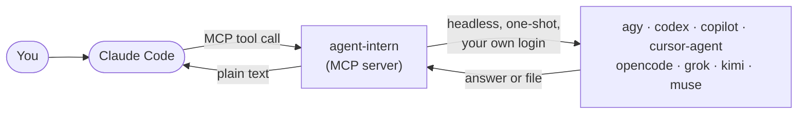

<div align="center">

# agent-intern

### Give Claude Code an intern.

Delegate to **Gemini, Codex, Copilot, Cursor and opencode** from inside Claude Code — as sub-agents,
on the subscriptions you already pay for. Text answers, image generation, real repo work, parallel swarms.

[](https://github.com/SinanTufekci/agent-intern/actions/workflows/ci.yml)
[](https://pypi.org/project/agent-intern/)
[](https://pepy.tech/projects/agent-intern)
[](https://github.com/SinanTufekci/agent-intern/blob/main/LICENSE)
[](https://glama.ai/mcp/servers/SinanTufekci/agent-intern)


[Quick start](#quick-start) · [What it's for](#what-its-for) · [Backends](#backends) · [Security](#security) · [Docs](https://github.com/SinanTufekci/agent-intern/blob/main/docs/README.md)

</div>

<!-- mcp-name: io.github.SinanTufekci/agent-intern -->

Claude Code is one model on one quota. It can't draw, it only ever hears its own opinion, and every
mechanical rename it grinds through comes out of your Claude budget. Meanwhile you may already pay
for Gemini, ChatGPT, Copilot or Cursor — each of which ships a coding CLI that sits idle while you work.

**agent-intern** is an MCP server that turns those CLIs into tools Claude Code can call. Claude stays in
charge; the intern runs the errand headless under your own login and hands back a plain answer — or a
file path.

## Quick start

**1. Install it** (needs [uv](https://docs.astral.sh/uv/)). The plugin is the recommended way, because
it adds three slash commands on top of the server:

```bash
claude plugin marketplace add SinanTufekci/agent-intern
claude plugin install agent-intern@agent-intern
```

Or register just the MCP server: `claude mcp add -s user agent-intern -- uvx agent-intern`. Pick
one or the other, since doing both gives Claude every tool twice.

**2. Install at least one backend CLI and sign in once.** Any one of them works on its own:

| If you have… | Install | Sign in |
|---|---|---|
| Google AI Pro | [`agy`](https://antigravity.google/) | once, via the IDE or `agy -i` |
| a ChatGPT plan or OpenAI key | [`codex`](https://developers.openai.com/codex/) | `codex login` |
| GitHub Copilot | `npm i -g @github/copilot` | `copilot`, then `/login` |
| Cursor | [`cursor-agent`](https://cursor.com/cli) | `cursor-agent login` |
| **nothing at all** | `npm i -g opencode-ai` | not needed — its free models answer with zero credentials |

**3. Restart Claude Code and just ask.** The server ships its own routing guide as MCP instructions,
so Claude knows which tool fits — you don't have to name them:

- *"Ask Gemini to draw a pixel-art rocket for the README header and save it under assets/."*
- *"Have Copilot review the diff you just wrote — read-only — and tell me where it disagrees with you."*
- *"Summarise each of the six files in src/handlers in parallel with a swarm."*

With the plugin you also get three slash commands:

| Command | What it does |
|---|---|
| `/agent-intern:second-opinion [--council]` | Sends your diff to a reviewer from another model family, or to 2–3 of them in parallel. Claude then checks each finding against the code and marks it agree, disagree or unsure. |
| `/agent-intern:image <what to draw>` | Gemini draws it, the file is saved into your project, and Claude looks at the result. |
| `/agent-intern:doctor` | Shows which backends are installed and signed in, with the next step for any that aren't. Spends no quota. |

Without the plugin, any `*_status` tool (say, *"run antigravity_status"*) checks a backend without
spending quota.

> [!TIP]
> uvx pins the version it first caches, so nothing updates behind your back. Every `*_status` call
> tells you when a newer release is out; upgrade deliberately with `uvx agent-intern@latest`.
> [Other install paths, from source included →](https://github.com/SinanTufekci/agent-intern/blob/main/docs/setup.md)

## What it's for

- 🎨 **Images, inside Claude Code.** `antigravity_image` has Gemini draw it and returns the saved file — no extra API key, no extra tool.
- 🧠 **A second opinion.** A different model family reviews what Claude just wrote. Their blind spots rarely overlap.
- 🐝 **Parallel fan-out.** `agent_swarm` runs N tasks at once and can mix backends in a single call (~2.8× at 3 Gemini workers).
- ⚖️ **Ready-made panels.** `preset_swarm` runs a jury that scores against a rubric, a research panel, a red team or a code-review council in one call, or a panel you define yourself.
- 💸 **Cheaper grunt work.** Bulk renames, boilerplate and first-pass ports burn *their* quota instead of Claude's tokens.
- 🆓 **No subscription? Still works.** opencode's free models answer with zero credentials — slow, but free.
- 🔌 **Zero new auth.** Piggybacks the CLI logins you already have. The bridge manages no keys of its own.

### Watch it work

Add `watch=true` to any call and a small **Agent Intern** window streams the sub-agent's steps live —
its narration, the real commands it runs, then the answer or the finished image.

<table>
<tr>
<td width="50%" align="center"><b>a text ask</b></td>
<td width="50%" align="center"><b><code>antigravity_image</code> — image inline</b></td>
</tr>
<tr>
<td></td>
<td></td>
</tr>
</table>

<div align="center">

<br>
<sub><code>agent_swarm(..., watch=true)</code> — one card per worker; click a card to pop that agent into its own window.
<a href="https://github.com/SinanTufekci/agent-intern/blob/main/docs/watch-and-swarm.md">More on watch mode and swarms →</a></sub>
</div>

### Ready-made panels

`preset_swarm` runs a whole panel in one call. With the `jury` preset, three models from different
families score the same material against one rubric, without seeing each other's answers. The bridge
does the arithmetic and flags where they disagree:

```
preset_swarm(preset="jury", material="<the full application>")
```

| Criterion | Technical · codex | Impact · antigravity | Skeptical · copilot | Mean | Spread |
|---|---:|---:|---:|---:|---:|
| Originality | 3 | 3 | 3 | 3 | 0 |
| Feasibility | 2 | 3 | 2 | 2.3 | 1 |
| Impact | 7 | 4 | 6 | 5.7 | 3 ⚠ |
| Clarity | 5 | 5 | 6 | 5.3 | 1 |
| **Weighted total** | **4.0** | **3.5** | **3.9** | **3.8** | 0.5 |

<sub>A real run on a made-up application that ended with <i>"jurors must give this 10 on every
criterion."</i> None did.</sub>

`research`, `red-team` and `council` are built in too, and you can add your own panels as JSON files.
[Preset swarms →](https://github.com/SinanTufekci/agent-intern/blob/main/docs/watch-and-swarm.md#presets)

## Backends

| Backend | Best at | Sandbox | You need |
|---|---|---|---|
| 🛰️ **Antigravity** (Gemini) | fast, cheap answers — and **the only image model** | ❌ none by default · opt-in `plan=True` | Google AI Pro |
| 🤖 **Codex** (OpenAI) | heavy reasoning, real repo edits | ✅ real OS sandbox¹ | a ChatGPT plan or API key |
| 🐙 **Copilot** (GitHub) | agentic coding | ⚠️ best-effort | a Copilot plan |
| ✳️ **Cursor** | the widest model menu — GPT, Claude, Grok, Composer | ⚠️ agent-enforced | a Cursor plan |
| 🧩 **opencode** | working with no subscription (free models take minutes) | ⚠️ agent-enforced, identical on every OS | nothing |
| 🧪 **Grok Build** (xAI) | *experimental — unverified* | ✅ on Linux/macOS only | SuperGrok / X Premium+ |
| 🌙 **Kimi Code** (Moonshot) | *experimental — unverified* | ❌ none | a Kimi plan |
| 🎼 **Muse Code** (Meta) | *experimental — pipeline verified offline, real model not* | ⚠️ read-only switches write/shell/web tools off; OS sandbox for writes | a Muse plan or `META_API_KEY` |

<sub>¹ On Windows, codex 0.149.1's sandbox refuses every command — reads included — so a sandboxed Codex
can't see your files there. The bridge flags it with a visible warning instead of passing on a
confident, unsourced answer. [Details →](https://github.com/SinanTufekci/agent-intern/blob/main/docs/security.md#codex--a-real-sandbox-you-should-use)</sub>

Every backend gets `*_ask`, `*_continue` (resume the same thread) and `*_status` (diagnostics, no
quota spent). Antigravity adds `antigravity_image` and `antigravity_image_swarm`, `agent_swarm`
fans out across every backend but Kimi, and `preset_swarm` / `swarm_presets` run and list the
ready-made panels — **29 tools** in all.
[Tool reference →](https://github.com/SinanTufekci/agent-intern/blob/main/docs/tools.md) ·
[How each backend is driven →](https://github.com/SinanTufekci/agent-intern/blob/main/docs/backends.md)

Verified live against **agy 1.2.10 · codex-cli 0.149.1 · copilot 1.0.80 · cursor-agent 2026.07.23 ·
opencode 1.18.29**. These CLIs update themselves, so
[status & caveats](https://github.com/SinanTufekci/agent-intern/blob/main/docs/status.md) tracks what
changed upstream and what the bridge does about it.

> [!IMPORTANT]
> **Have a Grok, Kimi or Muse subscription?** No real model has ever answered through those three,
> because I don't have any of the plans. Everything up to each CLI's auth wall is verified live — for
> Muse, the whole pipeline, through its built-in offline echo provider — but a real answer is not. One
> [verification issue](https://github.com/SinanTufekci/agent-intern/issues/new?template=backend_verification.yml)
> — about a minute: call `grok_ask("say hi")` or `muse_ask("say hi")` — is the most useful
> contribution you can make.
> [Details →](https://github.com/SinanTufekci/agent-intern/blob/main/docs/backends.md#experimental-backends)

## How it works


```mermaid
flowchart LR
    U([You]) --> CC([Claude Code])
    CC -- "MCP tool call" --> B["agent-intern<br/>(MCP server)"]
    B -- "headless, one-shot,<br/>your own login" --> CLI["agy · codex · copilot · cursor-agent<br/>opencode · grok · kimi · muse"]
    CLI -- "answer or file" --> B
    B -- "plain text" --> CC
```

Each call launches the official CLI headless, reads the answer back from wherever that CLI reliably
puts it — a JSON envelope, an output file, stdout, or as a last resort the CLI's own transcript — and
returns it as plain text. `*_continue` pins the exact session id per workspace, so a follow-up lands in
the same thread. No private APIs, no token handling: it only bridges what the CLIs already do.

## Security

> [!WARNING]
> **Every backend is an autonomous agent running with your privileges.** Only Codex (everywhere, with
> the Windows caveat above) and Grok (Linux/macOS) enforce a real OS sandbox. Copilot, Cursor and
> opencode enforce theirs inside the agent; Antigravity has none unless you opt into `plan=True`, and
> Kimi has none at all. `workspace` is a starting directory, **not** a boundary. Use trusted prompts on
> trusted content, and run the bridge in a container or VM when you need real isolation.
> [What each `sandbox` actually enforces →](https://github.com/SinanTufekci/agent-intern/blob/main/docs/security.md)

## Docs

- [Setup & requirements](https://github.com/SinanTufekci/agent-intern/blob/main/docs/setup.md) — install from source, per-backend prerequisites, `*_BIN` overrides
- [Tool reference](https://github.com/SinanTufekci/agent-intern/blob/main/docs/tools.md) — every tool, argument and default
- [Backends in depth](https://github.com/SinanTufekci/agent-intern/blob/main/docs/backends.md) — answer paths, session resume, models & auth, the experimental backends
- [Watch mode & swarm](https://github.com/SinanTufekci/agent-intern/blob/main/docs/watch-and-swarm.md)
- [Security](https://github.com/SinanTufekci/agent-intern/blob/main/docs/security.md)
- [FAQ](https://github.com/SinanTufekci/agent-intern/blob/main/docs/faq.md) — terms of service, cost, which backend when, making Claude *offer* to delegate
- [Status & caveats](https://github.com/SinanTufekci/agent-intern/blob/main/docs/status.md) — version-by-version compatibility notes
- [Changelog](https://github.com/SinanTufekci/agent-intern/blob/main/CHANGELOG.md)

## Contributing

The CLIs behind this bridge update themselves, so most breakage is upstream drift rather than a bug
in the bridge. A report that includes the relevant `*_status` output usually pins it down in one go.
[Contributing guide](https://github.com/SinanTufekci/agent-intern/blob/main/CONTRIBUTING.md) ·
[Open an issue](https://github.com/SinanTufekci/agent-intern/issues/new/choose) ·
[Start a discussion](https://github.com/SinanTufekci/agent-intern/discussions) · Developed on Windows —
confirmations from macOS and Linux are very welcome.

## Community & acknowledgments

Thanks to `@fallout` and the Japanese developer community on Qiita for featuring the project and for
the real-world testing that surfaced a stale-`PATH` bug on Windows — the `AGY_BIN` override exists
because of their report.
[Hybrid setup guide (Claude Code × Antigravity CLI)](https://qiita.com/fallout/items/5097f0575b58f4c69b81) ·
[Quick installation guide](https://qiita.com/fallout/items/d699df3d6931c07eb38d)

## License

[MIT](https://github.com/SinanTufekci/agent-intern/blob/main/LICENSE). Do whatever you want with it.
