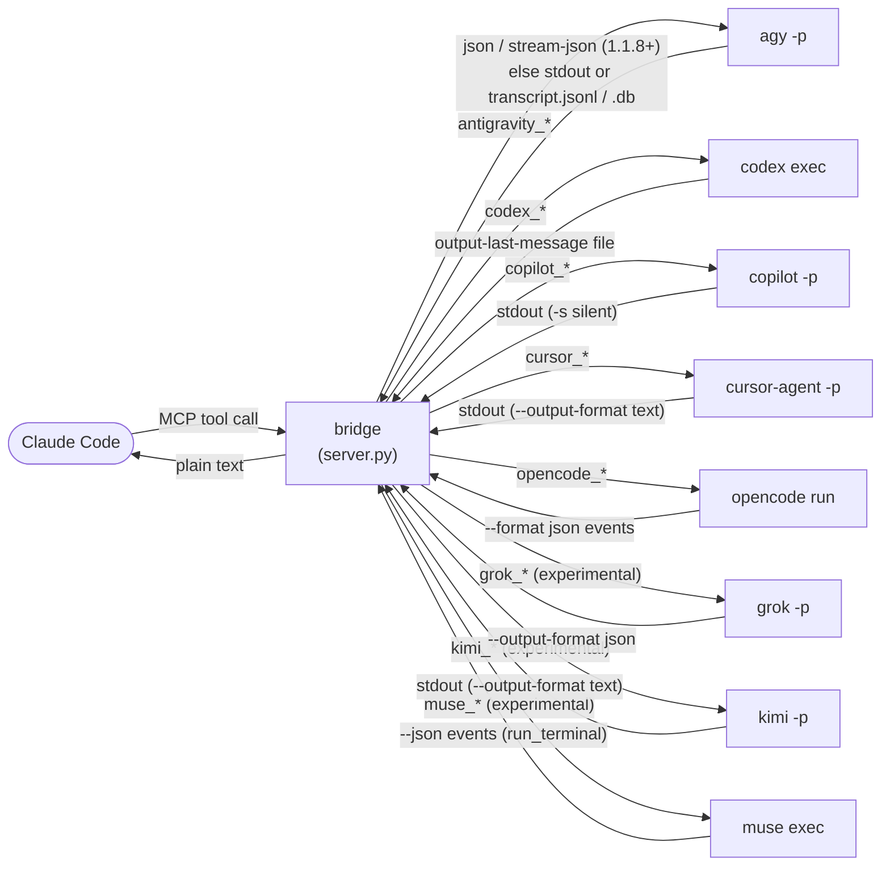

# Backends in depth

<sub>[← back to the README](../README.md) · [all docs](README.md)</sub>

How the bridge drives each CLI, how it reads the answer back, how `*_continue` finds the right session, model selection and auth — plus the three experimental backends.

## The backends at a glance

The bridge normalizes every CLI into the same shape, but they differ where it matters. Pick per task.
The five verified backends first; the [three experimental ones](#experimental-backends) follow.

| | 🛰️ **Antigravity** (`agy`) | 🤖 **Codex** (`codex exec`) | 🐙 **Copilot** (`copilot -p`) | ✳️ **Cursor** (`cursor-agent -p`) | 🧩 **opencode** (`opencode run`) |
|---|---|---|---|---|---|
| **Model** | Selectable via `model` (agy's `--model`); Gemini 3.8 Flash (High) default (see [Model & auth](#model--auth)) | Selectable via `model` (codex's `-m`) | Selectable via `model` (`--model`) | Selectable via `model` (`--model`), validated against `cursor-agent models` | Selectable via `model` (`-m`, `"provider/model"`), validated against `opencode models`; **free `opencode/*` ids need no account** |
| **Best at** | Fast, cheap tool-calling; quick answers | Heavier reasoning; real code/repo work | Agentic coding; real code/repo work | Agentic coding; wide model menu (GPT/Claude/Grok/Composer) | Working with **no subscription**; any provider you do have. Free models are slow (**152–260 s** measured) |
| **Image generation** | ✅ `antigravity_image` (+ `antigravity_image_swarm`) | ❌ no image model | ❌ no image model | ❌ no image model | ❌ no image model |
| **Sandbox** | ❌ no real boundary (`--sandbox` blocks only shell); ⚠️ opt-in `plan=True` blocks writes/shell, agent-enforced | ✅ real, enforced: `read-only` / `workspace-write` / `danger-full-access` | ⚠️ best-effort: tool/path permissions (`read-only` denies write/shell) — **not** an OS sandbox | ⚠️ agent-enforced: mode/force (`read-only` = `--mode ask`, write/shell tools unavailable) — **not** an OS sandbox | ⚠️ agent-enforced: an `OPENCODE_PERMISSION` policy that wins over the agent's own rules; **identical on every OS**; a would-be prompt is auto-rejected — **not** an OS sandbox |
| **How the answer is read** | `--output-format json` on agy 1.1.8+ (`stream-json` when watching); else stdout, else scraped from `transcript.jsonl` | Written to a file via `-o/--output-last-message` | stdout (`-s` silent mode) | stdout (`--output-format text`) | `--format json` NDJSON events (the same stream watch mode renders) |
| **Continue mechanism** | Pins the workspace's conversation id (`--conversation`) | Resumes the session id (`codex exec resume <id>`) | Resumes a self-set session UUID (`--session-id`) | Mints a chat id (`create-chat`) and resumes it (`--resume <id>`) | Pins the session id every event carries and resumes it (`-s <id>`); falls back to opencode's per-directory `-c` |
| **Auth** | OS credential store (AI Pro session) | `codex login` (ChatGPT account or API key) | OS credential store (`copilot login`) or a GitHub token env | `cursor-agent login` (OS credential store) or `CURSOR_API_KEY` | **None required** — free `opencode/*` models answer with 0 credentials; `opencode auth login` (or a provider env var) unlocks the rest |
| **In a swarm** | Runs with an isolated `HOME` to avoid state races | Fresh one-shot — needs no isolation | Fresh one-shot — needs no isolation | Fresh one-shot — needs no isolation | Fresh one-shot — needs no isolation |

## How it works

All eight backends run **headless** and one-shot per call; the bridge's job is to get a clean answer
out of each and hand it to Claude Code as a plain string.



**Antigravity.** On agy **1.1.8+** the bridge asks for structured output and reads a contractual
field instead of guessing: plain calls use `--output-format json` and return its `response`, while
[watch mode](watch-and-swarm.md#watch-mode) uses `--output-format stream-json` and rebuilds the answer from the stream's
terminal `result` event (the same shape the [Cursor bridge](#cursor-bridge) already used). Both also carry a
`conversation_id`, which the bridge records so `antigravity_continue` pins **exactly** the thread it
last ran in that workspace.

Older agy has no such flag, so the original path stays: on **1.0.15+** (Windows) `agy -p` writes its
clean answer to stdout and the bridge returns that; on older agy — or non-Windows, or a `--sandbox`
run — stdout is empty and the bridge falls back to agy's own transcript at:

```
~/.gemini/antigravity-cli/brain/<conv-id>/.system_generated/logs/transcript.jsonl
```

For that fallback it locates the conversation via `cache/last_conversations.json` (falling back to the
newest `brain/` directory touched since launch), streams the transcript, and returns the final
`source=MODEL, status=DONE, type=PLANNER_RESPONSE` entry — the answer, minus the intermediate
tool-calling steps (or the SQLite `.db` agy dual-writes, when no JSONL exists). This fallback still
runs on 1.1.8+ whenever a run yields no `result`, so nothing depends on the structured path alone.

**Codex.** `codex exec` is well-behaved: the bridge passes `-o/--output-last-message <file>` and
codex writes its final message straight there — no scraping. Continue works by capturing the session
id from codex's own rollout files (`~/.codex/sessions/.../rollout-*.jsonl`) and resuming with
`codex exec resume <id>`, falling back to the newest on-disk session for that cwd after a server
restart.

**Copilot.** `copilot -p "<prompt>" -s` runs a prompt non-interactively and prints the clean final
answer to stdout — the bridge reads it there, no scraping. It runs headless with `--allow-all-tools
--no-ask-user --no-auto-update` (so it never blocks on a prompt), and disables copilot's flaky
builtin GitHub-API MCP by default for predictable latency (`COPILOT_GITHUB_MCP=1` re-enables it).
Continue is **deterministic**: copilot's `--session-id <uuid>` both *sets* a new session's id and
*resumes* an existing one, so the bridge generates the UUID itself, pins it to the workspace, and
resumes that exact session — falling back after a restart to the newest on-disk session
(`~/.copilot/session-state/<id>/workspace.yaml`) whose recorded `cwd` matches.

**Cursor.** `cursor-agent -p --output-format text --trust "<prompt>"` runs a prompt non-interactively
and writes the clean final answer straight to stdout — the bridge reads it there, no scraping
(`--trust` trusts the workspace so it never blocks on a prompt). Continue is **deterministic and
race-free**: `cursor-agent create-chat` mints a fresh chat and prints its id, so the bridge mints the
id itself, pins it to the workspace, and resumes that exact chat with `-p --resume <chatId>` — no
rollout-scraping. After a restart it falls back to the newest on-disk chat under
`~/.cursor/chats/<md5(workspace)>/<chat-id>/` whose `meta.json` `cwd` matches (the chat-dir hash is
itself md5 of the workspace path).

## Model & auth

| | 🛰️ **Antigravity** | 🤖 **Codex** | 🐙 **Copilot** | ✳️ **Cursor** | 🧩 **opencode** |
|---|---|---|---|---|---|
| **Model** | **Selectable** via the `model` argument (agy's `--model`, e.g. `"gemini-3.1-pro-high"`, `"claude-sonnet-4-6"`); omit to use the `"model"` field in agy's `settings.json` (**`gemini-3.8-flash-high`** by default as of 1.1.25). **agy 1.1.5 replaced the old human labels with these slugs** — the old `"Gemini 3.1 Pro (High)"` form no longer works. Switching model in `-p` used to hang (through ~1.0.14) but is **fixed as of 1.0.16**. An unknown model was silently ignored through 1.1.1 and hard-fails in `-p` as of **1.1.2**; either way the bridge validates it against `agy models` and rejects a typo up front. Flash High is speed-optimized for cheap tool-calling; pick a bigger model for heavier work. | **Selectable** via the `model` argument (codex's `-m`). codex does not hang on a switch, so model choice is a first-class knob. | **Selectable** via the `model` argument (`--model`, e.g. `gpt-5.3-codex`, `claude-sonnet-4.6`, `auto`); omit for your account default. An unavailable model errors immediately. | **Selectable** via the `model` argument (`--model`, e.g. `gpt-5.2`, `claude-4-sonnet-thinking`, `auto`, or parameterized ids like `claude-opus-4-8[context=1m]`); a wide GPT/Claude/Grok/Composer menu, validated against `cursor-agent models` (a typo is rejected up front). Omit for your Cursor account default. | **Selectable** via the `model` argument (`-m`, always `"provider/model"` — e.g. `opencode/nemotron-3.5-lightning-free`, `anthropic/claude-sonnet-4-6`), validated against `opencode models` (a typo is rejected up front, which matters because opencode's own error for an unknown id is an unhelpful "Unexpected server error"). Omit for opencode's configured default. The `opencode/*-free` ids need **no account**, and are slow. |
| **Auth** | Piggybacks whatever credential store `agy` uses on your OS (Windows Credential Manager, macOS Keychain, libsecret on Linux — the bridge never touches it directly). Log in once; every call silent-auths on the **same AI Pro quota** you already pay for. | Uses your existing **Codex login** — ChatGPT account or API key. Run `codex login` once; verify with `codex_status`. | Uses your existing **Copilot login** — run `copilot` then `/login` once (OS credential store), or set `COPILOT_GITHUB_TOKEN`/`GH_TOKEN`/`GITHUB_TOKEN`. Verify with `copilot_status`. | Uses your existing **Cursor login** — run `cursor-agent login` once (OS credential store), or set `CURSOR_API_KEY`. Verify with `cursor_status`. | **None required.** The free `opencode/*` models answer with `0 credentials`. For anything better, `opencode auth login` (stored in `~/.local/share/opencode/auth.json`) or a provider env var such as `ANTHROPIC_API_KEY`. Verify with `opencode_status`. |

<a id="codex-bridge"></a>

## 🤖 Codex bridge — the well-behaved sibling

`codex exec` writes its final message to a file the bridge asks for via `-o/--output-last-message`,
so the answer comes back without any scraping (where agy needed a transcript workaround before 1.0.15
fixed its stdout). Three things make Codex worth reaching for over Antigravity:

- **Real sandbox.** `sandbox` accepts `read-only` (default — reads and answers, writes nothing),
  `workspace-write` (may edit files under the workspace), or `danger-full-access` (no sandbox —
  avoid). Unlike agy's no-op `--sandbox`, codex's `-s` actually enforces this. `codex exec` has no
  interactive approval gate, so this flag **is** your safety boundary — opt into write access
  deliberately.
- **Model selection works.** `model` maps to codex's `-m`. (agy's `--model` works in print mode too
  as of 1.0.16; every backend now exposes the same `model` knob, except Kimi, which has no list to
  validate against.)
- **Stronger reasoning.** Codex is a coding agent, not an image model — there's no `codex_image`. Its
  strength is reasoning and real code/repo work; hand it the jobs that need a heavier model.

**Auth.** Uses your existing Codex login (ChatGPT account or API key). Run `codex login` once; check
with `codex_status`. No new keys for the bridge to manage.

> [!WARNING]
> `codex exec` runs the model as an **autonomous agent with no interactive approval gate**. The
> `sandbox` flag (default `read-only`) is the real boundary, but `workspace-write` /
> `danger-full-access` let it modify files — and a swarm runs N agents at once. Only use it with
> **trusted prompts on trusted content**.

<a id="copilot-bridge"></a>

## 🐙 Copilot bridge — GitHub's agentic coder

The GitHub Copilot CLI (`copilot`, from `@github/copilot`) is stdout-native like Codex:
`copilot -p "<prompt>" -s` runs a prompt non-interactively and prints just the final answer to
stdout, so the bridge reads it there — no scraping. What makes it worth reaching for:

- **Model selection.** `model` maps to copilot's `--model`; `auto` lets Copilot pick. Unlike the agy
  and cursor tools, the bridge **can't validate this** — copilot exposes no non-interactive model
  list — and the working set is **account-dependent**: on a Copilot Pro account here, `auto` worked
  while `gpt-5.3-codex`, `claude-sonnet-4.6`, and even GitHub's own `--help` example `gpt-5.4` were all
  rejected as "not available". So omit `model` (account default) or pass `auto` unless you know your
  plan's ids; an unavailable one errors immediately with copilot's message, costing a call.
- **Deterministic, race-free continue.** copilot's `--session-id <uuid>` both **sets** a new session's
  id and **resumes** an existing one, so the bridge generates the UUID itself and pins it to the
  workspace — no rollout-scraping. After a restart it falls back to the newest on-disk session
  (`~/.copilot/session-state/<id>/workspace.yaml`) whose recorded `cwd` matches.
- **Fast by default.** Runs with `--allow-all-tools --no-ask-user --no-auto-update`, and disables
  copilot's builtin GitHub-API MCP (`--disable-builtin-mcps`) because its flaky HTTP connect can stall
  a call up to ~60 s. Set **`COPILOT_GITHUB_MCP=1`** to keep it (for Copilot's issue/PR/repo tools).

**Sandbox is best-effort, not enforced.** Unlike Codex's OS sandbox, copilot's boundary is
tool/path permissions. The `sandbox` knob maps to copilot flags for a uniform cross-backend field:

- **`read-only`** (default) — auto-approves tools so it runs headless, then **denies** the local
  `write` and `shell` tools (`--deny-tool`). Best-effort: it is **not** an OS sandbox, and network/MCP
  tools can still act. For a **hard** read-only boundary, use `codex_ask` instead.
- **`workspace-write`** — writes allowed, but file access stays confined to the workspace (no
  `--allow-all-paths`).
- **`danger-full-access`** — `--allow-all` (tools + all paths + all URLs). Avoid.

**Auth.** Uses your existing Copilot login — run `copilot` then `/login` once (stored in the OS
credential store), or set `COPILOT_GITHUB_TOKEN`/`GH_TOKEN`/`GITHUB_TOKEN` for headless use. Check
with `copilot_status`. If `copilot` isn't on `PATH` (the winget install can land off a stale `PATH`),
set **`COPILOT_BIN`** to its full path — e.g.
`%LOCALAPPDATA%\Microsoft\WinGet\Packages\GitHub.Copilot_*\copilot.exe`.

> [!WARNING]
> `copilot -p` runs the model as an **autonomous agent** with `--allow-all-tools` (required to run
> headless). Its `sandbox` is **best-effort tool/path permissions**, not an OS sandbox — safer than
> agy, weaker than Codex's `read-only`. Only use it with **trusted prompts on trusted content**.

<a id="cursor-bridge"></a>

## ✳️ Cursor bridge — the widest model menu

Cursor's agent CLI (`cursor-agent`, from [cursor.com/cli](https://cursor.com/cli)) is stdout-native
like Codex and Copilot: `cursor-agent -p --output-format text --trust "<prompt>"` runs a prompt
non-interactively and writes just the final answer to stdout, so the bridge reads it there — no
scraping (`--trust` trusts the workspace so it won't block on a prompt). What makes it worth reaching
for:

- **The widest model menu.** `model` maps to cursor's `--model` (e.g. `auto`, `gpt-5.2`,
  `claude-opus-4-8-high`, `composer-2.5`, `cursor-grok-4.5-high`) — GPT, Claude, Grok, and Composer in
  one place, ~190 ids at the time of writing. cursor bakes the **effort and speed axes into the id**
  (`…-low` / `-high` / `-xhigh` / `-max`, each with a `-fast` twin), and also accepts a bracket form on
  the family base, e.g. `claude-opus-4-8[context=1m,effort=high]`. The bridge validates against
  `cursor-agent models` and rejects a typo up front (like agy), accepting either an exact id or a
  family base. Omit `model` to use your Cursor account default. **cursor reshuffles this list often** —
  run `cursor-agent models` (or `cursor_status`) rather than trusting an example here.
- **Deterministic, race-free continue.** `cursor-agent create-chat` mints a fresh chat and prints its
  id, and `-p --resume <chatId>` resumes that exact chat — so the bridge mints the id itself, pins it
  to the workspace, and resumes deterministically (no rollout-scraping, same idea as Copilot's
  self-set session id). After a restart it falls back to the newest on-disk chat under
  `~/.cursor/chats/<md5(workspace)>/<chat-id>/` whose `meta.json` `cwd` matches (the chat-dir hash is
  itself md5 of the workspace path).

**Sandbox is agent-enforced, not an OS sandbox.** Like Copilot, cursor's boundary is which tools the
agent can reach, not an OS jail. The `sandbox` knob maps to cursor's mode/force flags for a uniform
cross-backend field:

- **`read-only`** (default) — `--mode ask`: the `write` and `shell` tools are **unavailable**, so
  cursor analyzes and answers but makes no edits (verified: it refuses to write files). Agent-enforced
  and best-effort — it is **not** an OS sandbox. For a **hard** read-only boundary, use `codex_ask`
  instead.
- **`workspace-write`** — `--force`: edits and commands allowed, file access rooted at `--workspace`.
- **`danger-full-access`** — `--force --sandbox disabled` (OS sandbox off). Avoid.

(Cursor also exposes an OS-level `--sandbox enabled/disabled`; the bridge drives the uniform field via
mode/force.)

**Auth.** Uses your existing Cursor login — run `cursor-agent login` once (OS credential store), or
set `CURSOR_API_KEY` for headless use. Check with `cursor_status`. If `cursor-agent` isn't reliably on
`PATH` (the installer drops a `cursor-agent.CMD` shim a bare name can't launch on Windows), set
**`CURSOR_BIN`** to its full path — mirrors the `AGY_BIN`/`CODEX_BIN`/`COPILOT_BIN` overrides.

> [!WARNING]
> `cursor-agent -p` runs the model as an **autonomous agent** with `--trust` (and `--force` when
> writes are allowed). Its `sandbox` is **agent-enforced** (read-only makes the write/shell tools
> unavailable), not an OS sandbox — safer than agy, weaker than Codex's `read-only`. Only use it with
> **trusted prompts on trusted content**.

<a id="opencode-bridge"></a>

## 🧩 opencode bridge — the one you can try without a subscription

[opencode](https://opencode.ai/) (SST's open-source terminal coding agent, `npm i -g opencode-ai`) is
stdout-native like Codex/Copilot/Cursor: `opencode run --format json "<prompt>"` runs a prompt
non-interactively and writes **NDJSON events** to stdout. Three things make it worth a slot of its own:

- **It answers with no account.** `opencode models` lists free hosted ids under opencode's own
  provider (`opencode/nemotron-3.5-lightning-free`, `opencode/mimo-v2.5-free`, …) that work with
  **`0 credentials`** configured. Every claim in this section was verified on **opencode 1.18.29 /
  Windows** against those models — this is the first backend here whose *answer path* could be proven
  without a paid plan. Add your own key (`opencode auth login`, or `ANTHROPIC_API_KEY` /
  `OPENAI_API_KEY` …) and the same tools drive Claude- and GPT-class models.
- **One stream serves both modes.** `--format json` is already incremental, so the plain call and the
  [watch view](watch-and-swarm.md#watch-mode) run the *identical* argv — there is no second output format to drift out
  of sync (grok needs `streaming-json` for this).
- **Its permission model is a real knob.** See below.

**Reading the answer.** Each line is one event — `{"type": "...", "timestamp": ..., "sessionID": ...}`
— and the bridge concatenates the completed `text` parts. An `{"type":"error"}` event carries
opencode's own message and is surfaced verbatim.

**Continue.** Every event carries the `sessionID`, so the bridge pins it to the workspace and resumes
that exact session with `-s <id>`. If that in-memory pin is gone (server restarted), it falls back to
opencode's own `-c`, which resolves to *the most recent session for the run directory* — verified
live: the same `-c` from a **different** directory starts a fresh session rather than resuming.
A stale id fails loudly (`Error: Session not found`, exit 1) instead of silently starting over.

**Model.** `-m provider/model`, validated against `opencode models` (which answers with no
credentials, so validation is free). This one is worth the up-front check: an unknown id comes back
from opencode as a bare `"Unexpected server error. Check server logs for details."`, which tells you
nothing.

**Sandbox — `OPENCODE_PERMISSION`, not a flag.** opencode's permission set is a config value, and the
bridge sets it per run via the `OPENCODE_PERMISSION` env var. Two facts (read off opencode's own
bundled source, then confirmed by running it) make that a genuine boundary rather than a suggestion:

1. **In headless `run`, a permission that would prompt is auto-rejected** — `if (auto) reply("once")
   else { println("...auto-rejecting"); reply("reject") }`. So "ask" means "deny" here, and the bridge
   can never wedge waiting on a prompt nobody can see.
2. **The config policy is merged *last* into every built-in agent** —
   `permission: merge(defaults, agent_specific, fromConfig(config.permission))` — so the bridge's
   policy overrides the agent's own rules. That matters: opencode's nominally read-only `plan` agent
   still leaves `bash` **allowed**, so `--agent plan` alone would not be a read-only mode.

- **`read-only`** (default) — denies `edit`, `bash`, `task` (no subagent gets a fresh unrestricted
  turn), `external_directory`, `webfetch` and `websearch`; keeps `read`/`glob`/`grep`/`list`, with
  `.env` files denied outright.
- **`workspace-write`** — leaves opencode's own defaults for `edit`/`bash` (already rooted at the run
  directory) and hard-denies `external_directory`, so reaching outside the workspace is *refused*
  rather than merely asked.
- **`danger-full-access`** — opencode's `--auto` ("auto-approve permissions that are not explicitly
  denied (dangerous!)" — their words), no policy at all. Avoid.

**The A/B test that backs this.** The same prompt — *"create written.txt containing HELLO"* — was run
against the same free model in both fenced modes. Under `workspace-write` it answered `DONE` in 428 s
and `written.txt` was there. Under `read-only` it never wrote anything: it spent the entire 630 s
budget retrying tools it had been denied, and the directory was still empty at the end. Same prompt,
same model, opposite outcomes — the policy is doing the work, not the model's goodwill.

⚠️ A malformed `OPENCODE_PERMISSION` is **silently ignored** (opencode logs a debug warning and
carries on with no restrictions), which is exactly the sort of failure that looks like it worked. The
bridge therefore builds the policy as a dict and `json.dumps` it — never by hand — and a test asserts
the round-trip.

**Two footguns this bridge already absorbed.**

- **stdin must be closed.** With a non-TTY stdin, opencode reads it *to EOF* and appends it to the
  prompt (`process.stdin.isTTY ? undefined : await Bun.stdin.text()`). An MCP server's child gets a
  pipe, not a TTY, so anything short of `DEVNULL` hangs forever. Every call passes it.
- **A timeout has to kill the whole tree.** On Windows `opencode` on `PATH` is npm's `opencode.CMD`
  shim, so the real `opencode.exe` is a *grandchild*; killing only the direct child leaves it alive
  holding the stdout pipe. Measured before the fix: a 270 s timeout returned at **396 s**, and only
  because the orphan was killed by hand. The bridge runs the blocking path through `Popen` (never
  `subprocess.run(timeout=…)`, whose Windows branch re-reads that very pipe) and kills the tree with
  `taskkill /T`.

**Slowness is normal.** The free models are queue-scheduled: measured **152 s**, **214 s** and **260 s**
for one-word answers. That is why `timeout_s` defaults to **300** here rather than the usual 180 —
don't mistake a slow free model for a hang, and prefer a configured paid model for real work. One
observed corollary: a weak free model asked under `read-only` to do something that *needs* a write
can spend the **whole** timeout retrying tools it will never be given (it wrote nothing, which is the
point — it just took the full budget to give up). Both fenced modes therefore also deny opencode's
`doom_loop` retry guard, whose default would already be rejected in headless mode, so that a user
config which allowed it can't turn a fenced run into an unbounded loop.

**Auth.** None needed for the free models. `opencode auth login` (also spelled `opencode providers`)
stores credentials in `~/.local/share/opencode/auth.json` — the XDG layout, on Windows too. Set
**`OPENCODE_BIN`** if `opencode` isn't reliably on `PATH`.

> [!WARNING]
> `opencode run` runs the model as an **autonomous agent**. Its `sandbox` is **agent-enforced**, not an
> OS boundary — a tool call is refused by opencode, not by the kernel — but unlike grok's OS sandbox it
> behaves the same on Windows, macOS and Linux. For a hard boundary, use `codex_ask`. Only use it with
> **trusted prompts on trusted content**.

<a id="grok-bridge"></a>

## 🧪 Grok Build bridge — a real sandbox, on two of three platforms

> [!WARNING]
> **EXPERIMENTAL — never verified end-to-end.** Everything below the "Auth" line is confirmed against
> a live grok 1.0.3; the answer path is not. See [Experimental backends](#experimental-backends), and
> please [report what you find](https://github.com/SinanTufekci/agent-intern/issues/new?template=backend_verification.yml).

xAI's [Grok Build](https://docs.x.ai/build/overview) (`grok`, installed with
`curl -fsSL https://x.ai/cli/install.sh | bash`, or `irm https://x.ai/cli/install.ps1 | iex` on
Windows) is stdout-native like Codex/Copilot/Cursor: `grok -p "<prompt>" --output-format json` runs a
prompt non-interactively and writes a single JSON result object to stdout. What makes it interesting:

- **It's open source.** [xai-org/grok-build](https://github.com/xai-org/grok-build) publishes the
  actual CLI source, so this bridge's flag surface was read off the real clap definitions rather than
  inferred from docs — then confirmed against `grok --help`. That's a much stronger footing than a
  docs-derived bridge, and it caught a live discrepancy: xAI's own headless docs use `-m grok-build`
  in their examples, but the real default on 1.0.3 is **`grok-4.5`**.
- **The answer carries its own session id.** `--output-format json` returns
  `{"text": …, "sessionId": …, "usage": …}`, so the bridge pins that id and resumes the exact session
  with `-r <id>` — no id-minting dance like Cursor's, no rollout-scraping like Codex's. After a
  restart it falls back to `-c`, grok's own "most recent session for this cwd", so continue survives
  without ever reading grok's opaque SQLite session store.
- **Free auth + model checks.** `grok models` answers *while logged out* (exit 0, printing
  `You are not authenticated.` and the catalogue), so `grok_status` and model validation cost nothing
  and need no login.

**Sandbox is real — on Linux and macOS.** This is the only backend besides Codex with an OS-enforced
boundary, but read the platform caveat:

- **`read-only`** (default) — `--sandbox read-only` **plus** a `--tools` allowlist
  (`read_file,list_dir,grep,glob,web_search,web_fetch`) **plus** `--no-subagents`.
- **`workspace-write`** — `--sandbox workspace`: writes land in the workspace, `~/.grok`, and temp.
- **`danger-full-access`** — `--sandbox off`. Avoid.

> [!CAUTION]
> **On Windows, grok's OS sandbox does not apply.** It's implemented with Landlock (Linux) and
> Seatbelt (macOS); where it can't be applied, xAI's docs say grok "logs a warning and continues
> **without enforcement**." That's why `read-only` here doesn't lean on the profile alone — the tool
> allowlist is agent-enforced and holds on every platform. An **allowlist**, not a denylist, precisely
> because it fails safe: a future grok that adds a new write tool can't silently slip through it.
> Note that MCP meta-tools stay available under an allowlist, so a configured MCP server could still
> write. For a hard boundary on every platform, use `codex_ask`.

Every mode also passes `--always-approve`: grok's headless mode does **not** auto-approve on its own
(unlike agy and Kimi), and there's no human to answer a prompt. Containment comes from the profile and
the allowlist, not from the approval gate.

**Auth.** `grok login` (browser OAuth), `grok login --device-code` (headless), or an `XAI_API_KEY` env
var; credentials cache in `~/.grok/auth.json`. Needs a **SuperGrok or X Premium+** subscription. Check
with `grok_status`. Set **`GROK_BIN`** to override the executable path — though the bridge already
falls back to the installer's own `~/.grok/bin` when `grok` isn't on `PATH`, which matters because the
installer appends to the user PATH and that never reaches an already-running server process.
`GROK_HOME` relocates the whole data dir. The bridge disables grok's background auto-updater per call
via `GROK_DISABLE_AUTOUPDATER=1` — a CLI that updates itself mid-session has broken this project
before.

<a id="kimi-bridge"></a>

## 🌙 Kimi Code bridge — no sandbox, per-directory sessions

> [!WARNING]
> **EXPERIMENTAL — never verified end-to-end.** See [Experimental backends](#experimental-backends).

Moonshot's [Kimi Code](https://github.com/MoonshotAI/kimi-code) (`kimi`, npm
`@moonshot-ai/kimi-code`) runs the Kimi K2 family. `kimi -p "<prompt>" --output-format text` writes
the clean final answer to stdout.

- **Continue is per-directory.** Kimi scopes sessions to the working directory and exposes
  `-c/--continue`, so the bridge just re-runs with `cwd=workspace` and `-c` — no id to capture, and
  no restart problem. (`-S/--session <id>` exists but is deliberately unused: its on-disk format
  couldn't be verified.)
- **No model validation.** Kimi has no `models` command; aliases are user-defined in
  `~/.kimi-code/config.toml` under `[models."<alias>"]`. `model` is a lenient pass-through, so a bad
  alias surfaces as Kimi's own run-time error.
- **`-p` refuses `--auto` and `--yolo`** (verified live on 0.29.1: *"Cannot combine --prompt with …"*)
  because print mode is already self-approving — so the bridge passes neither.

> [!CAUTION]
> **Kimi has no sandbox and no `sandbox` argument.** Print mode auto-executes every tool call with no
> approval gate — the same posture as agy's print mode. No flag makes it safe. Only use it with
> **trusted prompts on trusted content**.

**Auth.** `kimi login` (device-code OAuth) or an API key in `~/.kimi-code/config.toml` (it does *not*
read a bare env var). Check with `kimi_status`, which reads `kimi provider list` as the auth proxy.
Set **`KIMI_BIN`** to override the executable path; `KIMI_CODE_HOME` relocates the data dir.

**No swarm or watch support**, deliberately — both would depend on Kimi's `stream-json` envelope,
which no one has confirmed. They'll follow a successful verification report.

<a id="muse-bridge"></a>

## 🎼 Muse Code bridge — the experimental one that's verified furthest

Muse Code is Meta's terminal coding agent (Muse Spark models). `muse exec --json` runs one prompt to
completion and writes JSONL events to stdout; the answer is the `text` of the single `run_terminal`
event. What sets it apart from Grok and Kimi is a built-in `--provider echo` that runs the **whole**
exec pipeline offline, with no account — so the argv, the event stream, the answer, session resume and
the restart fallback were all observed on Muse Code 1.3.0, not taken from docs. Only a real Muse Spark
answer, and what real tool calls look like in the stream, remain unverified.

- **How it's launched.** On Windows the installer's `muse.cmd` runs a PowerShell 5.1 launcher that
  runs `muse-bin-<version>.exe`, named in `.muse-version`. The bridge runs that binary directly: a
  `.cmd` hands its arguments to `cmd.exe` (the [injection class](security.md#windows-batch-file-shims-and-the-prompt)
  0.30.3 fixed for cursor and opencode), and Windows PowerShell 5.1 started from a PowerShell 7
  environment can't load `Get-FileHash`, which breaks the launcher's self-update. The trade-off: calls
  through the bridge never trigger that self-update — running `muse` yourself does. On macOS/Linux the
  launcher is a bash script and is used as-is.
- **The prompt** always goes in a file (`--prompt-file`), never in argv. No argument the bridge passes
  contains user text, and a prompt starting with `-` can't be mistaken for a flag.
- **Continue.** The bridge names each session itself with `--session-id <uuid>` (muse both creates and
  resumes by that flag — verified) and pins it to the workspace. After a server restart it asks muse
  for the workspace's most recent session with `muse export --last` instead of reading muse's binary
  session store. Muse refuses to resume a session from a different workspace, which is why pins are
  per workspace.
- **Every run also passes** `--no-foreign-personal-context` (muse otherwise imports Claude Code's own
  skills and rules — including this bridge's plugin), `--trust-workspace` (the repo's AGENTS.md /
  CLAUDE.md load, like the other backends), `--user-input-auto-resolve` (a question nobody can answer is
  cancelled rather than hung on) and `--worktree off`.
- **Auth.** `muse login` (browser device code) or `META_API_KEY`, which takes priority. There is no free
  auth probe, so `muse_status` reports whether credentials exist, not whether they're still valid.
  Logged out, a run exits 1 with no events and the line "missing meta credentials: run `muse login`
  or set META_API_KEY" — which the bridge surfaces as is.
- **Swarm and watch** are supported. Four concurrent runs were verified not to contend. Watch mode
  shows muse's task stream; since the echo provider calls no tools, tool calls render by task kind
  only until someone reports what real ones look like.

<a id="experimental-backends"></a>

## 🧪 The three experimental backends — and how you can help

**Grok Build**, **Kimi Code** and **Muse Code** are wired in exactly like the other five, with one
honest difference: **no real model has ever answered through them.** I don't have a SuperGrok / X
Premium+ subscription, a Kimi plan or a Muse plan, so I cannot prove they answer. Muse goes furthest —
its offline echo provider let the entire pipeline be exercised (see [Muse Code bridge](#muse-bridge)). They ship anyway because a bridge nobody
can install is a bridge nobody can verify — and because the parts that usually rot are already pinned
down.

**What *is* verified live** (each CLI installed, run, and observed — just never logged in):

| | 🧪 **Grok Build** (`grok -p`) | 🌙 **Kimi Code** (`kimi -p`) |
|---|---|---|
| **Verified against** | grok 1.0.3 / Windows | kimi 0.29.1 / Windows |
| **Flag surface** | ✅ read off the **open-source clap definitions** ([xai-org/grok-build](https://github.com/xai-org/grok-build)), then confirmed against live `grok --help`. Every argv the bridge can build was executed and **parses cleanly** | ✅ confirmed against live `kimi --help`; also that `-p` *rejects* `--auto`/`--yolo` (print mode already self-approves, so the bridge passes neither) |
| **Auth failure mode** | ✅ exit 1 + `{"type":"error","message":"Not signed in. …"}` on stdout; no browser, no hang | ✅ exit 1 + stderr `No model configured` |
| **Model list** | ✅ `grok models` answers *while logged out* — so auth checks and model validation cost nothing. Live default is **`grok-4.5`**, not the `grok-build` xAI's own docs still print | ⚠️ none — Kimi has no `models` command; aliases are user-defined in `config.toml`, so `model` is a lenient pass-through |
| **On-disk layout** | ✅ `~/.grok/` (`config.toml`, `auth.json`, `sessions/`, `logs/`); `GROK_HOME` really relocates it | ✅ `~/.kimi-code/` (`config.toml`, `device_id`, `logs/`) |
| **Concurrency** | ✅ parallel `grok -p` runs don't deadlock on `~/.grok`'s lock files | ❔ untested |

**What is NOT verified** — everything behind the auth wall:

- the happy-path answer itself: Grok's `json` envelope (`text` / `sessionId`) and Kimi's stdout answer;
- that `-r` / `-c` really restore context;
- Grok's `streaming-json` event stream, which watch mode renders;
- whether Grok's sandbox profiles behave as documented (and note: **auth is checked before `--sandbox`
  and `-m` are validated**, so a bad value can't even be observed while logged out — which is why the
  bridge validates both client-side).

> [!NOTE]
> **Deliberately scoped out for Kimi:** `agent_swarm` and watch support. Both would depend on Kimi's
> `stream-json` envelope, and adding an unverified dependency on top of an unverified backend is how
> you get two bugs that mask each other. Grok gets both, because its stream format is documented in
> detail *and* its error events were observed live.

### How to help

If you have any of these subscriptions, please **[open a verification issue](https://github.com/SinanTufekci/agent-intern/issues/new?template=backend_verification.yml)**.
The template is a checklist — tick only what you actually saw. The first box (*"a fresh ask returned a
real answer"*) is worth more than all the others combined, and takes about a minute:

```bash
# 1. Does the setup look right? (spends no quota)
#    -> call grok_status / kimi_status / muse_status from Claude Code
# 2. Does it answer?
#    -> call grok_ask("say hi") / kimi_ask("say hi") / muse_ask("say hi")
# 3. If it fails, does the raw CLI fail the same way?
grok -p "say hi" --output-format json
kimi -p "say hi" --output-format text
muse exec --json -- "say hi"
```

That last command is the one I can't run from here, and it's what separates *"the bridge is wrong"*
from *"the CLI changed"*. Partial reports are welcome; so is a plain "it didn't work, here's the error".
